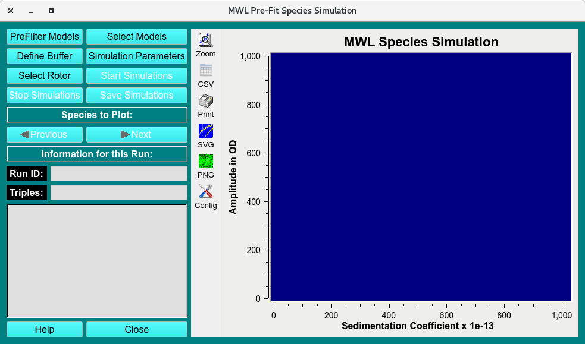
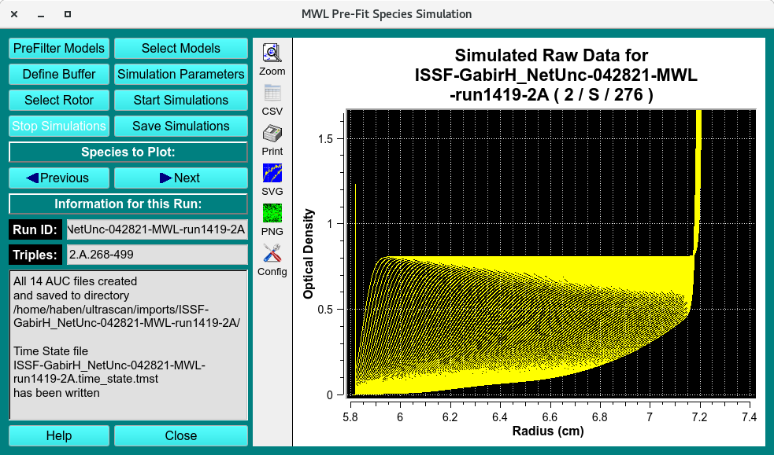

==================================
MWL Pre-Fit Species Simulation
==================================

.. toctree:: 
  :maxdepth: 3

.. contents:: Index
  :local: 

Generate simulation based on mw- runs 

This module is used to simulate a multi-wavelength experiment using Finite Element (ASTFEM) or Finite Volume (ASTFVM) methods. Multi-Wavelength 2DSA-IT models are loaded from the database. Simulation parameters are specified, the same as the experimental parameters. A simulation is then calculated and displayed. The simulation may be saved as a synthetic version of raw experimental data with a **ISSF-** prefix added. This module generates simulations with synchronous time grid based on the 2DSA-IT models loaded. 

.. rst-class::
    :align: center

    **MWL Pre-Fit Species Simulation main window**

MWL Pre-Fit Species Process: 
==============================

1. **PreFilter Models:** Select the pre-filter to find the distribution models.
2. **Select Model:** Load the 2DSA-IT models on which the simulation will be based. 
3. **Define Buffer:** Optionally (and rarely), you may wish to specify buffer conditions. This may be necessary if your intention is to simulate and save an artificial version of a specific experimental data set. Normally, the buffer conditions are those of water at 20 degrees Centigrade. 
4. **Simulation Parameters:** Secondly, open a dialog to specify parameters governing the :doc:`../simulation <simparams>`.
5. **Select Rotor:** Load the rotor and rotor calibration used in the pre-filter models and select the simulation rotor. 
6. **Start Simulation:** Initiate calculation of the specified simulation. (If an error has occurred, users can stop the simulation by clicking **Stop Simulation**)
7. **Save Simulations** After simulation, users can save the resulting **ISSF** auc file to disk for later import. 

.. rst-class::
    :align: center

    **Simulated Dataset**

MWL Pre-Fit Species Functions:
===============================

.. list-table::
  :widths: 20 50
  :header-rows: 0 
  
  * - **PreFilter Models** 
    - Load a run dataset as a Pre-filter using the "Select Run(s) as Models Pre-Filter (DB)".  
  * - **Select Models**
    - Select the distributions to base simulation on in the ":doc:`Load Distribution Model(s) <../common_dialogs.html#load-distribution-model>`_. Click and drag to select multiples model distributions. Click on **Select Models** first to select models across runs. 
  * - **Define Buffer**
    - Open the :doc:`Buffer Management <../buffer/index>` dialog to select the buffer the simulations will use for density and viscosity values. 
  * - **Simulation Parameters**
    - Click to set the :doc:`Simulation Parameters <../simparams>` profile. 
  * - **Select Rotor**
    - Click to open the :doc:`Rotor Management <../rotor>` dialog. Set the Rotor type and the associated calibration profiles for the simulation.  
  * - **Start Simulations**
    - Once all parameters have been entered, click to start simulation. 
  * - **Stop Simulations**
    - Click to stop simulation.
  * - **Save Simulations**
    - Save simulation once generated. Simulations are saved in $HOME/ultrascan/imports/
  * - **Run ID:** 
    - The Run name automatically generated for simulations. Simulations will have the "ISS-" prefix.  
  * - **Triplicate:** 
    - The Triplicate initially loaded using **Select Models**.  
  * - **Help**
    - The Help documentation of this "MWL Pre-Fit Species Simulation" Module.
  * - **Close**
    - Close window. 
