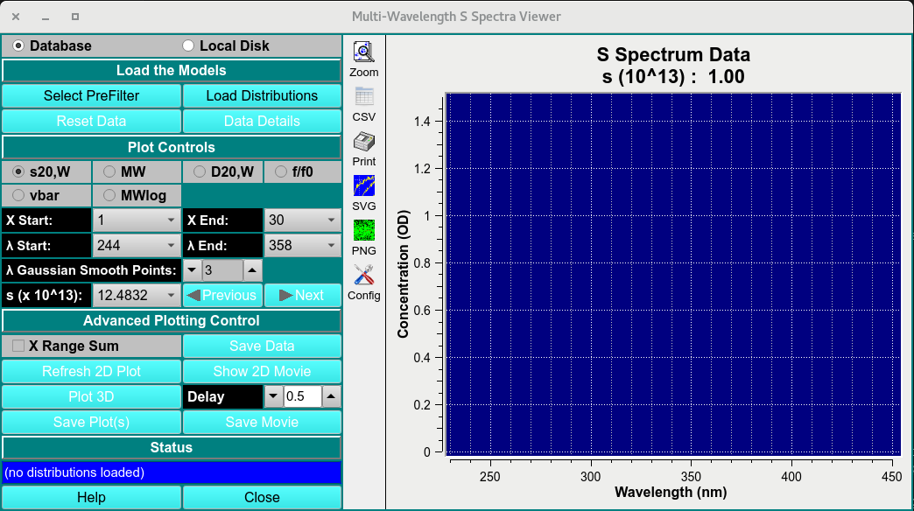
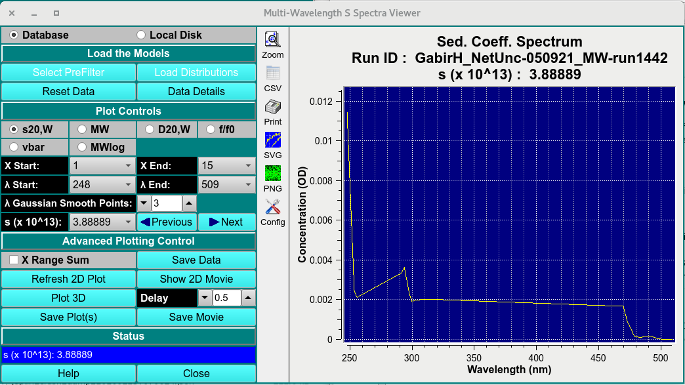
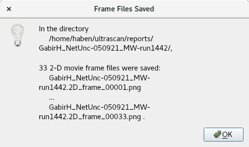

====================================
Multi-Wavelength S Spectra Viewer
====================================

.. toctree:: 
  :maxdepth: 3

.. contents:: Index
  :local: 

This module allows the user to view the multi-wavelength 2DSA models in a 2-D or 3-D plots. 

.. rst-class::
    :align: center

    **Main Window**

Process: 
==============

    * **Load MWL 2DSA-IT:** Load multi-wavelength 2DSA-IT models to view by clicking on **Select PreFilter** then **Load Distribution** and select the 2DSA-IT models. 

.. rst-class::
    :align: center

    **Loaded Window**

|
   
    1. **Plot Controls:** Set Z axis (S20,W, MW, D20,W, f/f0, vbar or MWlog) and range start (X start) and end (X End); set lambda start and end. 
    2. **Advancing Plotting Control** Once a 2-D plot and its ranges have been established, show a 2-D movie of all lambda/radius records to view the progression of data through record ranges. 
    3. Click on **Plot 3D** to bring up a control window. Within that dialog, choose scales and bring up a 3-D plot window. Continue to refine scales and orientation until the 3-D plot is as desired. 
    4. **Show a 3-D Movie:** Once a 3-D plot, with its scales and orientation, has been established, show a 3-D movie to see the change in data over time (scans). Note that scans may be excluded and a range of scans chosen to refine this movie. 

.. grid:: 2
  :gutter: 2 

  .. grid-item:: 

    .. image:: ../_static/images/mwlr_spectra_cont.png
      :align: left
      :width: 90%

    **3D-Display Control**

  .. grid-item:: 
    
    .. image:: ../_static/images/mwlr_spectra_3d.png
      :width: 120%
      :align: right

    **3D Viewer**

|
    
    * **Save Plots and Movies:** When plots and movies are all in a desired and informative state, you may save the plots and save frame files from the movies for processing by external imaging software. 

.. rst-class::
    :align: center

    **save movie as png files**

MWL Spectra Viewer Functions:
===================================

.. list-table::
  :widths: 20 50
  :header-rows: 0 

  * - **Select PreFilter** 
    - Load a run dataset as a Pre-filter using the "Select Run(s) as Models Pre-Filter (DB)".  
  * - **Load Distribution**
    - Select the distributions to plot on in the "`../Load Distribution Model(s) <common_dialogs.html#load-distribution-model>`_.
  * - **Reset Data** 
    - Reset loaded data. 
  * - **Data Details**
    - Open a detailed statistical:ref:`report <stats>` on selected dataset. 

MWL Spectra Viewer Plot controls
------------------------------------

.. list-table::
  :widths: 20 50
  :header-rows: 0 

  * - **X start and end** 
    - Start and end range of selected Z axis attribute. 
  * - **λ start and end** 
    - Start and end range of wavelength measured. 
  * - **λ gaussian smooth points:** 
    - Gaussian smoothing function applied to each spectra at any given Z value. 
  * - **S (x10^13):**
    - View the wavelength attribute distribution for any S point (Z-axis). 
  

MWL Spectra Viewer Advanced Controls: 
---------------------------------------

.. list-table::
  :widths: 20 50
  :header-rows: 0 

  * - **Save data**
    - Save the 2-D plot data. 
  * - **Refresh 2D plot**
    - Refresh plot. 
  * - **Show 2D movie**
    - Show spectra of each S value. 
  * - **Plot 3D**
    - Plot the 3-D graph with X as wavelength, Z as user selected attribute, and Y as signal intensity. 
  * - **Delay**
    - Frame delay between frames. 
  * - **Save plots** 
    - Save plots to $HOME/ultrascan/reports.
  * - **Save movie**
    - Save movie to $HOME/ultrascan/reports.
  * - **Status box** 
    - Update status box. 
  * - **Help** 
    - Help documentation to this module. 
  * - **Close**    
    - close window. 

.. _stats: 

  .. image:: ../_static/images/mwl-spec-viewer-report-1.png 
    :align: left
    :width: 120%

  .. image:: ../_static/images/mwl-spec-viewer-report-2.png
    :width: 120%
    :align: right

.. rst-class:: center

    **Statistical Details of loaded multi-wavelength dataset**

 
 