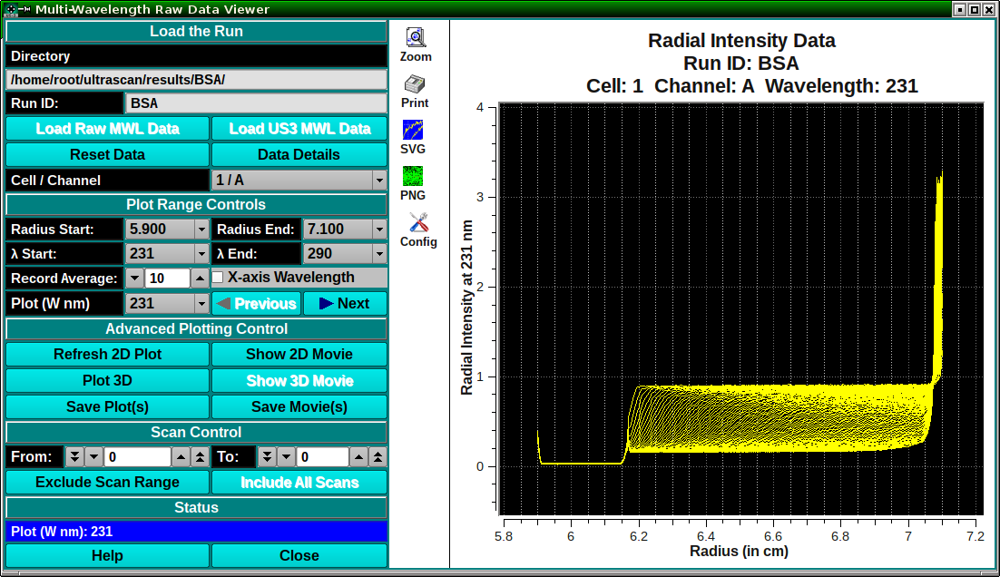

====================================
Multi-Wavelength Raw Data Viewer
====================================

.. toctree:: 
  :maxdepth: 3

.. contents:: Index
  :local: 

This module presents options for viewing multi-wavelength data for purposes of quality control. The user may, in this way, identify any problems in the experiment and get a sense of the wavelength, radial, and intensity ranges represented. 
Two types of input may be loaded for viewing. 

    * **Raw MWL:** The unprocessed .mwrs files of a run. 
    * **US3 MWL:** The already imported US3 .auc files for an experiment. 

Process: 
==============

    * **Load MWL Data:** Load multi-wavelength data to view by clicking on **Load Raw MWL Data** or **Load US3 MWL Data**, depending on the available or desired data type. 
    * **Define 2-D Plot and Ranges:** Set radius and lambda ranges; determine averaging count; choose the X-axis (radius or lambda); and possibly use the plot window Config option to refine the resulting 2-dimensional plot. 
    * **Show a 2-D Movie:** Once a 2-D plot and its ranges have been established, show a 2-D movie of all lambda/radius records to view the progression of data through record ranges. 
    * **Show and Refine 3-D Plot:** Click on **Plot 3D** to bring up a control window. Within that dialog, choose scales and bring up a 3-D plot window. Continue to refine scales and orientation until the 3-D plot is as desired. 
    * **Show a 3-D Movie:** Once a 3-D plot, with its scales and orientation, has been established, show a 3-D movie to see the change in data over time (scans). Note that scans may be excluded and a range of scans chosen to refine this movie. 
    * **Save Plots and Movies:** When plots and movies are all in a desired and informative state, you may save the plots and save frame files from the movies for processing by external imaging software. 

The main MWLR_Viewer window is shown here in the state it appears after loading US3 MWL data. 

.. rst-class::
    :align: center

    **Main Window**

.. subfigure:: AB     
  :class-grid: outline 
  :gap: 8px
  :align: center

  .. image:: _static/images/mwlr_viewer_ctl.png
    :align: left
    :width: 55%

  .. image:: _static/images/mwlr_viewer_3d.png
    :width: 100%
    :align: right

.. rst-class:: center

    **3D-Display Control and 3-D Viewer**

Functions:
===============

.. list-table::
  :widths: 20 50

  * - **Directory:**
    - A text box to the right of this label shows the full path to currently loaded data.
  * - **Run ID:**
    - A text box to the right of this label shows the currently loaded data's run identifier
  * - **Load Raw MWL Data:**
    - Click here and, in the resulting **Load Data Dialog**, select a run from the **imports** directory that contains a set of **.mwrs** files to load.
  * - **Load US3 MWL Data:**
    - Click here and, in the resulting **Load Data Dialog**, select a run from the **results** directory that contains a set of already imported **.auc** files to load.
  * - **Reset Data**
    - Clear data and plots in preparation for loading a new data set.
  * - **Data Details**
    - Click on this button to bring up a text dialog that shows details about the currently loaded data.
  * - **Cell / Channel**
    - Select the Cell/Channel of data to view.
  * - **Radius Start:**
    - Select the start radius in cm. from the list of available radius values.
  * - **Radius End:**
    - Select the end radius in cm. from the list of available radius values.
  * - **λ Start:**
    - Select the start lambda in nm. from the list of available wavelength values.
  * - **λ End:**
    - Select the end lambda in nm. from the list of available wavelength values.
  * - **Record Average:**
    - Select the number of wavelength records over which to compute an average for each record.
  * - **X-axis Wavelength**
    - Check this box to change the plot to one in which the X-axis is wavelength and records are radius records.
  * - **Plot (W nm)** or **Plot (R cm)**
    - Select the identifier of the lambda or radius record to plot.
  * - **Previous**
    - Click to plot the previous lambda/radius record.
  * - **Next**
    - Click to plot the next lambda/radius record.
  * - **Refresh 2D Plot**
    - Click this button to replot the 2-D plot after any changes in controls or ranges.
  * - **Show 2D Movie**
    - Click here to begin a 2-D movie over the lambda/radius record range.
  * - **Plot 3D**
    - Click to open a **3D Plot Control Dialog**, from which a **3D Plot Window** may be opened or replotted. Note that if a 3D Plot Window is already opened and scan ranges have been changed, this button can be clicked to re-plot the 3D Plot for the new first scan.
  * - **Show 3D Movie**
    - Click here to begin a 3-D movie over the scan range.
  * - **Save Plot(s)**
    - Click this button to save the current 2-D and/or 3-D plot.
  * - **Save Movie(s)**
    - Click here to re-play 2-D and/or 3-D movies and save the PNG files of each frame in the reports directory.
  * - **Hold 3D Movie Colors Constant**
    - Check this box before beginning a 3-D movie in order to preserve the correspondence of colors in the currently selected color map to the maximum amplitude range. By default, colors are mapped to each frame's amplitude range.
  * - **From:**
    - Select the first scan of a scan range focus.
  * - **To:**
    - Select the last scan of a scan range focus. The **from** and **to** values may be used to exclude bad scan curves or to limit the range of a 3-D plot or movie.
  * - **Exclude Scan Range**
    - Click on this button to exclude the currently selected range of scans.
  * - **Include All Scans**
    - Click this button to revert to the full range of data scans.
  * - **Status**
    - The text box below this banner shows the current status of the ongoing or just-completed process.
  * - **Help**
    - Click to show this help documentation.
  * - **Close**
    - Click to close the MWLR viewer
 

The default 2-D plot and movie frames is of wavelength records with radius as the X axis. You may change to radius records with lambda as the X axis by checking the X-axis Wavelength box. With this checked, the main window would be similar to the following. 

.. image:: _static/images/mwlr_viewer_wvl.png
    :align: center

.. rst-class::
    :align: center

    **Alternate Record and X-axis**