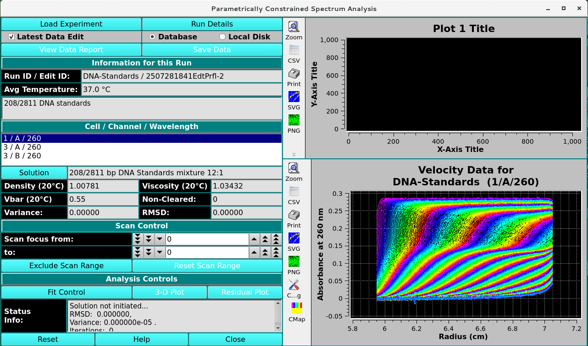

==============================================
Parametrically Constrained Spectrum Analysis
==============================================

This module enables users to perform parametrically constrained spectrum analysis on a chosen experimental data set. The PCSA module fits sedimentation velocity data using linear or sigmoidal constraints to model the relationship between the s and f/f0 of heterogenous macromolecule mixtures. This module is ideal for interacting macromolecules and growing polymer chain systems. Upon completion of an analysis fit, plots available include: model lines; experiment; simulation; overlaid experiment and simulation; residuals; time-invariant noise; radially-invariant noise; 3-d model. Final outputs may include a model and computed noises. 

.. toctree::
   :maxdepth: 1
   :caption: Table of Content:

   pcsa
   pcsa_analys
   pcsa_adv
   pcsa_rpscan
   pcsa_mlines
   pcsa_results
   

.. rst-class:: center

    **Parametrically Constrained Spectrum Analysis window**

Reference:
===========

Gorbet G., T. Devlin, B. Hernandez Uribe, A. K. Demeler, Z. Lindsey, S. Ganji, S. Breton, L. Weise-Cross, E.M. Lafer, E.H. Brookes, B. Demeler. `A parametrically constrained optimization method for fitting sedimentation velocity experiments. <https://www.sciencedirect.com/science/article/pii/S0006349514002288>`_ Biophys. J. (2014) vol 106, 1741-50.

Also Available `Here <https://demeler.uleth.ca/biophysics/archive/Demeler/1-PCSA-Biophys.J.-2014-Gorbet_et_al.pdf>`_

Related
====================

`Finite Element Viewer <../fe_match/index.html>`_

`2-Dimensional Spectrum Analysis <2dsa/index.html>`_

`Initialize Genetic Algorithm <../ga_initialize.html>`_