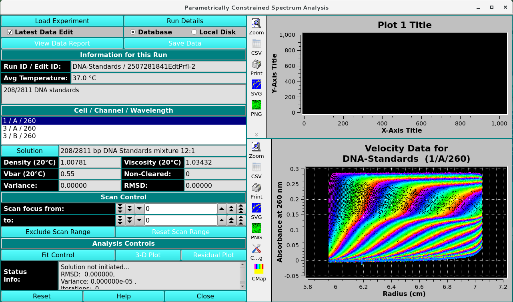

==============================================
Parametrically Constrained Spectrum Analysis
==============================================

This module enables you to perform parametrically constrained spectrum analysis on a chosen experimental data set. The PCSA module fits sedimentation velocity data using linear or sigmoidal constraints to model the relationship between the molar mass and anisotropy of heterogenous macromolecule mixtures. This module is ideal for interacting macromolecules and growing polymer chain systems. 

.. rst-class:: center

    **Noise Vector prompt**

.. toctree::
   :maxdepth: 1
   :caption: Table of Content:

   pcsa
   pcsa_analys
   pcsa_adv
   pcsa_results
   psca_rpplot

Reference
===========

Gorbet G., T. Devlin, B. Hernandez Uribe, A. K. Demeler, Z. Lindsey, S. Ganji, S. Breton, L. Weise-Cross, E.M. Lafer, E.H. Brookes, B. Demeler. `A parametrically constrained optimization method for fitting sedimentation velocity experiments. <https://www.sciencedirect.com/science/article/pii/S0006349514002288>`_ Biophys. J. (2014) vol 106, 1741-50.

Also Available `Here <https://demeler.uleth.ca/biophysics/archive/Demeler/1-PCSA-Biophys.J.-2014-Gorbet_et_al.pdf>`_

Related
====================

`Finite Element Viewer <../fe_match/index.html>`_

`2-Dimensional Spectrum Analysis <2dsa/index.html>`_

`Initialize Genetic Algorithm <../ga_initialize.html>`_