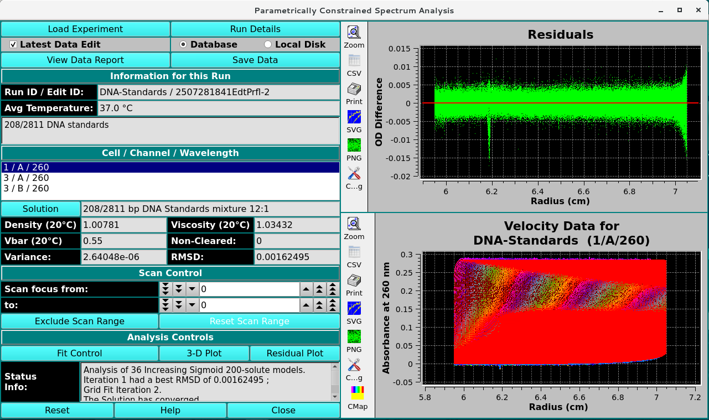

==============================================
Parametrically Constrained Spectrum Analysis
==============================================

.. toctree:: 
  :maxdepth: 2

.. contents:: Index
  :local: 

The PCSA method is used for **composition analysis** of sedimentation velocity experiments. It can generate *sedimentation coefficient*, *diffusion coefficient*, *frictional coefficient*, *f/f0 ratio*, and *molecular weight distributions*. The distributions can be plotted as `3-dimensional plots <3d_plot.html>`_ (2 parameters from the above list against each other), with the third dimension representing the concentration of the solute found in the composition analysis. The set of all such final calculated solutes form a model which is used to generate a simulation via Lamm equations. The simulation is plotted overlaying a plot of experimental data.

The PCSA pass proceeds for a set of models each of which consists of the solute points along a curve in s,f/f0 space. The model whose RMSD of the resulting residuals (simulation-experimental difference) is the lowest forms the starting point for a second phase which uses Levenberg-Marquardt to refine the model to a final output model. The set of initial curves is specified by a s and f/f0 ranges and a direct or implied number of variations in f/f0 end-points or sigmoid par1, par2 values. The type of curve used may be any of the following. 

 * **Straight Line**
 * **Increasing Sigmoid**
 * **Decreasing Sigmoid** 
 * **Horizontal Line [ C(s) ]**

.. image:: ../_static/images/pcsa.png
  :align: center

.. rst-class:: center

    **PCSA Simulation Window**

PCSA Process: 
=================

 *  **Step 1:** *Load Experimental Data:* First, load experimental velocity data. Click on "Load Data" to select an edited velocity data set from the database or from local disk. 
 *  **Step 2:** *Define the Analysis Fit:* Secondly, open an `Analysis control window <pcsa_analys.html>`_ by clicking on "Fit Control". Within that dialog, define the ranges and counts that comprise the analysis. 
 *  **Step 3:** *Start the Fit:* Next, after having specified analysis parameters, begin the fit analysis by clicking "Start Fit". 
 *  **Step 4:** *Display and Save Results:* After simulation, a variety of options are available for displaying simulation results, residuals, and distributions. Report text files and graphics plot files can also be generated. 

Upon completion of an analysis fit, plots available include: model lines; experiment; simulation; overlayed experiment and simulation; residuals; time-invariant noise; radially-invariant noise; 3-d model. Final outputs may include a model and computed noises. A detailed explanation of the results are found in `Parametrically Constrained Spectrum Analysis Results <pcsa_results.html>`_

The main PCSA window is shown here in the state it appears after the completion of a fit run. 

.. rst-class:: center

    **Fitted PCSA Simulation**

Functions:
==========

.. list-table::
  :widths: 20 50
  :header-rows: 0 
  
  * - **Load Experiment**
    - Click here and, in the resulting `Load Run Data Dialog <common_dialogs.html#data-loader>`_, select an edited data set to load.
  * - **Run Details**
    - Pop up a dialog showing `Run Details Dialog <run_details.html>`_.
  * - **Latest Data Edit**
    - Uncheck to allow choosing an edit other than the latest one for the raw experimental data.
  * - **Database**
    - Select to specify data input from the database.
  * - **Local Disk**
    - Select to specify data input from local disk.
  * - **View Data Report**  
    - Generate a report file and view it in a dialog. See the details of the report in `PCSA Process Results <pcsa_results.html#pcsa-report>`_.
  * - **Save Data**
    - Save models and noises, as well as report and plot images files.
  * - **Run ID / Edit ID:**
    - The Run identifier string and the Edit identifier (generally a time string) are displayed for loaded edit.
  * - **Avg Temperature:**
    - The average temperature over all the scans of the loaded data.
  * - **(experiment description)**
    - A text string is displayed giving a fairly detailed description of the experiment.
  * - **Cell / Channel / Wavelength**
    - One or more rows of data edit triples. If more than one, click on a row to select it as the data of interest.
  * - **Solution**
    - Click this button to open a `Solution Management dialog <us_solution.html>`_ that allows changes to buffer and analyte characteristics of the data set. 
  * - **Density (20°C)**
    - Shows the density value for the loaded experiment. Click the Solution button to open a dialog in which density and other values may be changed.
  * - **Viscosity (20°C)**
    - Shows the viscosity value for these loaded experiment. Click the Solution button to open a dialog in which viscosity and other values may be changed.
  * - **Vbar (20°C)**
    - Shows the vbar value for the loaded experiment. Click the Solution button to open a dialog in which vbar and other values may be changed.
  * - **Skipped**
    - The count of experiment data scans skipped.
  * - **Variance:**
    - Variance value (square of RMSD) for residuals.
  * - **RMSD:**
    - Root-Mean-Square-of-Differences for residuals.
  * - **Scan focus from:**
    - Select a low scan of the range of values for exclusion from analysis. 
  * - **to:**
    - Select a high scan of the range of values for exclusion from analysis.
  * - **Exclude Scan Range**
    - Initiate exclusion of the scans given in the above controls. 
  * - **Reset Scan Range**
    - Reset to the full range of scans.
  * - **Fit Control**
    - Open a dialog to set analysis parameters and start a fit run. For details on the results of clicking this button, see `PCSA Analysis Control <pcsa_analys.html>`_.
  * - **3-D Plot**
    - After a PCSA model is fitted, open a control window for a `3-Dimensional plot <3d_plot.html>`_ of the final computed model. 
  * - **Residual Plot**
    - After a PCSA model is fitted, open a plot dialog for a far more detailed set of result plots. See `PDSA Residual Plot Dialog <pcsa_results.html#pcsa-data-residuals-viewer>`_ for further details.
  * - **Status Info:**
    - This text window displays continually updated summaries of computational activity and results.
  * - **Status Info**
    - This text window displays continually updated summaries of computational activity and results. 
  * - **(upper right side plot)**
    - Upon analysis completion, this plot is of the Residuals (Experimental minus Simulation minus any Noise).
  * - **(lower right side plot)**
    - Upon analysis completion, this plot is of an overlay of the Experimental and Simulation data.

**Window Controls**

.. list-table::
  :widths: 20 50
  :header-rows: 0 

  * - **Reset** 
    - Indicate that window is reset and the plots are initiated.
  * - **Help** 
    - Display this detailed Parametrically Constrained Spectrum Analysis help.
  * - **Close** 
    - Close all windows and exit.
    

