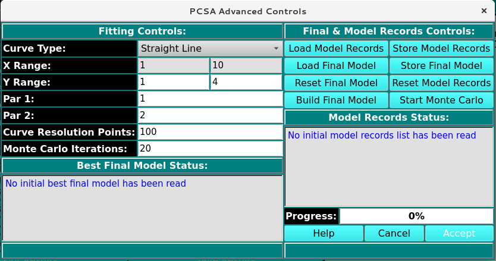

========================
PCSA Advanced Controls 
========================

.. toctree:: 
  :maxdepth: 3

.. contents:: Index
  :local:

This dialog allows user manually adjust the Y range, par1/par2, the Curve resolution points and perform monte carlo analysis on the Best Fitted Model (BFM). 

 
.. rst-class::
    :align: center

    **PCSA Advanced Controls**

Advance Controls Functions:
===========================

**Fitting Controls**

.. list-table::
  :widths: 20 50
  :header-rows: 0

  * - **Curve Type:**
    - The module take the specifies curve type selected in the `PCSA Fit Controls <pcsa_analys.html>`_ Window.
  * - **X Range**
    - The module take the X parameter range specified in the `PCSA Fit Controls <pcsa_analys.html>`_ Window.
  * - **Y Range**
    - Adjust the Y parameter range 
  * - **Par1**
    - Adjust parameter 1 of the selected curve. 
  * - **Par2**
    - Adjust parameter 2 of the selected curve.
  * - **Curve Resolution Points**
    - Adjust the number of points used to simulate along the curve selected. 
  * - **Monte Carlo Iterations:**
    - Set the number of monte carlo interations to perform
  * - (Best Final Model Status)
    - Update the status of the window. 

**Final and Model Records Controls**

.. list-table::
  :widths: 20 50
  :header-rows: 0

  * - **Load Model Records**
    - Load all the model records of the simulated data.
  * - **Load Final Model**
    - load the model with the lowest RMSD. 
  * - **Reset Final Model**
    - Reset the loaded final model
  * - **Build Final Model**
    - Re-simulated the final model withthe lowest RMSD
  * - **Store Model Records** 
    - Save all model records of the latest simulated data
  * - **Store Final Model**
    - Save model with the lowest RMSD of the latest simulated data
  * - **Reset Model Records** 
    - Reset the loaded model record.
  * - **Start Monte Carlo**
    - Start the 
  * - (Model Record Status)
    - 
  * - **Progress** 
    - 
  * - **Help** 
    - Display this detailed help.
  * - **Cancel**
    - Close the dialog window and exit.
  * - **Accept**
    - Close the dialog window, communicate the current Alpha value to the caller, and exit.