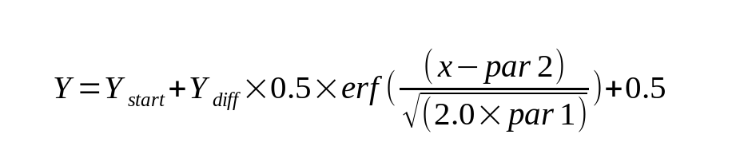

================================================================
Parametrically Constrained Spectrum Analysis Fitting Controls 
================================================================

.. toctree:: 
  :maxdepth: 3

.. contents:: Index
  :local: 

The parameters of this dialog define and control an analysis run to find the set of solutes that best fits experimental data. 
Each analysis run proceeds over a defined set of curves in s and f/f0 space. The single analysis pass produces the model whose associated simulation differs the least from the experimental data, as determined by its RMSD value. Time-invariant and/or radially-invariant noise(s) may also be computed. The curves in a set cover a specified s and f/f0 range and vary according to a specified increment or count. Each model has a specified number of input solute points along its curve. 

After an initial pass in which all the specified model curves are evaluated, the results are sorted by fitness (least RMSD). The best model then becomes the starting point for a second pass that utilizes Levenberg-Marquardt to refine the model. The result of that second pass is inserted as the final best model. 
For a straight line type, a specified variation count is given. Lines cover the full s range, with end points along the f/f0 range varying the specified number of times. Each implied starting point connects with each of the possible end points. So the square of the implied number of f/f0 end points is the number of models analyzed. If the type is Horizontal Line, the f/f0 value is the same for start and end points, so the number of models is the variations count itself (not its square). 

For sigmoid types, a variation count is directly specified. The curves cover the full s and f/f0 ranges, with "par1" and "par2" values each varying the specified number of times, yielding a number of test models equal to the square of that count. The par1 value changes logarithmically from 0.001 to 0.5; and par2 changes linearly from 0.0 to 1.0. 

.. image:: /_static/images/pcsa_analys-line.png
  :align: center

.. rst-class:: center

    **PCSA Fitting Controls**

.. _pcsa_fitting:

PCSA Fitting Process: 
=========================

* **Set the Curve Type:** First, specify the type of curve you expect the species to follow. Choices are: 

.. list-table::
  :widths: 50 50 50 50 50
  :header-rows: 1   

  * - Straight Line
    - Increasing Sigmoid
    - Decreasing Sigmoid 
    - Horizontal Line [ C(s) ]
    - Second-Order Power Law
  * -
    -
    -
    -
    -

.. subfigure:: ABCDE     
  :class-grid: outline 
  :gap: 8px
  :align: center

  .. image:: ../_static/images/pline_stline.png
    :align: left
    :width: 100%

  .. image:: ../_static/images/incr_sigmoid.png
    :width: 100%
    :align: left

  .. image:: ../_static/images/pline_dsig.png
    :width: 100%
    :align: right 

  .. image:: ../_static/images/hori_cs.png
    :width: 100%
    :align: right 

  .. image:: ../_static/images/pline_power.png
    :width: 100%
    :align: right

.. rst-class:: center

    **Example lines of PCSA Fitting Curves**

* **Define the Ranges:** Next, define the s and f/f0 ranges; and directly (sigmoids) or indirectly (lines) give the number of variations in each dimension. 

* **Specify Resolution Points:** Specify how many solute points exist on each curve. 

* **Set Threads:** Next, after control values are set, define a number of threads that is appropriate to the complexity of the run and the number of processors or cores available on your machine. 
* **Start the Fit:** Begin the fit analysis by clicking "Start Fit". 

* **Display and Save Results:** After simulation, a variety of options are available for displaying simulation results, residuals, and distributions. Report text files and graphics plot files can also be generated. 

* **Regularize:** If you wish to perform Tikhonov Regularization, you can set a Regularization Parameter (Alpha) or determine a good parameter value by clicking "Perform Regularization Scan". When you have a reasonable Alpha, click on Regularize Current Model. 

.. image:: /_static/images/pcsa_controls_simulated.png
  :align: center

.. rst-class:: center

    **Updated PCSA Fitting Controls after Simulation completed**

Control dialog parameters differ slightly in interpretation, based on whether the curve type is a line or a sigmoid. 

* If straight line is specified, the curve variation count gives the number of start and end point f/f0 variations. 
* If horizontal line is specified, curve variations gives the total models, since start and end points always have the same f/f0 value.
* If one of the sigmoid types is specified, the specified number of variations is in both the par1 and par2 values of the sigmoid function: 

.. note:: 

 Notes on Fit Stages and Regularization:

 * During all model fitting runs, at least two fit stages occur:
    * **Fixed Stage:** The models following fixed curves that were defined are evaluated and results ordered by best fitness (least RMSD).
    * **LM Stage:** The best model from the previous stage forms the starting point for a Levenberg-Marquardt fit sequence that results in a refined model being found. This refined model gets inserted at the top of the ordered models list.
 * If you wish to apply Tikhonov regularization in order to smooth concentration peaks in the final model, up to two additional stages may occur:
    * **Scan Stage:** Starting with the best model from the LM stage, a range of Regularization Parameter (Alpha) values is tested in a separate dialog to derive an optimal Alpha.
    * **Final Stage:** The result of the LM stage is used as a starting point for one final model computation, this time using a given Alpha.
 * Where regularization is to be employed, then, the two most common run sequences are:
    * **Fixed+LM+Scan+Final** -- where the optimal Alpha is unknown and needs to be determined, then applied.
    * **Fixed+LM+Final** -- where the optimal Alpha is already known or was determined in a previous sequence. This sequence may be employed after a ...Scan... sequence that used moderate Variations Count and Curve Resolution Points for speed. Those Count and Points values may now be increased for accuracy and this Fixed+LM+Final sequence performed.
 * Note that clicking the Start Scan button really initiates a Fixed+LM+Scan sequence. 
    * When it completes, clicking on the Final Fit button results in the Final stage being performed.
 * Note that where regularization is not to be employed (Alpha=0), the only run sequences that will be used is:
     * Fixed+LM -- where the final LM model is the desired overall final model. 

A detailed explanation of the PCSA specific results can be found in `Parametrically Constrained Spectrum Analysis Results <pcsa_results.html>`_

Functions:
============

.. list-table::
  :widths: 20 50
  :header-rows: 0
  
  * - **Curve Type:**
    -  Select from the list of types; either a line or one of the sigmoid types.
  * - **Lower Limit (s x 1e-13):**
    -  Set a lower limit of sedimentation coefficient values to scan.
  * - **Upper Limit (s):**
    -  Set an upper limit of sedimentation coefficient values to scan.
  * - **Lower Limit (f/f0):**
    -  Set a lower limit of frictional ratio values to scan.
  * - **Upper Limit (f/f0):**
    -  Set an upper limit of frictional ratio values to scan.
  * - **Variations Count:**
    -  Specify the number of curve variations in each direction to form the models. Usually, the square of this value is the number of models to analyze. The number of variations is applied to each of "par1" and "par2" in the sigmoid computations. In the Horizontal Line case, this value is the number of models.
  * - **Grid Fit Iterations:**
    -  Specify the number of iterations of fixed grid fits to perform. Each iteration after the first starts with a range of par1 and par2 values or f/f0 values that is refined from the best models of the previous iteration.
  * - **Threshold Delta-RMSD Ratio:**
    -  Specify the ratio of the delta in RMSD to previous iteration RMSD that is the threshold below which the iterative scan is taken to have converged.
  * - **Curve Resolution Points:**
    -  Specify the number of points to generate for each test line. This is the number of solute points that each model will have.
  * - **Maximum L-M Evaluate Calls:**
    -  Specify the maximum number of Levenberg-Marquardt evaluate calls to allow. The default value of 100 is almost always sufficient for L-M to converge. This value is used to insure that a run-away condition will not occur. Additionally, a value of "0" may be specified to suppress L-M and use the final fixed grid best model as the overall best model.
  * - **Thread Count:**
    -  Specify by counter the number of threads to use for computations. This value is the total number of worker threads used at one time. The master thread generally has little work to do during computations, so the value may be set to your machine's total processors or cores, 8-16 threads work best for a typical single-wavelength datasets.
  * - **Start Fit**
    -  Click to begin the fit analysis. The analysis will proceed through fixed curve analysis followed by Levenberg-Marquardt refinement, resulting in either a final model or the base model from which regularization may proceed.
  * - **Stop Fit**  
    -  If something seems wrong with the progress of analysis or if you realize you have parameterized incorrectly, click this button to abort the fit run.
  * - **Perform Regularization Scan**
    -  Once fit analysis is complete, you may optionally click here to bring up a `Regularization Parameter Scan <pcsa_rpscan.html>`_ dialog that sets the best value for Regularization Parameter.
  * - **Regularize Current Model**
    -  Any time you set the Regularization Parameter, either manually or through scan, you may then compute a final model, using that parameter, by clicking here. 

.. note:: Note that if the parameter is set to zero, the button here is relabeled to "Unregularize Current Model".

.. list-table::
  :widths: 20 50
  :header-rows: 0

  * - **Regularize in L-M Fits**
    - This box should normally remain unchecked, but you may check it in order to test regularization during the Levenberg-Marquardt stage of model fitting.
  * - **Regularize in Fixed Fits**
    - This box should normally remain unchecked, but you may check it in order to test regularization during both the fixed-curves and L-M stages of model fitting.
  * - **Fit Time-Invariant Noise**
    - Check this box if you want to calculate time-invariant noise.
  * - **Fit Radially-Invariant Noise**
    - Check this box if you want to calculate radially-invariant noise.
  * - **Plot Results**
    - Open 3-D and Residual plot dialogs to display final results.
  * - **Save Results:**
    - Save final model(s) and any noises generated. Also output `PCSA report <pcsa_results.html#pcsa-report>`_ and plot image files.
  * - **Advanced Controls**
    - Click on this button to open the advanced controls dialog
  * - **Plot Model Lines**
    -  Click on this button to open a dialog showing the Model Lines specified (such as :ref:`Sigmoid Models <pcsa_fitting>`). 
            
.. note:: Note that the dialog is automatically opened upon analysis completion. But this button can be used to re-display completed model lines if the dialog has been closed by the user. The dialogs after analysis include color-coded illustrations of best and near-best models: :ref:`Fitted Models <pcsa_fitting>`.

.. list-table::
  :widths: 20 50
  :header-rows: 0

  * - **Status:**
    -  A progress bar showing activity progress within each iteration pass.
  * - **Best Model Variance:**
    -  The minimum variance value for models thus far computed is continually updated.
  * - **Best Model RMSD:**
    -  Simularly, the minimum RMSD value for models thus far computed is continually updated. 

.. note:: Note that at completion of all model computations, this box and the one above will hold values for the final best model, which might not be a minimum (when regularizing, for example).

.. list-table::
  :widths: 20 50
  :header-rows: 0

  * - **Status Information:**
    -  The text box here is continually updated with summaries of analysis activity and results.

**Window Controls**

.. list-table::
  :widths: 20 50
  :header-rows: 0

  * - **Reset** 
    - Indicate that window is reset and the plots are initiated.
  * - **Help** 
    - Display this detailed PCSA Fitting Controls help.
  * - **Close** 
    - Close all windows and exit.

