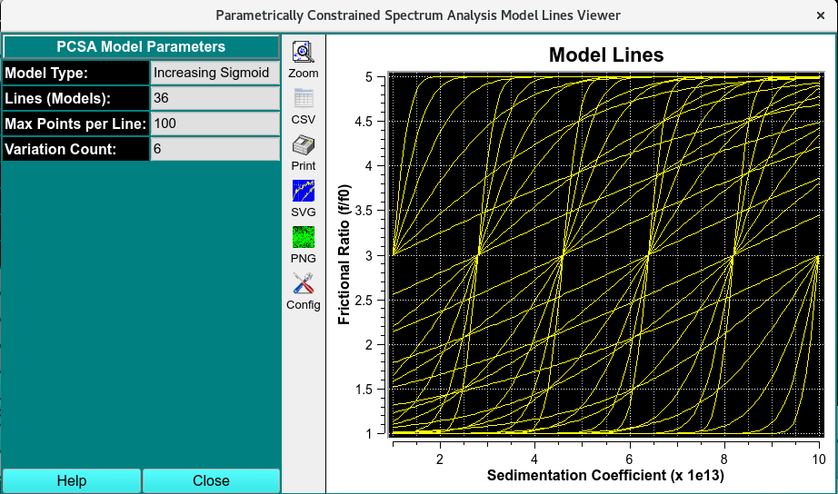
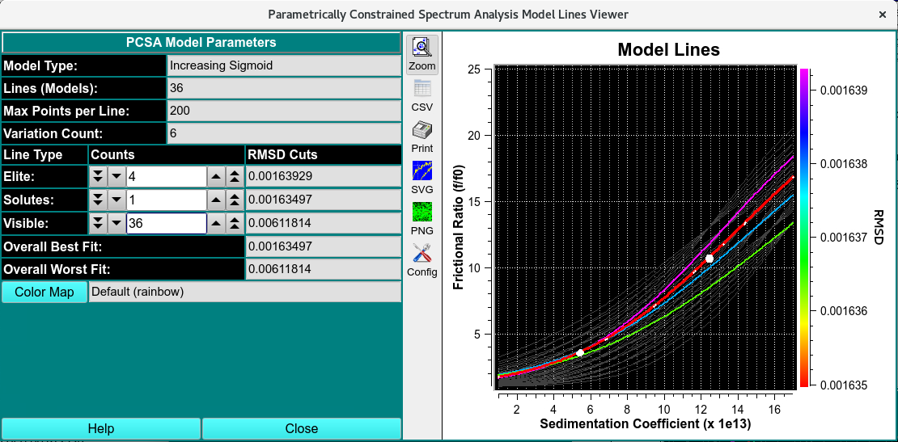

============================
Model Lines Plot for PCSA
============================

.. toctree:: 
  :maxdepth: 3

.. contents:: Index
  :local: 

This dialog displays the lines in s x f/f0 space that define models evaluated by Parametrically Constrained Spectrum Analysis. The lines from the best models are illustrated with color coding. Worst-model lines are shown with dark gray lines or may be removed from the plot. A selected set of the best model lines contain white dots showing computed solute points, with size proportional to relative concentration. 

The appearance of the plot may be governed by setting the cutoff points in terms of line counts for (1) the number of "elite" (best-model, lowest-RMSD) colored lines; (2) the number of the best models for which to show solute points; and (3) the number of overall visible lines. It is also possible to choose an alternative color map. The default color map ranges through the colors of the rainbow from red (best) to magenta (worst of the elite). 

Dialog Sections: 
==================

    * **Model Documentation:** A set of read-only text boxes that document the type of analysis that was performed. 
    * **Display Controls:** A set of line counters and their accompanying read-only RMSD equivalents for specifying the cutoff points of elite, solute-containing, and visible lines. There are also read-only text boxes showing the best and worst overall RMSD values from the fits. 
    * **Color Map:** A button for choosing a file containing an alternative to the default color map. 
    * **General Control:** For example, the Close button. 
    * **Model Lines Plot:** Plotted lines and axes including the color gradient. 

.. rst-class::
    :align: center

    **PCSA Model Lines Initiation Grid**

Sample Model Lines Dialogs: 
=============================

The plot dialog differs slightly based on whether the curve type is a line or a sigmoid. Below are images for sigmoids and straight line. 

.. rst-class::
    :align: center

    **Simulated PCSA Sigmoidal Model Lines**

.. image:: ../_static/images/pcsa_mline_str.png
    :align: center

.. rst-class::
    :align: center

    **Simulated PCSA Straight Model Lines**

Functions: 
===============

.. list-table::
  :widths: 20 50
  :header-rows: 0

  * - **Model Type:**
    - Documentation of the type of curve that defines models. 
  * - **Lines (Models):**
    - Documentation of the number of model lines that were created. 
  * - **Points per Line:**
    - Documentation of the number of solute points in input models. 
  * - **f/f0 Increment:** 
    - The frictional ratio increment between the set of start and end point variations for straight-line models. 
  * - **Variation Count:** 
    - The number of variations in each of par1 and par2 in the computation of sigmoid model curves. 
  * - **Elite:** 
    - To the right of this label is a counter for setting the number of colored best-model lines to display. To the right of the counter is the RMSD-cutoff equivalent. 
  * - **Solutes:** 
    - To the right of this label is a counter for setting the number of best-model lines for which solute points are to be displayed. To the right of the counter is the RMSD-cutoff equivalent. 
  * - **Visible:**
    - To the right of this label is a counter for setting the number of visible lines to show. Normally, this should range from the Elite count to the number of total lines. To the right of the counter is the RMSD-cutoff equivalent. 
  * - **Overall Best Fit:**
    - The read-only text box to the right of this label documents the lowest overall RMSD value encountered. 
  * - **Overall Worst Fit:** 
    - The read-only text box to the right of this label documents the highest overall RMSD value encountered. 
  * - **Color Map:** 
    - This button opens a Load Color Map dialog in which an alternative color map file may be selected. To the right of the button is a text box giving the name for the current selection. A default UltraScan installation will contain a number of color map files. You can construct your own variation using the Color Gradient Generator. At the opening of the plot dialog, a default rainbow colors map is selected. 
  * - **(Model Lines):** 
    - The plot on the right of the dialog window displays model lines as controlled by the user. The right side axis shows the color gradient annotated with corresponding RMSD values. 
  * - **Help** 
    - Display this and other documentation. 
  * - **Close** 
    - Close all windows and exit. 

.. Note::
     that RMSD values increase from bottom to top, as is the convention with numeric annotation. But this means that the color corresponding to the best model is shown on the bottom. 

.. note::
     that the images and controls documented above are for model lines plots shown after a fit computation. There are also variations of this dialog showing pure single-color lines before any fit. There are 4 basic variations of this dialog depending on whether it is displayed before or after a fit and on whether the curve type is straight line or sigmoid. 