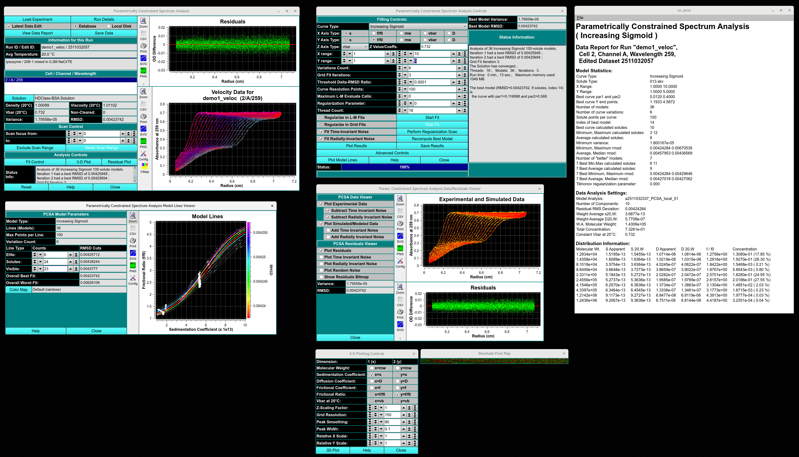
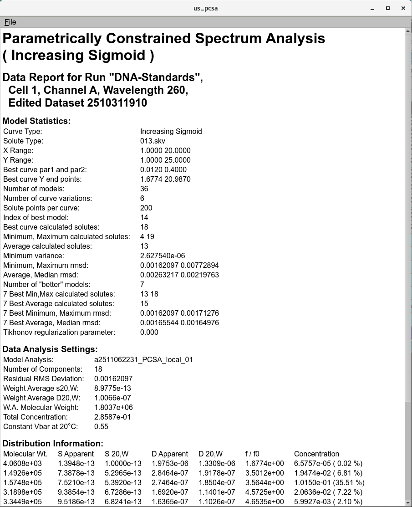

=====================================================
Parametrically Constrained Spectrum Analysis Results
=====================================================

.. toctree:: 
  :maxdepth: 3

.. contents:: Index
  :local: 

Upon completion of an analysis fit, windows and plots generated include: 

* `PCSA Fitting Controls <pcsa_analys.html>`_ - Once the PCSA module has simulated the model with, the Status Information on the window updates to include the best model after the iterative simulations are done. the par1 and par2  for the curves updates.  
* `PCSA model lines viewer <pcsa_rpscan.html>`_ - simulated model lines; 
* :ref:`PCSA data/residuals viewer <pcsa_data_residuals_viewer>` - Visual comparison of simulated and experimental data. Graphical display of time and radially invariant noises subtracted; 
* :ref:`PCSA Report <pcsa_report>` - Generate a Simulated model Report file and view it in a dialog;
* :ref:`Bit Map residuals <residual_bit_map>` Bit map of every scan as a pixel line and the positive or negative difference of the model to the data are highlighted as red (negative) and green(positive) pixels. an Excellent residual map will have a random distribution of red and green pixels; 
* `3-Dimensional Plot Controls <../3d_plot.html>`_ - 3D plots of the simulated data

.. rst-class::
    :align: center

    **Simulated PCSA Results**

PCSA Data Residuals Viewer
============================

.. _pcsa_data_residuals_viewer:

The simulation creates a data set with the same ranges as the edit experimental data set. The actual values for scan readings vectors are synthetically produced, as illustrated by the plot below.

.. image:: ../_static/images/pcsa_res_viewer.png
    :align: center

.. rst-class:: 
    :align: center
    
    **PCSA Data and Residual Viewer**

Residual Bit Map
=================

.. _residual_bit_map:

Experimental-Simulation residuals are plotted in another way in a bit map. This small window represents each residual #Scans x #Readings point as a color: green where simulation is greater than experimental; red where experimental is greater. A random distribution of colors throughout the bit map is indication of a good model fit. 

.. image:: ../_static/images/pcsa_bitmap.png
    :align: center

.. rst-class:: 
    :align: center

    **Pixel Bit Map**

PCSA Report
===============

.. _pcsa_report:

The "Save Data" button in the `PCSA Controls <pcsa_analys.html#pcsa-fitting-process>`_ produces a set of report files. One of these is displayable via the "View Report" button, which produces a dialog that shows the contents of a report. A dialog sample follows. 

.. rst-class:: 
    :align: center

    **PCSA Report**

  **Detailed 2DSA Report**

   - **Heading 1:** Analysis type
   - **Heading 2:** This heading indicates the "dataset named in the Import module", the cell number, channel, and wavelength triplicate, the edit profile processed in the Edit data module,  
   - **Model Statistics:** The settings entered to generate the models and the. The model line used by the analysis,  number_the type of analysis completed_the database request number_number of models in the analysis cohort
   - **Data Analysis Settings:** The name of the model is determined by the analysis number_the type of analysis completed_the database request number_number of models in the analysis cohort
   - **Number of components:** Number of components with unique s, and D values. 
   - **Residual RMS Deviation:** The RMSD determined by re-simulating the model in the finite element viewer module. 
   - **Model-reported RMSD:** The RMSD of the simulated model determined by message passing interface (MPI ) or the 2DSA GUI.
   - **Weight Averaged s20,W, D20,W, Molecular weight, and f/f0:** describe the weight averaged (using % of the total concentration) to calculate the s20,W, D20,W, Molecular weight, and f/f0 coefficients of each component at 20ºC and in water. 
   - **Total concentration:** The baseline and noise subtracted optical density at the measured wavelength of the absorbing components as a function of radius.  
   - **Constant vbar20:** The analyte vbar at 20ºC. 

.. note:: 
   Difference between the Residual RMSD and model-reported RMSD should be within 3 significant figures. Greater then 3 significant figures indicates an error in analysis. 

Distribution Information Units:
-------------------------------

- **Molec. Wt.:** Dalton
- **S Apparent:** seconds
- **S 20,W:** Seconds 
- **D Apparent:** cm²/s
- **D 20,W:** cm²/s
- **f/f0:** unitless
- **Concentration:** optical density (OD) at measured wavelength, (% contribution)
