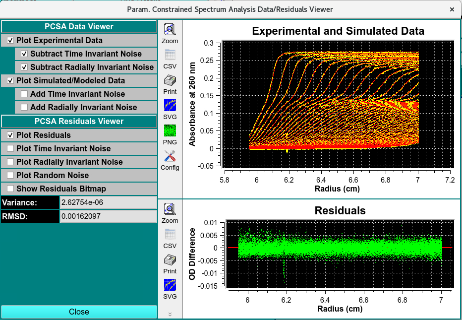
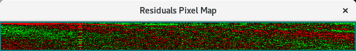
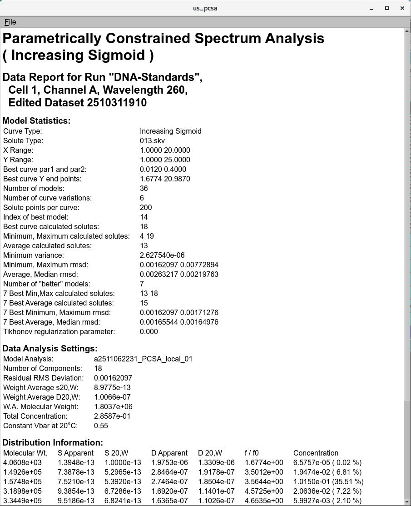

=====================================================
Parametrically Constrained Spectrum Analysis Results
=====================================================

.. toctree:: 
  :maxdepth: 3

.. contents:: Index
  :local: 

.. _pcsa-data-residuals-viewer:

PCSA Data Residuals Viewer
============================

The simulation creates a data set with the same ranges as the edit experimental data set. The actual values for scan readings vectors are synthetically produced, as illustrated by the plot below.

.. rst-class:: 
    :align: center
    
    **PCSA Data and Residual Viewer**

Residual Bit Map
=================

.. _residual_bit_map:

Experimental-Simulation residuals are plotted in another way in a bit map. This small window represents each residual #Scans x #Readings point as a color: green where simulation is greater than experimental; red where experimental is greater. A random distribution of colors throughout the bit map is indication of a good model fit. 

.. rst-class:: 
    :align: center

    **Pixel Bit Map**

.. _pcsa-report:

PCSA Report
===============

The "Save Data" button in the `PCSA Controls <pcsa-fitting-process>` produces a set of report files. One of these is displayable via the "View Report" button, which produces a dialog that shows the contents of a report. A dialog sample follows. 

.. rst-class:: 
    :align: center

    **PCSA Report**

  **Detailed 2DSA Report**

   - **Heading 1:** Analysis type
   - **Heading 2:** This heading indicates the "dataset named in the Import module", the cell number, channel, and wavelength triple, the edit profile processed in the Edit data module,  
   - **Model Statistics:** The settings entered to generate the models and the. The model line used by the analysis,  number_the type of analysis completed_the database request number_number of models in the analysis cohort
   - **Data Analysis Settings:** The name of the model is determined by the analysis number_the type of analysis completed_the database request number_number of models in the analysis cohort
   - **Number of components:** Number of components with unique s, and D values. 
   - **Residual RMS Deviation:** The RMSD determined by re-simulating the model in the finite element viewer module. 
   - **Model-reported RMSD:** The RMSD of the simulated model determined by message passing interface (MPI) or the 2DSA GUI.
   - **Weight Averaged s20,W, D20,W, Molecular weight, and f/f0:** describe the weight averaged (using % of the total concentration) to calculate the s20,W, D20,W, Molecular weight, and f/f0 coefficients of each component at 20ºC and in water. 
   - **Total concentration:** The baseline and noise subtracted optical density at the measured wavelength of the absorbing components as a function of radius.  
   - **Constant vbar20:** The analyte vbar at 20ºC. 

.. note:: 
   Difference between the Residual RMSD and model-reported RMSD should be within 3 significant figures. Greater then 3 significant figures indicates an error in analysis. 

Distribution Information Units:
-------------------------------

- **Molec. Wt.:** Dalton
- **S Apparent:** seconds
- **S 20,W:** Seconds 
- **D Apparent:** cm²/s
- **D 20,W:** cm²/s
- **f/f0:** unitless
- **Concentration:** optical density (OD) at measured wavelength, (% contribution)

