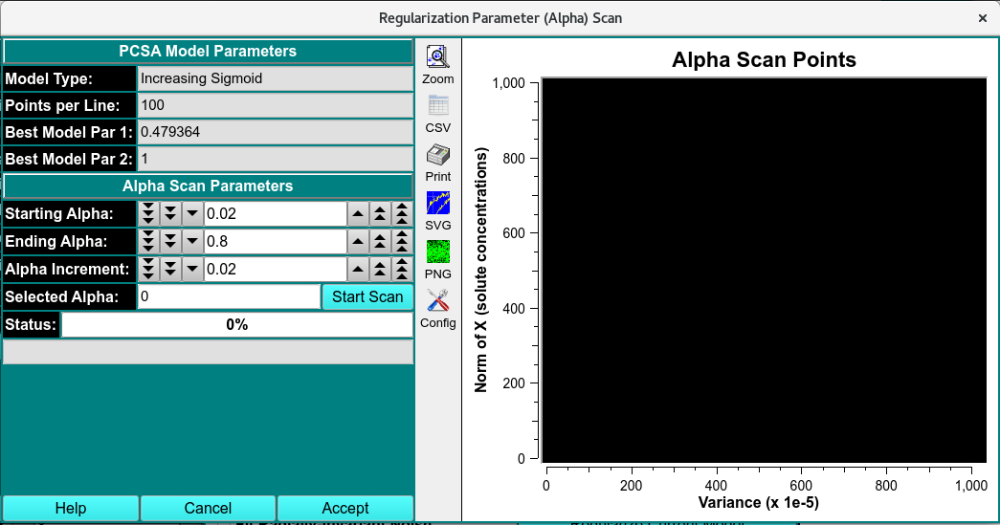
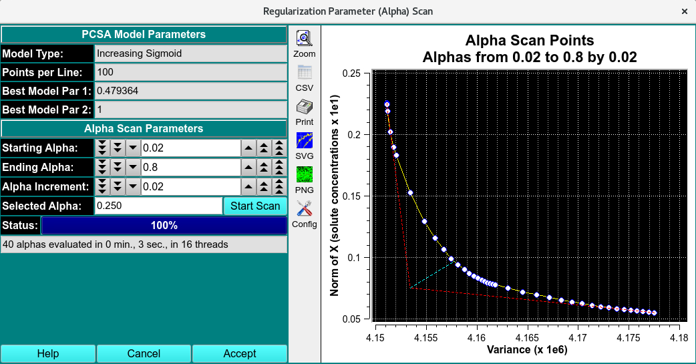

=================================================
Regularization Parameter Scan and Plot for PCSA
=================================================

.. toctree:: 
  :maxdepth: 3

.. contents:: Index
  :local: 

This dialog provides the means to perform a scan of possible regularization parameter (alpha) values. Regularization is done once the Best Fit Model (BFM) has been generated. The solution can include false-positive contributions from the stochastic noise in the data. Tikhonov regularization (TR) minimizes the contributions of the false positive components by adding a regularization parameter (alpha) - a number between 0.0 and 1.0 - where 0 has no regularization and 1 has maximum regulariation at the expense of goodness of fit. The final selected Alpha value is passed back to the Analysis Control dialog of PCSA. A full Parametrically Constrained pass can then be performed for the constant Alpha value.

The dialog begins with the final best model from an initial PCSA scan. The user chooses a range and increment of Alpha values and initiates a scan that computes models, each of which will have an associated variance and x-norm-squared value. The plot produced tracks a line through each of those points. The "elbow" of the curve is analytically determined and graphically represented. The Alpha of the elbow point may be accepted as is. Alternatively, the user may select a different point by holding down the Ctrl key and the left mouse button while positioning the resulting vertical line at the desired curve point. At mouse button release, the Alpha is displayed beneath the vertical line and in the Selected Alpha text box. Clicking the Accept button will close the dialog and communicate the Alpha in the text box to the calling PCSA Analysis Control dialog. Note that the text box Alpha may be manually changed to refine the accepted value. 

Sample Regularization Parameter Scan Dialogs: 
---------------------------------------------

The dialog images below show the plot results after a scan of Alpha values has completed. The yellow line connecting white dots tracks the variance, x-norm points associated with each Alpha. The red dashed lines are straight lines fitted to the first and last 5 points of the curve. The cyan line extends from the intersection of the two red lines to the point on the curve nearest to it. That nearest point is taken as the "elbow" of the curve; and its associated Alpha is the automatically determined best value. In the second image below, the user uses the Ctrl key and left mouse button to select an overriding elbow point and its associated Alpha value. 

.. rst-class:: center

    **Before Regularization**

.. rst-class:: center

    **After Regularization**

.. note::
  1. The text box Alpha may be manually changed to refine the accepted value.
  
  2. Model line point and variation values may be selected for speed in preparation for the Alpha scan. Once the Accept button is clicked here and focus is returned to the Analysis Control dialog, larger point and variation values may be used, along with the selected Alpha, in order to compute a more accurate final model. 

Regularization Parameter Functions:
-----------------------------------

.. list-table::
  :widths: 20 50
  :header-rows: 0

  * - **Model Type:**
    - Documentation of the type of curve that defines models.
  * - **Points per Line:**
    - Documentation of the number of solute points in input and scan models.
  * - **Best Model Par 1:**
    - Documentation of the par1 value of the line   that defines the input solutes of the model.
  * - **Best Model Par 2:**
    - Documentation of the par2 value of the line   that defines the input solutes of the model.
  * - **Starting Alpha:**
    - A counter by which the user can set the starting Alpha of the scan to perform.
  * - **Ending Alpha:**
    - A counter by which the user can set the ending Alpha of the scan to perform.
  * - **Alpha Increment:**
    - A counter by which the user can set the increment between test Alphas in the scan to perform.
  * - **Selected Alpha:**
    - A text box that is filled with the analytically determined Alpha or an Alpha associated with the curve point interactively set by the user using Ctrl-Left-Button mouse selection. This text box value can also be manually changed.
  * - **Start Scan**
    - Click on this button once the scan Alpha range has been set, in order to begin a scan.
  * - **Accept**
    - Close the dialog window, communicate the current Alpha value to the caller, and exit.

**Window Controls**

.. list-table::
  :widths: 20 50
  :header-rows: 0 

  * - **Help** 
    - Display this detailed help.
  * - **Cancel**
    - Close the dialog window and exit.

