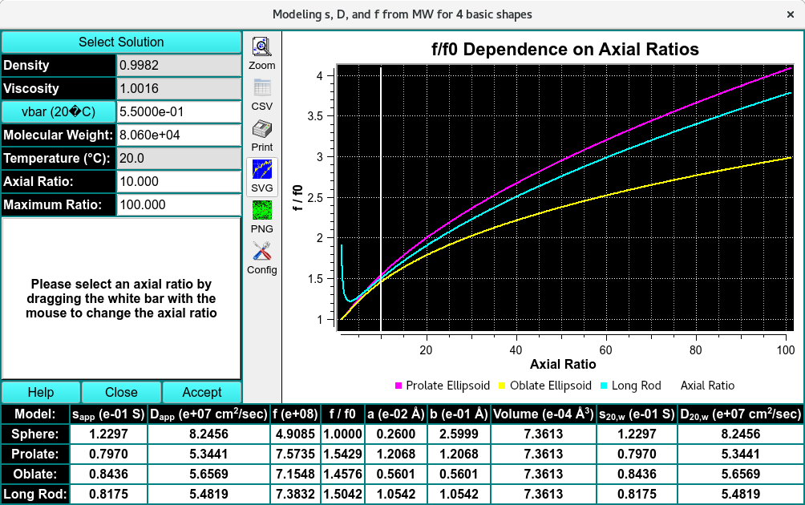

========================================
Modeling for Shapes
========================================

.. toctree:: 
  :maxdepth: 3

.. contents:: Index
  :local: 

 In this dialog, you select an axial ratio to model component parameters for 4 basic shapes.

.. rst-class:: 
    :align: center

    **Analyte Shape Prediction**