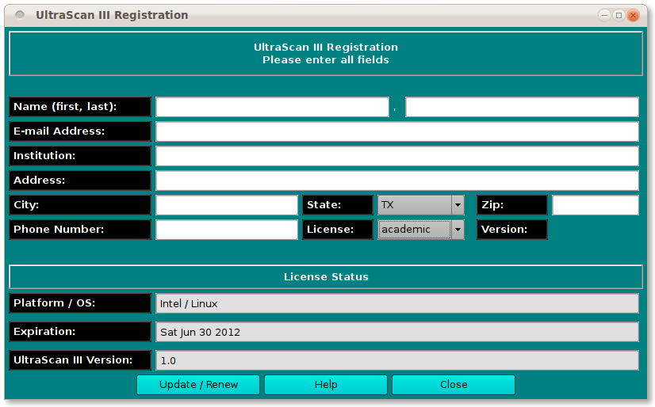

==========================================
Registration / License Update Panel
==========================================

.. toctree:: 
  :maxdepth: 3

.. contents:: Index
  :local: 

The registration control panel allows UltraScan III registration or update of a license. The contact fields should be filled out completely and then the Update / Renew button clicked. 
If you are registering for the first time, you will be sent an e-mail with instructions for completing the registration process. If you are simply updating information, the process is complete after Update / Renew. 

 

This panel is self-explanatory. For completeness, the GUI options are detailed below. Be sure to fill out all text boxes. 

 * **Name (first, last):** - Fill in your first and last name. 
 * **E-mail address:** - Give your best contact e-mail address. 
 * **Institution:** - Fill in the institution or company at which you will be using UltraScan III. 
 * **Address:** - Fill in address number and street. 
 * **City:** - Give your city name. 
 * **State:** - Select your state. 
 * **Zip:** - Fill in the postal zip code. 
 * **Phone Number:** - Give your best contact telephone number. 
 * **License:** - Enter the license type you desire:** academic or commercial. 
 * **Update / Renew** - When all the above fields are complete, click this button to complete the registration or update. 
 * **Help** - See this documentation. 
 * **Close** - Exit the registration dialog. 