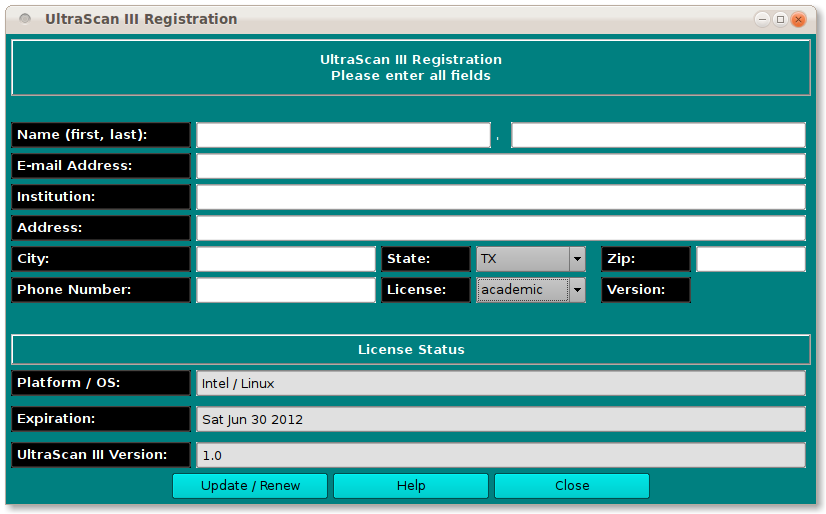
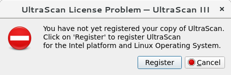
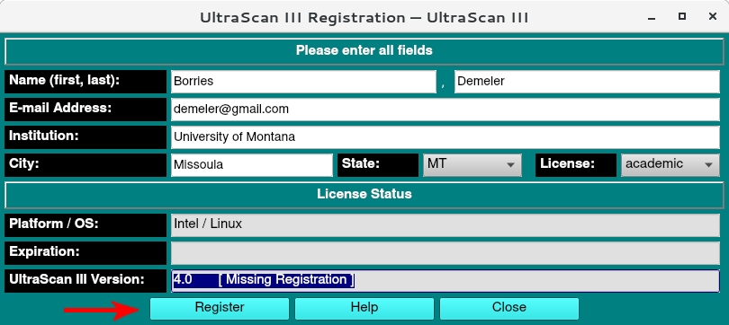
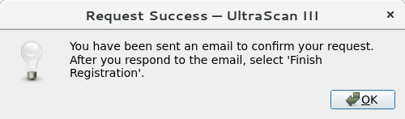
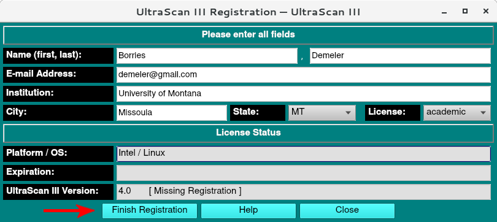
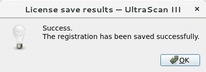
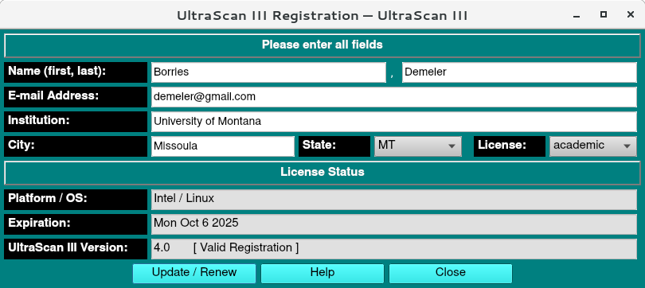

==========================================
Registration / License Update Panel
==========================================

.. toctree:: 
  :maxdepth: 3

.. contents:: Index
  :local: 

The registration control panel allows Ultrascan-III registration or update of a license. The contact fields should be filled out completely and then the Update / Renew button clicked. 
If you are registering for the first time, you will be sent an e-mail with instructions for completing the registration process. If you are simply updating information, the process is complete after Update / Renew. 

Process:
==========

Each user must register their Ultrascan-III installation. If you have multiple computers, your registration must be repeated on each device and each account sued, but the associated license is automatically transferred, as long as the same e-mail address is used. Registration is invoked automatically the first time UltraScan is started, or when the current registration is expired. If UltraScan has not previously been registered, a dialog pops up. The registration program will auto-detect your hardware platform and operating system. Click on "Register":

After clicking on "Register", the registration dialog opens up:

Fill in your contact information and click on "Register" to submit your registration (red arrow).

.. note:: 
  Your computer must be connected to the network for the registration to succeed!

A 1 year license for the free use of UltraScan will be generated remotely. An email will be sent to the registered email address with an activation link, which must be confirmed:

After confirming your UltraScan registration by clicking on the link in the email that was sent, the last step is to click on "Finish Registration" (red arrow) to confirm receipt of the license. If the registration was successful, you can finish the registration process by clicking on "Finish Registration" (red arrow): 

.. note:: 
  Again, your computer must be connected to the network for this step of the registration to succeed. 

A 1 year license for the free use of UltraScan is now associated with the user's e-mail address, and a dialog should indicate the success of this step: 

The leftmost button now should read "Update/Renew": The license will expire after one year and can be renewed by simply clicking on the **Update/Renew** button: 

License Functions:
====================

This panel is self-explanatory. For completeness, the GUI options are detailed below. Be sure to fill out all text boxes. 

 * **Name (first, last):** - Fill in your first and last name. 
 * **E-mail address:** - Give your best contact e-mail address. 
 * **Institution:** - Fill in the institution or company at which you will be using Ultrascan-III. 
 * **Address:** - Fill in address number and street. 
 * **City:** - Give your city name. 
 * **State:** - Select your state. 
 * **Zip:** - Fill in the postal zip code. 
 * **Phone Number:** - Give your best contact telephone number. 
 * **License:** - Enter the license type you desire:** academic or commercial. 
 * **Update / Renew** - When all the above fields are complete, click this button to complete the registration or update. 
 * **Help** - See this documentation. 
 * **Close** - Exit the registration dialog. 