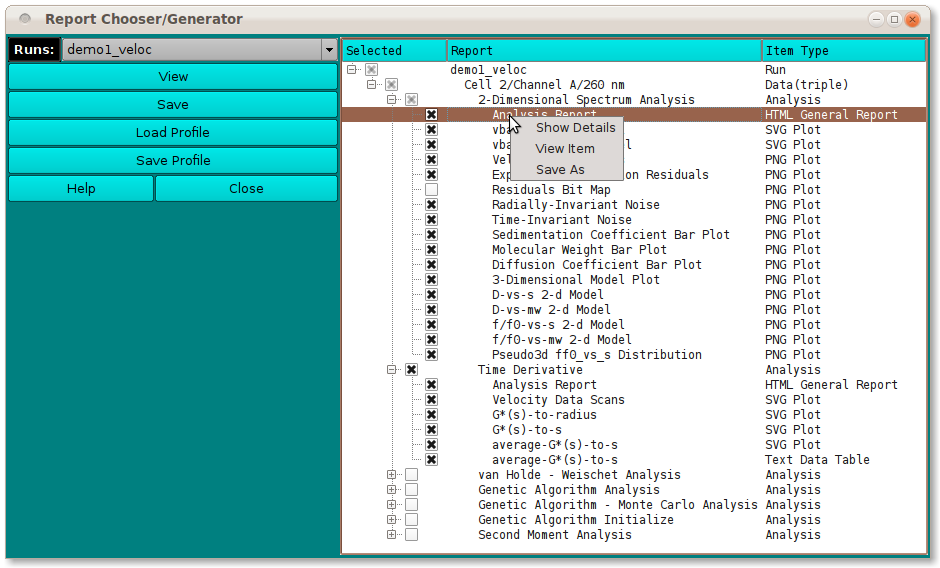

==========================================
Manage Data in Database and on Local Disk
==========================================

.. toctree:: 
  :maxdepth: 3

.. contents:: Index
  :local: 
  
This module is launched from the US main window using the Utilities > Report Generator menu item. It enables the user to create and view a composite report generated from selections of individual analysis program reports and plots. 
Upon launch, selection of a Run (or **all** runs) populates a data tree with reports from which to select the components of the composite report. A click on the **View** or the **Save** button generates the report, which can be viewed in a browser and printed. Both the composite report HTML and all the component reports and plots are copied to a new folder so that the page is fully self-contained, can be archived, and can be viewed in the future. 

.. image:: _static/images/manage_data.png
    :align: center

Functions:
================

.. list-table::
  :widths: 20 50
  :header-rows: 0

  * - **Runs:** 
    - Select a run identifier to present reports for that run or select **all** to show all available reports of all runs.
  * - **(data tree selections)** 
    - Select reports and plots for the composite by checking the box to the left of an item. A check or uncheck of an item above the final (report/plot) tree level selects or de-selects all lower-level items. A check box with a shaded mark indicates that some (not all) of the item's descendant items have been selected. Click on the **+** or **-** boxes to expand or collapse tree portions.
  * - **View**
    - Once selections are as desired, click on this button to generate the composite report and view it in the configured browser. See a :ref:`Sample composite report view <reporter-view>`. A print within the browser can be used to generate hardcopy or a PDF version. Component reports and plots will start on page boundaries.
  * - **Save** 
    - Click this button to generate the report, but without being immediately taken to a view of it. You will receive a Notice of report save..
  * - **Load Profile** 
    - Make component report selections by means of a previously saved selection profile. Click this button to initiate a Profile Load Dialog.
  * - **Save Profile** 
    - Save component report selections for later use by clicking this button to initiate a Profile Save Dialog. Note that you need only specify the base name for the saved file. An **rs_** prefix and **.xml** extension will be automatically added.
  * -  **Help** 
    - Display this and other documentation.
  * -  **Close** 
    - Close all windows and exit.

.. image:: _static/images/reporter-view.png
    :align: center
    
.. _reporter-view:

Item Row Context Menu Options:
===============================

Right-mouse-button clicking on a data tree row displays a context menu that applies to the row item.

Dialog items:
---------------

.. list-table::
  :widths: 20 50
  :header-rows: 0
  
  * - **Show** 
    - Details Release on this menu item to see an Item Details Window.
  * - **View** 
    - Item Release on this menu item to view an Item View Window. This is a way to preview individual items that are potential candidates for the composite report.
  * - **Save** 
    - As Save a copy of the currently selected item. The location and name of the file copy may be chosen in the resulting standard file dialog.
