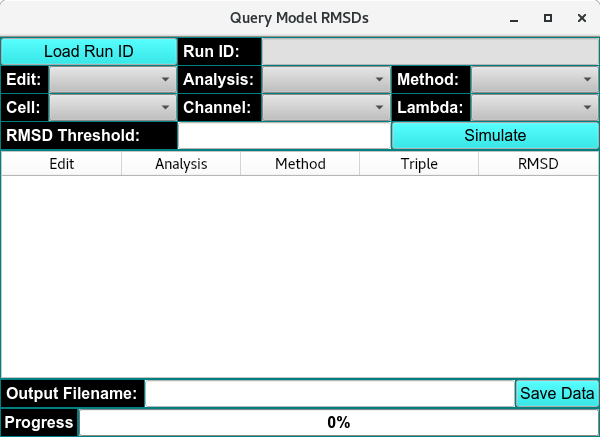
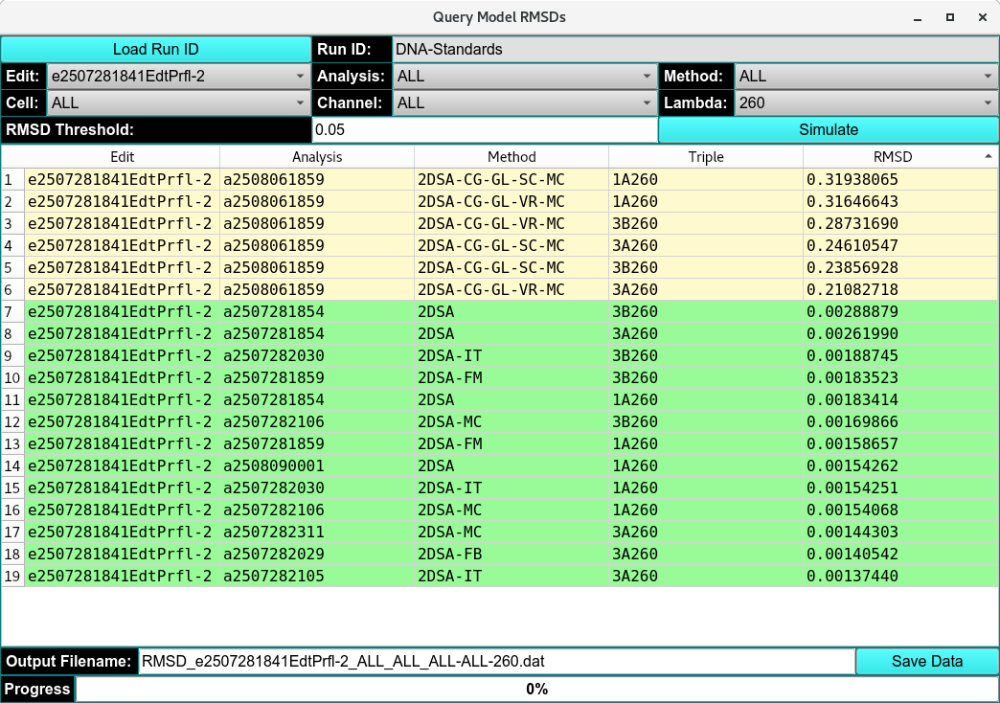

=========================================
RMSD Model Query  
=========================================

.. toctree:: 
  :maxdepth: 3

.. contents:: Index
  :local: 
  
  
The RMSD Model Query and Simulation module allows you to retrieve and evaluate RMSD (Root Mean Square Deviation) results for all models fitted to a selected experimental run.

.. rst-class::
    :align: center

    **Empty RMSD Model Query Window**

When you open the module, click on "Load Data" to loads the chosen experimental run. You can then specify the following parameters:

* **Edit Profile:** Select the data edit profile to be used.
* **Cells and Cell Channels:** Choose the cell(s) and corresponding channel(s).
* **Analysis:** Select the analysis type.
* **Analysis Method:** Choose the analysis method(s) to include.
* **Lambda:** Specify the wavelength(s) at which the sample(s) were measured.
* **RMSD Threshold:** Set the maximum acceptable RMSD value.

Once parameters are selected, you can run the simulation to compute the RMSD for every combination of edit, analysis, method, and sample triplicate. RMSD results are displayed in a table, where values below the threshold are highlighted in green and values above the threshold in yellow. The table can be exported as a .dat file for further processing.

.. rst-class::
    :align: center

    **Loaded RMSD Model Query Window**

For deeper inspection, select an item from the results list and click Simulate to generate:

* `Finite Element Data / Residual Viewer <fe_match_simulate.html>`_

* `Residual Pixel Map <fe_match_simulate.html>`_

* `3D Plot Controls <3d_plot.html>`_

These tools allow detailed examination of model fits and residual map. 