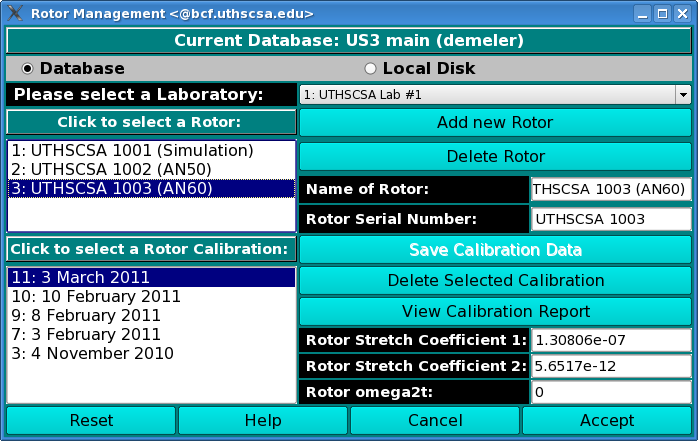
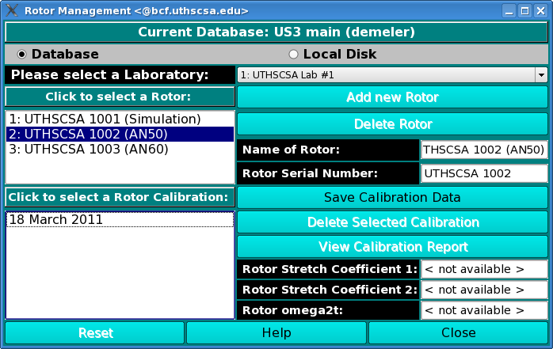

============================
Manage Rotor Information
============================

.. toctree:: 
  :maxdepth: 3

.. contents:: Index
  :local: 

How to Manage Rotors and Rotor Calibration files
=======================================================

Using this window, you can manage rotor information on your local disk or in the current database. 

.. rst-class:: 
  :align: center

    **Edit solution Window**

To load rotor information into the current window, first select the Use Database or the Use Local Disk radio button. Then select the appropriate lab in the lab drop-down box. Follow the sequence below that fits your particular situation. Note: most likely you will be using Sequence 1. 

Select and View Rotor information
-------------------------------------------

In this sequence you have come to this window from US_Convert, and you would like to select the rotor and rotor calibration that were in place during your experiment. First, select the appropriate rotor from the top listbox, and then select the correct rotor calibration profile. The rotor calibration profiles are sorted in reverse order by date, so that the most recent one is on top. This is the most likely choice. 
Once the lab, rotor, and rotor calibration have been selected, you may click on the `View Calibration Report <rotor_calibration>` button to view the report, or view other related information in the stretch coefficient boxes or the omega2t box. Click the **Accept** button to confirm your choices and return to the previous window. 

.. rst-class::
    :align: center

    **Rotor Management**

Add Rotor Calibration
------------------------------

.. note::
    Administrators only. 

In this sequence you have come to this window from `Rotor Calibration <rotor_calibration.html>`_ module and you would like to associate the calibration with an existing rotor. Click on the rotor you would like to associate and then click on **Save Calibration Data.** 

.. rst-class::
    :align: center

    **Add Rotor Calibration**

Add New Rotor
------------------------

.. note::
    Administrators only. 

Click on **Add Rotor** to add a new rotor. 

.. rst-class::
    :align: center

    **Add New Rotor**

Rotor Calibration:
=====================

.. _rotor_calibration:

Calibration reports can be loaded to each Rotor in this window. 

.. image:: _static/images/rotorstretch_report.png
  :align: center

.. rst-class::
    :align: center

    **Rotor Calibration Report**

The Rotor Calibration reports can be generated in `Edit Rotor Calibration <rotor_calibration.html>`_