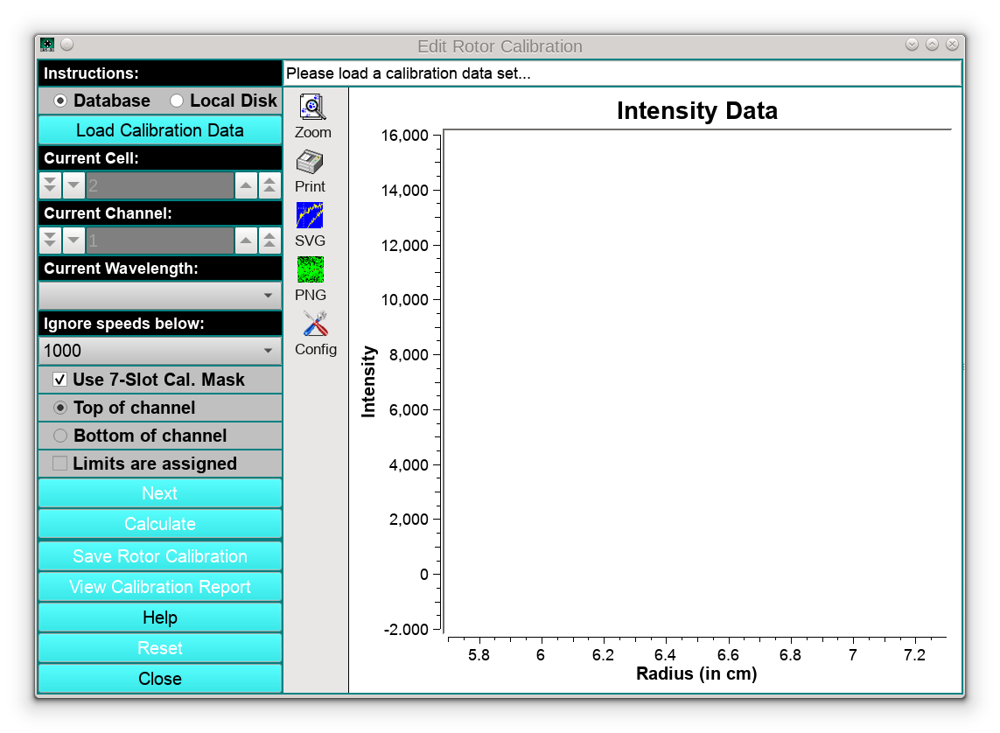
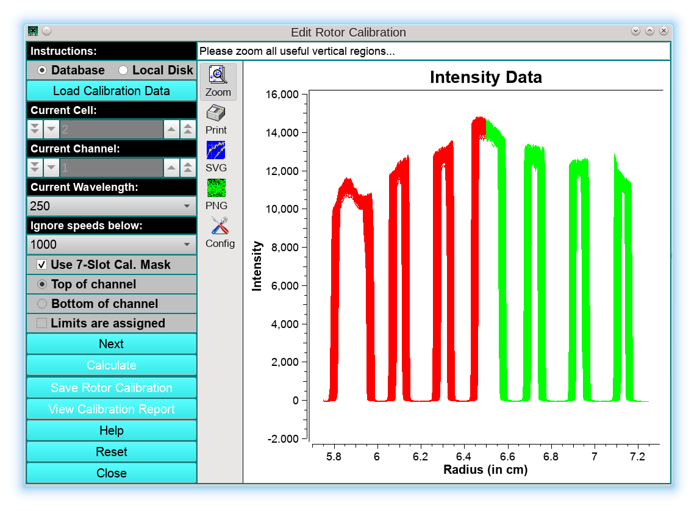
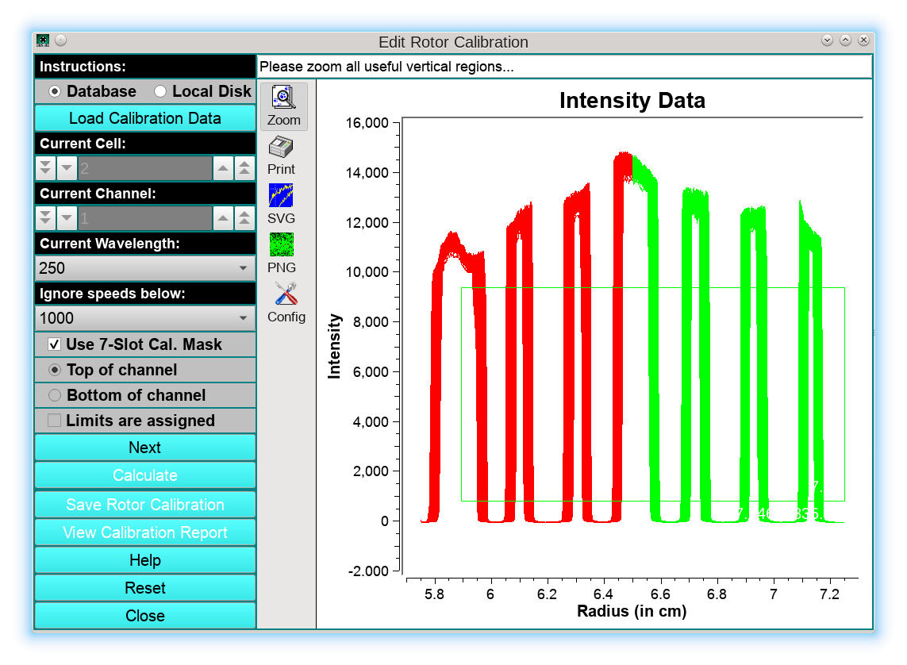
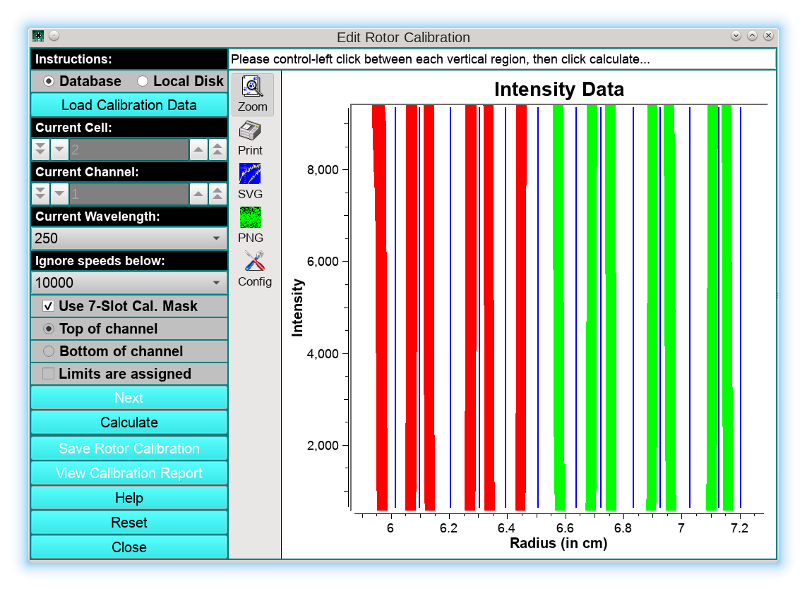
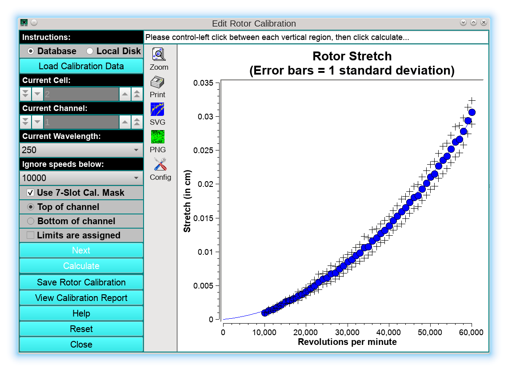
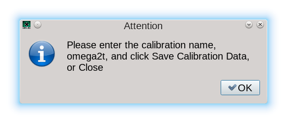

==============================================
Rotor Stretch Calibration Utility
==============================================

.. toctree:: 
  :maxdepth: 3

.. contents:: Index
  :local: 

.. rst-class::
    :align: center

    **Edit Calibration Data**

The purpose of this program is to analyze rotor stretch profile data acquired with the analytical ultracentrifuge, and to create a rotor stretch calibration profile for different rotors in use at a laboratory.

In combination with the centerpiece geometry, the rotor stretch calibration serves to inform all analysis protocols relying on finite element modeling about the position of the cell bottom, which is one of the boundary conditions required for the solution of the Lamm equation. During acceleration, the rotor will stretch and move the bottom of the celll position by the amount of the stretch outward. The stretch is a function of the rotor speed, which depends on the square of the angular velocity. The rotor stretch calibration profile is stored in the LIMS database for each rotor in use and retrieved on the fly to calculate boundary conditions. This value is calculated based on a second-order polynomial that describes the amount of stretch observed for each rotor.

The amount by which each rotor stretches as a function of rotor speed depends on the rotor's type and age. Hence it is advisable to individually calibrate each rotor in use periodically. The rotor stretch is mostly independent of temperature and can be measured at any temperature.

The rotor stretch can be measured with either the Proteomelab XLA/XLI instrument or the Optima AUC. The Optima is preferred, because it offers higher radial resolution, and hence more reproducible data. The recommended protocol is to acquire the calibration data by scanning the 7-channel calibration disk **(available from AUC Solutions, 15826 Los Altos, Houston, Texas 77083, USA Telephone: (210) 920-4AUC)** which provides the highest statistical significance by measuring displacement replicates from 13 edges.

The scanning protocol prescribes to spin up the rotor to 3,000 rpm and to wait 15 minutes, then to scan the calibration disk five times in intensity mode. When scanning is complete, the rotor is accelerated by 1,000 rpm to 4,000 rpm, and, following another 15 minute equilibration period, the calibration disk is scanned again five times in intensity mode. This cycle is repeated until the maximum speed of the rotor has been reached.

The first step in the program is to load the calibration data from a 7-channel calibration disk by clicking on the **Load Calibration Data** button. Once the data are loaded, the user can select a different cell, channel, or wavelength from this data set by manipulating the respective counters or drop-down lists. The intensity data will be shown graphically in the main window. The left half of the cell will be drawn in red, the right half in green. Make sure the checkbox **Use 7-Slot Cal. Mask** is checked!, and select the lowest speed to be included in the fit. We recommend to set the slowest speed to 10,000 rpm, because the rotor stretch below 10 krpm is less than the radial resolution of the instrument and therefore those measurements are not useful. In the status bar the message: "Please zoom all useful vertical regions..." will appear:

In the next step, the user needs to zoom all vertical regions, marking the edge positions in the graph as shown by the green rectangle below:

Here it is recommended to exclude the left-most vertical region since it typically is partially obliterated by the screwring of the cell housing, as well as any noisy sections of the image, because they distort the averaged data. After releasing the mouse, just the vertical regions will be shown, and need to be separated by the lines draw in blue, which can be created by clicking in the middle between each vertical region. (Windows/Linux users: Hold control key while clicking, Mac users: Hold command key):

Next, the user should click **Calculate** to process the data. The resulting fit will be shown on the next screen:

Absolute stretch values are plotted in blue as a function of speed, with black crosses depicting the standard deviations of each stretch value, and the blue line is a second-order polynomial fit that characterizes the stretch of the rotor as a function of rotor speed. At this point, the user can save the calibration profile by clicking on Save Rotor Calibration, which will bring up a new dialog:

Clicking OK, the user is prompted with the `Rotor Management <rotor.html>`_ program where a new stretch profile can be stored. 

It is important to note that the appropriate rotor is pre-selected, based on the rotor information used to store the data originally in the LIMS database when the data was committed to the database. The user can add a name for the calibration as well as a w2t value for the rotor, if known. The date on which the rotor data are committed is automatically added to each rotor's profile in the LIMS system. The final report can be printed out by clicking on **View Calibration Report**:

.. image:: _static/images/rotorstretch_report.png
  :align: center