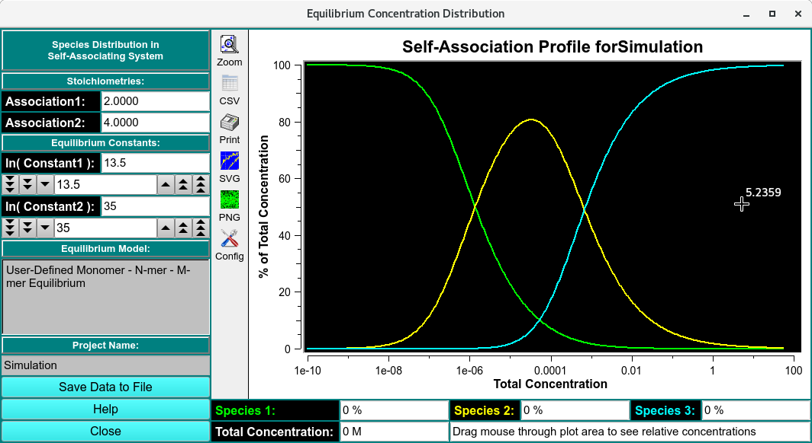

=============================
Self-association Simulator
=============================

.. toctree:: 
  :maxdepth: 3

.. contents:: Index
  :local: 

This module is used to simulate binding isotherms for reversibly self-associating systems with up to three species (monomer, N-mer, M-mer). The program is started from the Simulation menu (Self-Association Equilibrium): 

.. rst-class::
    :align: center

    **Self-Association Simulation Profile**

Functions:
===========

.. list-table::
  :widths: 20 50
  :header-rows: 0 

  * - **Association (1,2):**
    - Enter an integral value to specify the stoichiometry of the association (e.g., 2, 3, 4...) 
  * - **Equilibrium constants:**
    - Enter the natural log of the association constants for each reaction. 
  * - **Save Data to File:**
    - Export the currently displayed association profile to a csv file. 
  * - **Self-Association Profile for Simulation:**
    - Binding isotherms for Monomer, N-mer and M-mer. 
  * - **Species 1/2/3:**
    - Percentage of species' concentration with respect to the total concentration, requires mouse click on the canvas to be activated. 
  * - **Total Concentration:**
    - Total concentration of the reacting molecule. 
  * - **Help**
    - Display this and other documentation. 
  * - **Close**
    - Close all windows and exit. 