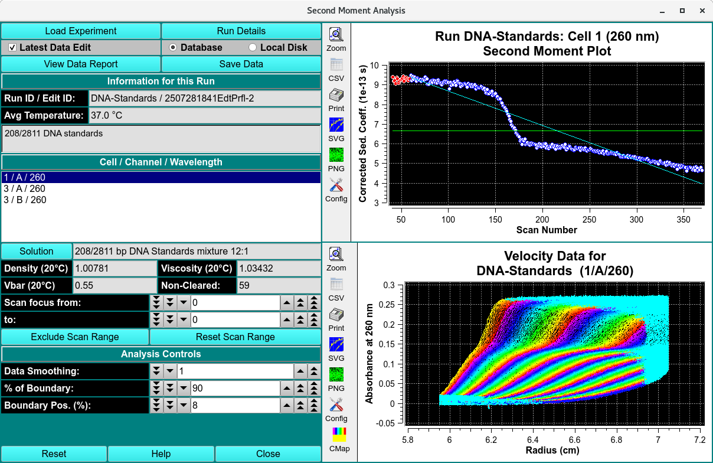

==============================
Second Moment Data Analysis
==============================

.. toctree:: 
    :maxdepth: 3

.. contents:: Index
    :local: 

The second moment analysis will calculate weight-average sedimentation coefficients for each scan included in the analysis by finding the second moment point in the boundary. The second moment analysis can serve as a valuable diagnostics tool in identifying problems such as time-dependent degradation, aggregation and even concentration dependency.

.. note::
    It is important to keep in mind that the second moment analysis is only valid for scans that have cleared the meniscus and still have a stable plateau. All other scans should be excluded from the analysis. 

Functions:
===========

.. list-table::
  :widths: 20 50
  :header-rows: 0 

  * - **Load Experiment** 
    - Click on this button and, in the resulting `Load Data Dialog <data_loader.html#data-loader>`_, select an edited data set to load.
  * - **Run Details** 
    - Bring up a `Run Details Dialog <run_details.html>`_ with a summary of data and run details.
  * - **Latest Data Edit** 
    - Uncheck to allow choosing an edit other than the latest one for the experimental data. 
  * - **Database** 
    - Check to specify data input from the database.
  * - **Local Disk** 
    - Check to specify data input from local disk.
  * - **View Data Report** 
    - Create a results text file and display its contents in a text dialog.
  * - **Save Data** 
    - Create several data and report files based on input data and vHW parameters.
  * - **Run ID / Edit ID:** 
    - The main run title of the data and an edit identifier are displayed.
  * - **Avg Temperature:** 
    - The average temperature of solute is displayed in Celsius.
  * - **(description)** 
    - The text box below the one for temperature shows a full data description string.
  * - **Cell / Channel / Wavelength**
    - The text box below this label gives cell, channel and wavelength triples available in this data set. Highlight the desired value.
  * - **Solution** 
    - Click this button to open a `Solution Management dialog <us_solution.html>`_ that allows changes to buffer and analyte characteristics of the data set.
  * - **Density (20°C)** 
    - Shows the density value for the loaded experiment. Click the Solution button to open a dialog in which density and other values may be changed.
  * - **Viscosity (20°C)** 
    - Shows the viscosity value for these loaded experiment. Click the Solution button to open a dialog in which viscosity and other values may be changed.
  * - **Vbar (20°C)** 
    - Shows the vbar value for the loaded experiment. Click the Solution button to open a dialog in which vbar and other values may be changed.
  * - **Skipped** 
    - The count of experiment data scans skipped.
  * - **Scan focus from:** 
    - Choose the first of a range of scan numbers that may potentially be excluded from analysis.
  * - **To:** 
    - Choose the end of a range of scan numbers that may potentially be excluded from analysis. The From/To scan range is illustrated in both plots to the right.
  * - **Exclude Scan Range** 
    - If the From/To scan range selections are as desired, click on this button to exclude the indicated scans from analysis.
  * - **Reset Scan Range** 
    - Reset to the full range of scans.
  * - **Data Smoothing:** 
    - Choose the number of points to use for any smoothing of raw input data.
  * - **% of Boundary:** 
    - Choose the percentage of the range from concentration baseline to plateau that is to be used for analysis.
  * - **Boundary Pos. (%):** 
    - Choose the percent of the plateau-baseline range that is to be added to the baseline to form the beginning of analysis span.
  * - **(Second Moment Plot)** 
    - The upper of the two right-side plots shows the second moment plot of sedimentation coefficient for each scan.
  * - **(Velocity Data Plot)** 
    - The lower of the right-side plots shows selected velocity data for which a second moment calculation has been made.

**Window Controls**

.. list-table::
  :widths: 20 50
  :header-rows: 0 

  * - **Reset** 
    - Indicate that parameters are to be reset and the plots re-displayed based on original parameters.
  * - **Help** 
    - Display this detailed Second-Moment  help.
  * - **Close** 
    - Close all windows and exit.

Related 
========

`van Holde - Weischet Analysis <vhw_enhanced.html>`_

`Time Derivative <time_derivative.html>`_