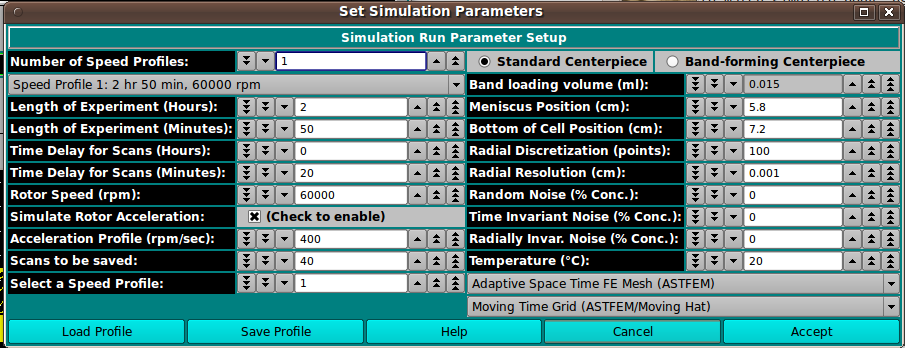

==========================================
Simulation Parameters
==========================================

.. toctree:: 
  :maxdepth: 3

.. contents:: Index
  :local: 

An option in UltraScan III `Simulation Module <astfem_sim.html>`_, this dialog allows specifying parameters governing a simulation. 
The dialog allows multiple speed profiles in the course of the simulation. Items along the left side of the dialog refer to the currently selected speed step. Those on the right are for the general properties of the simulation, including radial ranges and simulation method. 

.. rst-class::
    :align: center

    **Simulation Parameters**

Functions:
===========

.. list-table::
  :widths: 20 50
  :header-rows: 0

  * - **Number of Speed Profiles:**
    - Specify the total number of speed profiles to define. 
  * - **(Speed Profile...)**
    - Select the speed profile for which parameters to be specified below apply. 
  * - **Length of Experiment (Hours):**
    - Current speed step duration in hours. 
  * - **Length of Experiment (Minutes):** 
    - Current speed step duration in residual minutes (beyond duration given in hours). 
  * - **Time Delay for Scans (Hours):** 
    - Current speed step time delay in hours. 
  * - **Time Delay for Scans (Minutes):** 
    - Current speed step time delay in residual minutes (beyond delay given in hours). 
  * - **Rotor Speed (rpm):**
    - Current speed step rotor speed in revolutions per minute. 
  * - **Simulate Rotor Acceleration:**
    - Check the box to the right to enable simulation of gradual acceleration of the rotor initially or between steps with differing rotor speeds. 
  * - **Acceleration Profile (rpm/sec):**
    - If rotor acceleration is to be simulated, the value here gives the acceleration as a change in revolutions per minute for each second. 
  * - **Scans to be saved:**
    - The number of scans to be simulated and saved for this speed step. 
  * - **Select a Speed Profile**
    - Selecting a number here is an alternate way (to the "Speed Profile..." drop-down) to specify the speed step for which parameters above apply. 
  * - **Standard Centerpiece**
    - Check to specify a standard, non-band-forming centerpiece. 
  * - **Band-forming Centerpiece**
    - Check to specify a band-forming centerpiece. 
  * - **Band-loading volume (ml):**
    - Specify any band-loading volume in milliliters. 
  * - **Meniscus Position (cm):** 
    - Specify the radial position of the meniscus. 
  * - **Bottom of Cell Position (cm):** 
    - Specify the radial position of the simulation data bottom. 
  * - **Radial Discretization (points):** 
    - Specify the number points for which concentrations are calculated over the radial range. 
  * - **Radial Resolution (cm):** 
    - Specify the resolution of the radial range, the increment in centimeters between radius points. 
  * - **Random Noise (% Conc.):** 
    - Specify the percent concentration of random noise to calculate and add to the simulation. 
  * - **Time Invariant Noise (% Conc.):** 
    - Specify the percent concentration of time-invariant noise to calculate and add to the simulation. 
  * - **Radially Invar. Noise (% Conc.):** 
    - Specify the percent concentration of radially-invariant noise to calculate and add to the simulation. 
  * - **Temperature (°C):** 
    - Specify the temperature in degrees centigrade to assign to scans. 
  * - **(mesh type):** 
    - Select the mesh or method type to use in the simulation: ASTFEM, CLAVERIE, MOVING-HAT, USER, ASTFVM. 
  * - **(grid type):** 
    - Select the grid type to use in the simulation: MOVING, FIXED. 
  * - **Load Profile** 
    - Open a dialog to load a previously saved simulation parameters profile in "sp-.xml" name form. 
  * - **Save Profile** 
    - Open a dialog to save the current simulation parameters to a profile file in "sp-.xml" name form. 
  * - **Help** 
    - Display this documentation. 
  * - **Cancel** 
    - Exit this dialog without returning parameter values to the caller. 
  * - **Accept** 
    - Exit this dialog and return parameter values to the caller. 