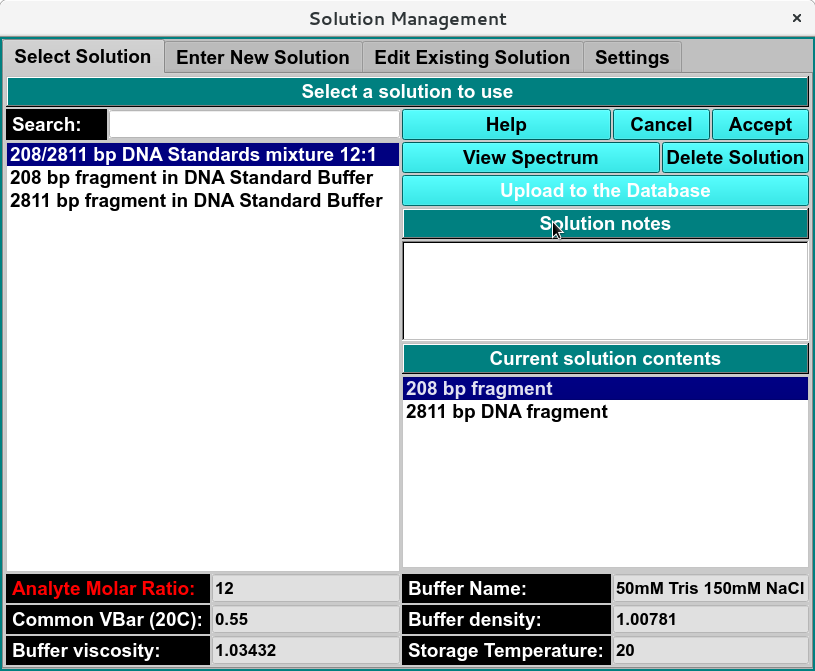

===========================
Manage Solution Information
===========================

This window allows the users to specify the analyte(s) measured and the buffer condition. Once created, the solution module allows the user to manage the solution information by creating new solutions, editing existing entries, and synchronizing solution data between your local system and the user database.

In each panel, tabs are visible at the top of the window to enable the user to move to another panel, to perform specific solution subtasks. 

.. toctree::
   :maxdepth: 1
   :caption: Table of Content:
   
   solution_select
   solution_new
   solution_edit
   solution_settings 

* `Select Solution <solution_select.html>`_ - A panel whose primary purpose is to select a solution to return to the caller.
* `Enter New Solution <solution_new.html>`_ - A panel whose primary purpose is to enter a brand new solution, defined mostly by specifying components and each one's concentration.
* `Edit Existing Solution <solution_edit.html>`_ - A panel whose primary purpose is to change non-hydrodynamic characteristics of an already existing solution.
* `Settings <solution_settings.html>`_ - A panel whose primary purpose is to set Database-or-Disk input, the investigator; or to synchronize the local solution components file from the database.
