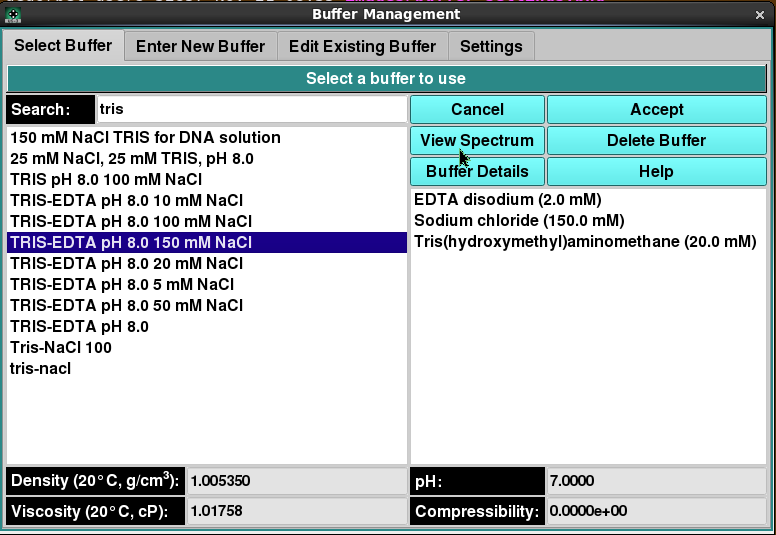

===========================
Manage Solution Information
===========================

.. toctree::
   :maxdepth: 1
   :caption: Table of Content:

    solution_select
    solution_new
    solution_edit
    solution_settings

**Select solution:** A panel whose primary purpose is to select a solution to return to the caller.

**Enter New solution:** A panel whose primary purpose is to enter a brand new solution, defined mostly by entering the sequence of proteins and nucleic acids and each one's concentration. 

**Edit Existing solution:** A panel whose primary purpose is to change non-hydrodynamic characteristics of an already existing buffer. 

**Settings:** A panel whose primary purpose is to set Database-or-Disk input, the investigator; or to synchronize the local buffer components file from the database. 
