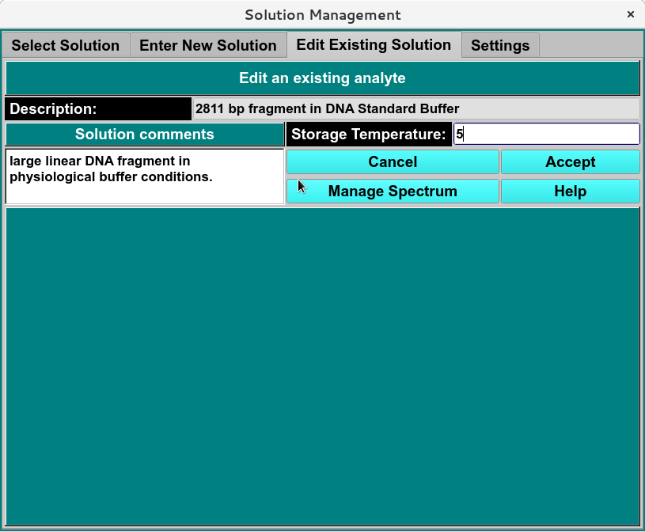

=======================================
Edit Existing Solution Tab
=======================================

.. toctree:: 
  :maxdepth: 3

.. contents:: Index
  :local: 

**Panel Tab Options:**

* :doc:`Select Solution <ssolution_select>` - A panel whose primary purpose is to select a Solution to return to the caller.
* :doc:`Enter New Solution <solution_new>` - A panel whose primary purpose is to enter a brand new Solution, defined mostly by specifying components and each one's concentration.
* :ref:`Edit Existing Solution <edit_solution>` - A panel whose primary purpose is to change non-hydrodynamic characteristics of an already existing Solution.
* :doc:`Settings <solution_settings>` - A panel whose primary purpose is to set Database-or-Disk input and to select the investigator. 

Edit Solution Panel: 
=========================

.. _edit_solution: 

Using this panel, you can add a spectrum profile, change the storage temperature and add or edit the solution comments. 

.. rst-class:: 
    :align: center

    **Edit solution Window**