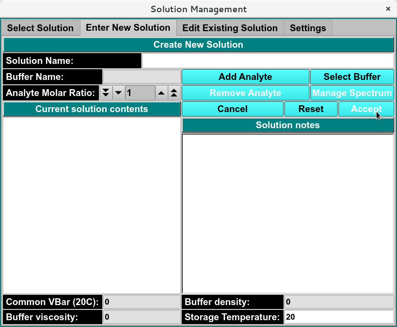

=======================================
Enter New Solution Tab
=======================================

.. toctree:: 
  :maxdepth: 3

.. contents:: Index
  :local: 

**Panel Tab Options:**

* `Select Solution <solution_select>` - A panel whose primary purpose is to select a Solution to return to the caller.
* :ref:`Enter New Solution <enter-new-solution>` - A panel whose primary purpose is to enter a brand new Solution, defined mostly by specifying components and each one's concentration.
* `Edit Existing Solution <solution_edit>` - A panel whose primary purpose is to change non-hydrodynamic characteristics of an already existing Solution.
* `Settings <solution_settings>` - A panel whose primary purpose is to set Database-or-Disk input and to select the investigator. 

Enter New Solution Panel
=========================

.. _enter-new-solution: 

Using this panel, you can create a new solution in the current database or on the local disk. Most commonly, you select or create analytes in the solution using the :doc:`Analyte Management <../analyte/index>`. As each is selected, you enter the molar ratio of each analyte, then select or create a buffer condition from the set of buffers in the :doc:`Buffer Management <../buffer/index>`. After providing a descriptive title, you add a spectrum of the solution by clicking :ref:`Manage Spectrum <add-analyte-spectrum>` or you can click on the Accept button to upload the solution to the DB or to local disk and to return to the Select Solution panel.

As with all panels, a set of tabs allows you to navigate to other panels in order to perform specialized subtasks relating to solution management. 

.. rst-class:: 
    :align: center

    **Enter New solution Panel**
  
New Solution Functions:
=============================

.. list-table::
  :widths: 20 50

  * - **Search**
    - Use to search by enter all or portion of the title. 
  * - **Help**
    - Access this help documentation for the Solution Management module 
  * - **Cancel**
    - Close window and return to previous page. 
  * - **Accept**
    - Return to previous page with selected solution. 
  * - **Delete Solution**
    - Delete selected solution. 
  * - **Solution Notes**
    - Display notes added to solution 
  * - **Current Solution Contents**
    - Describe the analyte component(s) of solution. 
  * - **Analyte Molar Ratio** 
    - Once a solution has been selected and a solution contents item (analyte) has been chosen, use this to enter the comparative amount of that analyte that is in the solution. 
  * - **Buffer Name:**
    - Selected buffer name. 
  * - **Common VBar(20C):**
    - The common vbar at a temperature of 20 degrees C. 
  * - **Buffer Density**
    - The density of the currently selected buffer.
  * - **Buffer viscosity:**
    - The viscosity of the currently selected buffer.
  * - **Storage Temperature:** 
    - The average temperature of all the runs. 

Add New Solution Steps:
========================

* **Step 1:** - Enter the :doc:`Analyte Management <../analyte/index>` module to select or create an analyte by clicking **Add Analyte** button. 
* **Step 2:** - For solutions with multiple analytes, enter the Analyte Molar Ratio integer of each Analyte. 
* **Step 3:** - Enter the :doc:`Buffer Managenemt <../buffer/index>` module to call or create a buffer by clicking **Select Buffer**. 
* **Step 4:** - Add a descriptive title in the **Solution Name:**  
* **Optional/Additional:** - Enter Solution note, enter a solution spectrum profile. 

Once the new solution has been sufficiently defined, the **Accept** button becomes enabled. 

