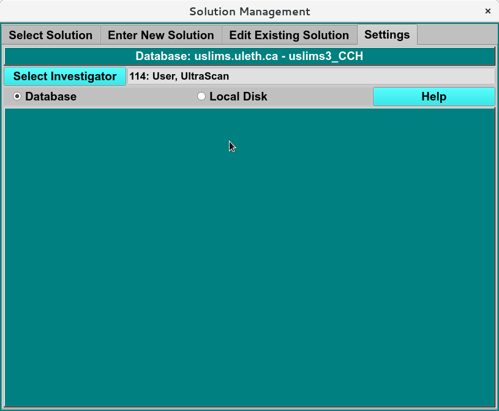

=======================================
Solution Settings Tab
=======================================

.. toctree:: 
  :maxdepth: 3

.. contents:: Index
  :local: 

**Panel Tab Options:**

* `Select Solution <ssolution_select.html>`_ - A panel whose primary purpose is to select a Solution to return to the caller.
* `Enter New Solution <solution_new.html>`_ - A panel whose primary purpose is to enter a brand new Solution, defined mostly by specifying components and each one's concentration.
* `Edit Existing Solution <solution_edit.html>`_ - A panel whose primary purpose is to change non-hydrodynamic characteristics of an already existing Solution.
* **Settings Solutions** - A panel whose primary purpose is to set Database-or-Disk input and to select the investigator. 

.. rst-class:: 
    :align: center

    **Solution Settings Window**
