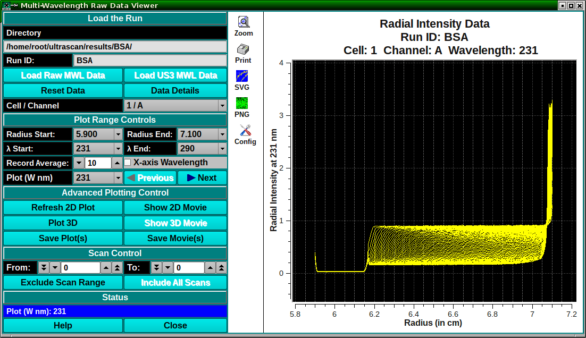

===========================================================================
Flowchart for the Analysis of Multi-Wavelength Sedimentation Velocity Data 
===========================================================================

.. toctree:: 
  :maxdepth: 3

.. contents:: Analysis Steps:
  :local: 

Step 1: Import Experimental data into UltraScan-III OpenAUC format
----------------------------------------------------------------------

    .. note::
        Required for data from XLA or XLI, this step is performed automatically in the Optima AUC.
        Sedimentation velocity data should not be measured in absorbance mode, use intensity mode instead.

#.  Import the experimental data: Utilities: :doc:`Import Experimental Data <convert>`
#.  Confirm Investigator setting and local/database selection
#.  Import Experimental Data from local disk 
#.  Edit Run Information, Select Lab/Rotor/Calibration
#.  Enter a Label (verbose description for the run)
#.  Select the corresponding project by clicking on the Project button. If there is no project, create a new project. 
#.  Confirm experiment type and optical detection system
#.  Enter any comments, if applicable
#.  Select instrument, rotor, rotor calibration and operator
#.  Click on Accept.
        * Edit the Description field if necessary
#.  Navigate to the first channel and select the centerpiece type.
#.  Select the proper solution - Make sure that the solution contains at least one analyte and a buffer
        * If you have more than one Triple, you can click on Apply to All but verify centerpiece and solution for each Triple first. Also, check the Description field again to make sure the appropriate information is saved.
#.  If data were collected in intensity mode, you will need to Define Reference Scans by selecting a short region from the air-to-air interface portion of the data.
#.  For equilibrium data from 6-channel centerpieces you should separate each channel with the Define Subsets/Process Subsets functions.
#.  Failed Triples or empty Triples can be excluded from the run by clicking on Drop Selected Triples.
#.  When everything has been set you can Save the scans to database or disk.

Step 2: Edit experimental data
--------------------------------

#. Edit the data in the :doc:`Edit Data <us_edit>` module. 
#. Load data from the database or a local data directory containing the UltraScan-III openAUC data files.data. 
#. Select the Cell / Channel / Wavelength Triple to be edited. 
#. Specify the meniscus of the data by holding down the Control key and using the left mouse button. The meniscus value may be manually adjusted with the keyboard. 
#. Specify the left and right edges of the data to be analyzed. 

    .. note::
        Please note: Do not pick the left data edge too close to the meniscus. During meniscus fitting, the evaluated meniscus positions may reach inside of the data range and violate the boundary conditions of the finite element solution. This will cause the meniscus fit to fail. 

#. Specify the location of the scan plateau. This is the radial position where most scans have a stable plateau, but the selected position should not reach into the back-diffusion region. The most appropriate point tends to be close to the right edge of the data range, but not so far to the right that it extends into the region where the concentration of the later scans curves upward at the bottom of the cell due to back-diffusion. 
#. Make any other optional adjustments to the data that are necessary and save the edit profile. When saving, a pop-up message is presented asking for an edit ID. The default for this ID is the current date and time in the form of YYMMdd hhmm (Year / Month / Day / Hour / Minute), but this default can be supplemented with a suffix of your own choice. 

Step 3: Inspect and plot the raw data 
----------------------------------------

#. Inspect the raw MWL data using the :doc:`Multi-Wavelength Raw Data Viewer <multi-wavelength/index>` in the Multi-wavelength modules.  
#. Load the data from the local disk or the database. 
#. Select the Cell / Channel / Wavelength Triple to be inspected.
#. Generate and save the 3-D plot and movie. 

.. rst-class::
    :align: center

    **Raw MWL Data Inspection and Plotting**

Step 4: Perform a 2DSA refinement following the :doc:`2DSA Flowchart <start_page>`
----------------------------------------------------------------------------------------

#. Follow Steps 3-6 in the :doc:`2DSA Flowchart <start_page>` to perform 2DSA analysis and fit the associated Time- and Radially- invariant noises, the meniscus and bottom boundary positions and rotor stretching and final iterative refinements. 

Step 5: Simulated a time-grid synchronized model based on 2DSA-IT MWL models
-------------------------------------------------------------------------------

#. Simulate a time synchronized **ISSF_** model based on the MWL 2DSA-IT models using the :doc:`MWL Pre-Fit Species Simulation <multi-wavelength/mwl_species_sim>`. 
#. Click **PreFilter Models** to define the MWL pre-filter for the simulation and
#. Click **Select Models** and load all related 2DSA-IT models from one MWL dataset channel.
#. **Define Buffer** and open the :doc:`Buffer Management <buffer/index>`  dialog to define the experimental parameters of the dataset
#. Define the simulation parameters
#. Click **Define Rotor** and open the :doc:`Rotor Management <rotors>`  dialog to select the Default 1003 (Simulation) rotor. 
#. Start the simulation and save the open-auc file into $HOME/ultrascan/imports folder. 
 

Step 6: Create basis spectra for each species
---------------------------------------------------

#. Generate the extinction coefficient basis spectrum of an analyte in the :doc:`Spectrum Fitter <us_spectrum>` dialog. 
#. Using a UV-visible spectrophotometer, scan the serial dilutions of analyte - spectra. 
#. load csv files, define the column separator character and click **Apply**.  
#. Add the extinction coefficient of the analyte at 260 or 280 nm, and click Perform a global fit if known.
#. A second fitting dialog will appear to perform the fit. Typical users don't have to change any setting. Click **Fit**.
#. Once the fit is complete, the result will automatically populate the main window. On the main window, click **Save**. Give the .dat file a unique name. 

Step 7: Import and Edit the **ISSF-** data file
--------------------------------------------------

#. Repeat steps 1 and 2 for the newly generated **ISSF-** open auc file. 

Step 8: Deconvolute MW data using species basis spectra
----------------------------------------------------------

#. Deconvolute the analytes in :doc:`MWL Species Fit Analysis <multi-wavelength/mwl_species_fit>`. 
#. Load the time-synchronized **ISSF-** simulation generated using :doc:`Optima MWL Fit Simulations <multi-wavelength/mwl_species_sim>` using :ref:`Load Run Data Dialog <fe-data-loader>` . 
#. Click **Load Species Fits** and load the species extinction coefficient basis spectra from local disk. 
#. Perform the deconvolution by clicking **Species Fit Data**. 
#. Deconvoluted sedimentation velocity data of each species will by generated with a **SSF-ISSF-** pre-fix. 

Step 9: Import and Edit the SSF-ISSF- data files
--------------------------------------------------

#. Repeat steps 1 and 2 for the newly generated **SSF-ISSF-** open auc files.

Step 10: Perform a 2DSA with refinement only
-----------------------------------------------

#. Perform 2DSA refinement of the **SSF-ISSF-** datasets. 

Step 11: Perform van Holde-Weischet analysis - (recommended)
----------------------------------------------------------------

#. Open Velocity: :doc:`Enhanced van Holde-Weischet <vhw_enhanced>`.
#. Load the desired experiment, applying the noise files from Step 6 (the latest model).
#. Check Plateaus from 2DSA and Use Enhanced vHW.
#. Adjust Beck Diffusion Tolerance, Divisions, Data Smoothing, % of Boundary, and Boundary Position to desired values.
#. If appropriate, delete early scans to improve resolution and reduce noise. Only keep scans and boundary portions that contribute to well correlated line fits in the linear extrapolations.
#. Select groups, if appropriate, to generate weight averaged s-values for discrete species.
#. Display :doc:`Distribution Plot and histogram <vhw_distrib_plot>`.
#. Save Data and distributions.

.. note::
    Refer to the :doc:`van Holde-Weischet manual <vhw_enhanced>` page for additional details.

Step 12: Overlay combined distributions - (recommended)
----------------------------------------------------------------

#. All van Holde-Weischet distributions and finite element models can be combined into a single plot for easy comparison.
#. Use Velocity: :doc:`Combine Distribution Plots <vhw_combine>` (vHW) for van Holde-Weischet plots.
#. Use Velocity: :doc:`Combine Discrete Distributions <ddist_combine>` for all finite element models (2DSA, GA, Monte Carlo).
#. Use Velocity: :doc:`Combine Integral Distributions <idist_combine>` for all finite element models (2DSA, GA, Monte Carlo).
#. Use Velocity: :doc:`Combine pseudo-3D Distributions <pseudo3d>` for all finite element models (2DSA, GA, Monte Carlo).

Reference
----------

**2DSA**

Brookes E, Cao W, Demeler B. `A two-dimensional spectrum analysis for sedimentation velocity experiments of mixtures with heterogeneity in molecular weight and shape. <https://pubmed.ncbi.nlm.nih.gov/19247646/>`_ Eur Biophys J. (2010) 39(3):405-14. 

Kim H, Brookes E, Cao W, Demeler B. `Two-dimensional grid optimization for sedimentation velocity analysis in the analytical ultracentrifuge. <https://pubmed.ncbi.nlm.nih.gov/29777290/>`_ Eur Biophys J. 2018 Oct;47(7):837-844. doi: 10.1007/s00249-018-1309-z. PMID: 29777290 

|

**Experimental Design**

Demeler, B. (2024). `Methods for the design and analysis of analytical ultracentrifugation experiments. <https://currentprotocols.onlinelibrary.wiley.com/doi/epdf/10.1002/cpz1.974>`_ Current Protocols, 4, e974. doi: 10.1002/cpz1.974 

|

**PCSA**

Gorbet G., T. Devlin, B. Hernandez Uribe, A. K. Demeler, Z. Lindsey, S. Ganji, S. Breton, L. Weise-Cross, E.M. Lafer, E.H. Brookes, B. Demeler. `A parametrically constrained optimization method for fitting sedimentation velocity experiments. <https://www.sciencedirect.com/science/article/pii/S0006349514002288>`_ Biophys. J. (2014) vol 106, 1741-50.

|

**Genetic Algorithm**

Brookes E, Demeler B. `Parsimonious Regularization using Genetic Algorithms Applied to the Analysis of Analytical Ultracentrifugation Experiments <https://demeler.uleth.ca/ultrascan-publications/BrookesDemeler-GECCO-2007.pdf>`_. GECCO '07: Proceedings of the 9th annual conference on Genetic and evolutionary computation, London, July 7-11, 2007, 361–368, https://doi.org/10.1145/1276958.1277035, ACM 978-1-59593-697-4/07/0007

|

**Monte Carlo**

Demeler B and E. Brookes. `Monte Carlo analysis of sedimentation experiments. <https://link.springer.com/article/10.1007/s00396-007-1699-4>`_ Colloid Polym Sci (2008) 286(2) 129-137 

|

**Adaptive Space-Time Finite Element Solution**

Cao, W and Demeler B. `Modeling Analytical Ultracentrifugation Experiments with an Adaptive Space-Time Finite Element Solution for Multi-Component Reacting Systems. <https://www.sciencedirect.com/science/article/pii/S0006349508702844>`_ Biophys. J. (2008) 95(1):54-65 