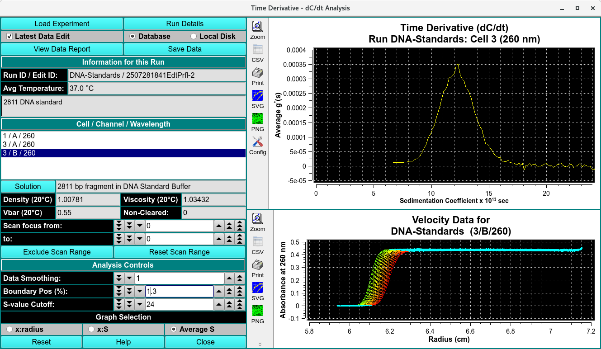

============================================================
Time Derivative (dC/dt) Data Analysis
============================================================

.. toctree:: 
  :maxdepth: 3

.. contents:: Index
  :local: 

    

The DCDT or Time Derivative method will calculate g(S) differential sedimentation profiles by subtracting consecutive scan pairs from each other and mapping the resulting difference curves to the S domain to obtain dcdt curves. The advantage of this method is its ability to nicely subtract out time invariant noise, such as window scratches and dirt, as well as refractive index hetereogeneities in the windows. The latter is particularly important for low-concentration interference data. Unlike the `van Holde - Weischet method <vhw_enhanced.html>`_, the Time Derivative method does not correct for diffusion. In order to obtain accurate results with this method, it is important that you use only a small scan range over which diffusion has not changed significantly.

Functions:
===========

.. list-table::
  :widths: 20 50
  :header-rows: 0

  * - **Load Experiment** 
    - Click on this button and, in the resulting `Load Data Dialog <common_dialogs.html#data-loader>`_, select an edited data set to load.
  * - **Run Details** 
    - Bring up a `Details for Raw Data <run_details.html>`_ dialog with a summary of data and run details.
  * - **Latest Data Edit** 
    - Uncheck to allow choosing an edit other than the latest one for the experimental data.
  * - **Database** 
    - Check to specify data input from the database.
  * - **Local Disk** 
    - Check to specify data input from local disk.
  * - **View Data Report** 
    - Create a results text file and display    its contents in a text dialog.
  * - **Save Data** 
    -  Create several data and report files based on  input data and vHW parameters.

**Information for this Run**

.. list-table::
  :widths: 20 50
  :header-rows: 0  

  * - **Run ID / Edit ID:** 
    - The main run title of the data and  an edit identifier are displayed.
  * - **Avg Temperature:** 
    - The average temperature of solute is  displayed in Celsius.      
  * - **(description)** 
    - The text box below the one for temperature   shows a full data description string.

**Cell / Channel / Wavelength** 

.. list-table::
  :widths: 20 50
  :header-rows: 0 

  * - **Cell / Channel / Wavelength** 
    - The text box below this label gives cell, channel and wavelength triples available in this data set. Highlight the desired value.
  * - **Solution** 
    - Click this button to open a `Solution Management dialog <us_solution.html>`_ that allows changes to buffer and analyte characteristics of the data set.
  * - **Density (20°C)** 
    - Shows the density value for the loaded experiment. Click the Solution button to open a dialog in which density and other values may be changed.
  * - **Viscosity (20°C)**
    -  Shows the viscosity value for thes loaded experiment. Click the Solution button to open a dialog in which viscosity and other values may be changed.
  * - **Vbar (20°C)** 
    - Shows the vbar value for the loaded experiment. Click the Solution button to open a dialog in which vbar and other values may be changed.
  * - **Skipped** 
    - The count of experiment data scans skipped.
  * - **Scan focus from:** 
    - Choose the first of a range of scan numbers that may potentially be excluded from analysis.
  * - **To:** 
    - Choose the end of a range of scan numbers that may potentially be excluded from analysis. The From/To scan range is illustrated in both plots to the right.
  * - **Exclude Scan Range** 
    - If the From/To scan range selections are as desired, click on this button to exclude the indicated scans from analysis.
  * - **Reset Scan Range** 
    - Reset to the full range of scans
  
**Analysis Controls**

.. list-table::
  :widths: 20 50
  :header-rows: 0  

  * - **Data Smoothing:** 
    - Choose the number of points to use for any smoothing of raw input data.
  * - **Boundary Pos. (%):** 
    - Choose the percent of the plateau-baseline range that is to be added to the baseline to form the beginning of analysis span.	
  * - **S-value Cutoff:** 
    - Choose the sedimentation coefficient value to form the maximum X value of the Time Derivative plot.

**Graph Selection**

.. list-table::
  :widths: 20 50
  :header-rows: 0   

  * - **x:radius** 
    - Select this radio button to choose a g(S) versus radius dC/dt plot.
  * - **x:S** 
    - Select this radio button to choose a g*(S) versus sedimentation coefficient dC/dt plot.
  * - **Average S** 
    - Select this radio button to choose an Average g*(S) versus sedimentation coefficient dC/dt plot.
  * - **(Time Derivative Plot)** 
    - The upper of the two right-side plots shows one of three types (x:radius, x:S, Average S) of  Time Derivative (dC/dt) plots.
  * - **(Velocity Data Plot)** 
    -  The lower of the right-side plots shows selected velocity data for which a time derivative  calculation has been made.

**Window Controls**

.. list-table::
  :widths: 20 50
  :header-rows: 0 

  * - **Reset** 
    - Indicate that parameters are to be reset and the plots re-displayed based on original parameters.
  * - **Help** 
    - Display this detailed Time-Derivative help.
  * - **Close** 
    - Close all windows and exit.

Related
====================

`Edit UltraScan Data <us_edit.html>`_

`Fit Meniscus <fit_meniscus.html>`_

`Finite Element Model Viewer <fe_match.html>`_