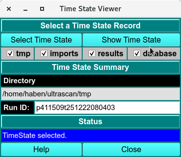
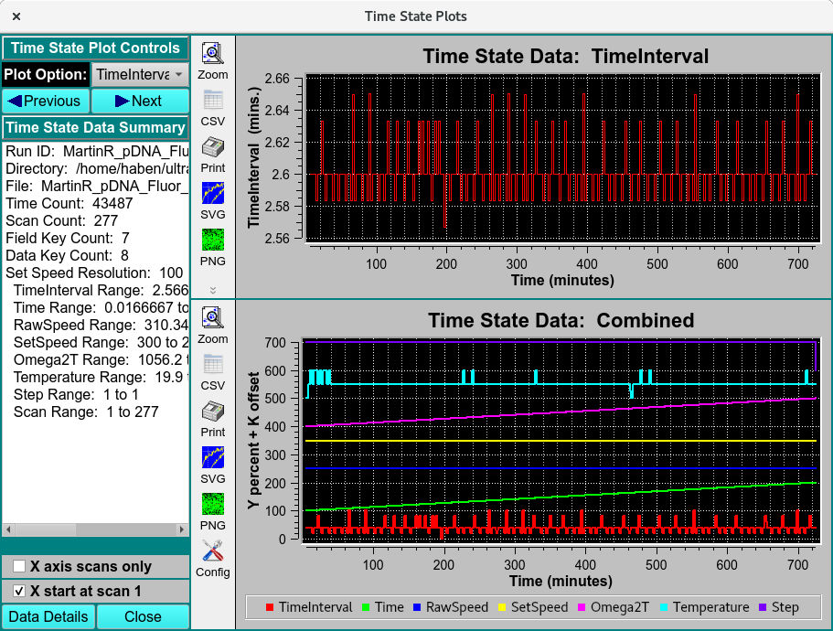
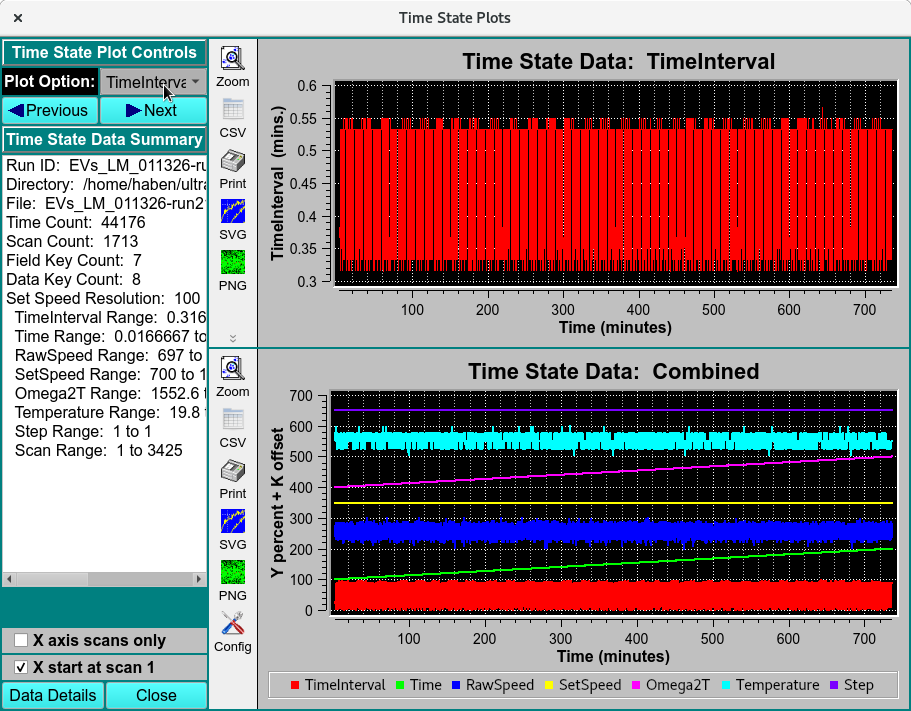
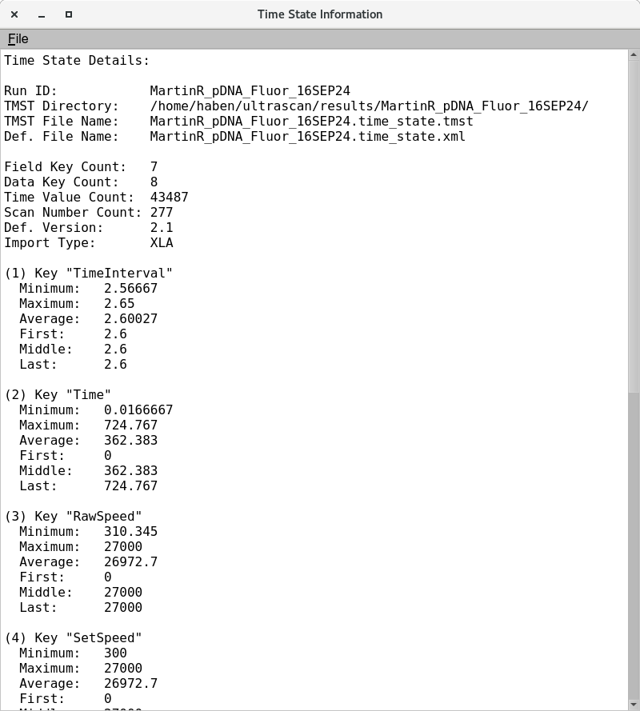

=========================================
Time State Viewer 
=========================================

.. toctree:: 
  :maxdepth: 3

.. contents:: Index
  :local: 

The Time State viewer module provides users with the metadata  of only select dataset. Metadata include the RunID, filename, directory location and Instrument parameters (TimeInterval, Time, RawSpeed, SetSpeed,omega2T, Temperature and step) across the experimental time/scan number. 

Process
=============

Step 1. Click **Select Time State** to select a run. 

.. image:: _static/images/timestate-0.png
    :align: center

Step 2. **Show Time State** button is enabled and call the **Time State Plots** window. 

Step 3. Flip through the pulldown Plot Options(TimeInterval, Time, RawSpeed, SetSpeed,omega2T, Temperature and step) to plot in the individual time state data. The bottom **Time State data: Combined** show the combined curves of TimeInterval, Time, RawSpeed, SetSpeed,omega2T, Temperature and step across the total scan number. 

Step 4. Click **Data Details** to load the **Time State Details:** of the run. 

