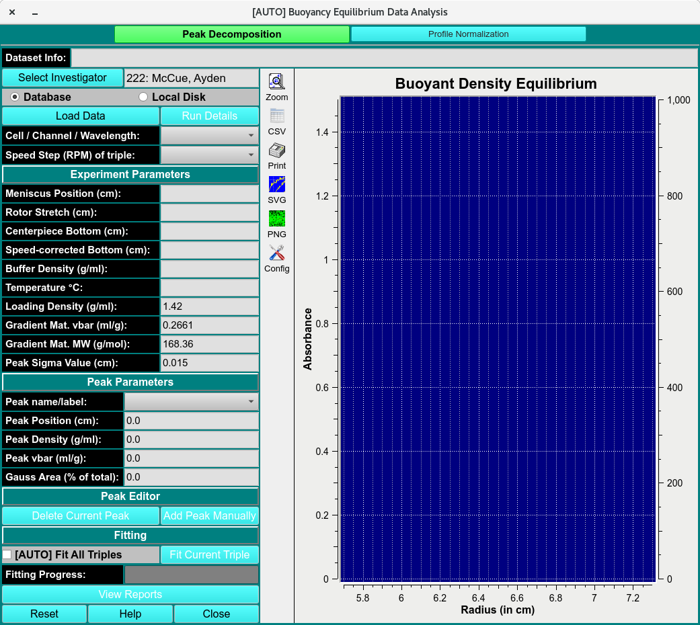
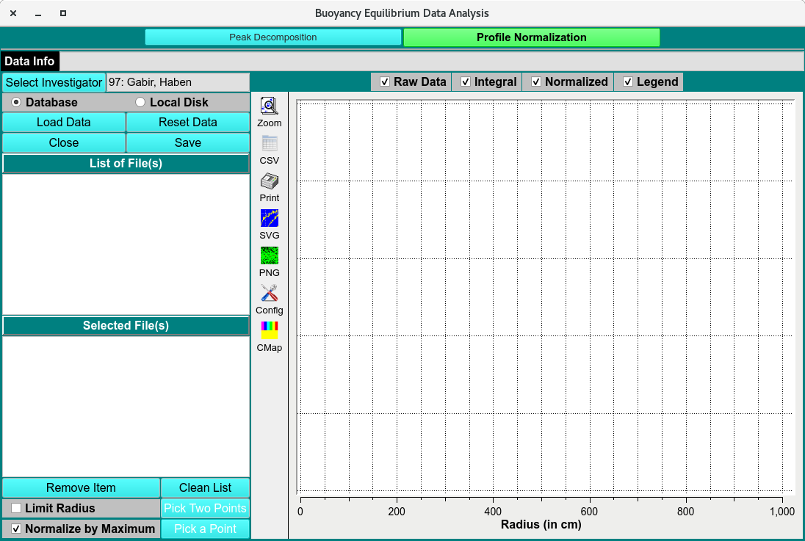

====================================
Buoyancy Equilibrium Data Analysis
====================================

.. toctree:: 
  :maxdepth: 3

.. contents:: Index
  :local: 
  
.. caution::
  This module is designed to determine the density and partial specific volume of peak positions in a gradient forming solution at equilibrium, for example, in analytical buoyant density gradient experiments (ABDE) experiments. The model's original numerical calculation does not take into account certain non-ideality conditions encountered in CsCl, a topic that is currently under investigation. Until an update is available, the density results obtained in CsCl gradients could be inaccurate.

  

.. rst-class::
    :align: center

    **ABDE Analysis Main Window**

Peak Decomposition
=====================

.. image:: _static/images/us_buoyanc.png
    :align: center

.. rst-class::
    :align: center

    **Spectrum Fitter**

.. rst-class::
    :align: center

    **Spectrum Fitter**

Peak Decom. Functions: 
--------------------------

.. list-table::
  :widths: 20 50
  :header-rows: 0 
  
  * - **Dataset Info:**
    - Displays information about the currently selected dataset used for buoyancy equilibrium analysis.
  * - **Database**
    - Selects data from the database as the source for analysis.
  * - **Local Disk**
    - Selects data files stored on the local computer.
  * - **Load Data**
    - Loads the selected dataset into the Peak Decomposition window.
  * - **Run Details**
    - Displays details for the loaded run, including experiment and scan information.
  * - **Cell /Channel/ Wavelength:**
    - Shows the selected cell, channel, and wavelength for the current dataset.
  * - **Speed Step (RPM) of Triple:**
    - Displays the rotor speed step associated with the selected triple.

Experimental Parameters
~~~~~~~~~~~~~~~~~~~~~~~~~

.. list-table::
  :widths: 20 50
  :header-rows: 0 
  
  * - **Meniscus Position (cm):**
    - Displays or sets the radial position of the meniscus in centimeters.
  * - **Rotor Stretch (cm):**
    - Displays the rotor stretch correction applied to the measurement.
  * - **Centerpiece Bottom (cm):**
    - Displays the radial position of the centerpiece bottom.
  * - **Speed-corrected Bottom (cm):**
    - Displays the bottom position corrected for rotor speed effects.
  * - **Buffer Density (g/ml):**
    - Specifies the density of the buffer solution.
  * - **Temperature °C:**
    - Displays or sets the experimental temperature in degrees Celsius.
  * - **Loading Density (g/ml):**
    - Specifies the density of the loaded sample.
  * - **Gradient Mat. vbar (ml/g):**
    - Displays or sets the partial specific volume of the gradient material.
  * - **Gradient Mat. MW (g/mol):**
    - Displays or sets the molecular weight of the gradient material.
  * - **Peak Sigma Value (cm):**
    - Specifies the Gaussian peak width used during decomposition.

Peak Parameters
~~~~~~~~~~~~~~~~~~~~~~~~~

.. list-table::
  :widths: 20 50
  :header-rows: 0 

  * - **Peak name/label**
    - Displays the name or identifier assigned to the selected peak.
  * - **Peak Position (cm):**
    - Displays or sets the radial position of the selected peak.
  * - **Peak Density (g/ml):**
    - Displays the density corresponding to the selected peak position.
  * - **Peak vbar (ml/g):**
    - Displays the partial specific volume associated with the selected peak.
  * - **Gauss area (1% of total):**
    - Displays the Gaussian peak area as a percentage of the total signal.

Peak Editor
~~~~~~~~~~~~~~~~~~~~~~~~~

.. list-table::
  :widths: 20 50
  :header-rows: 0 
  
  * - **Delete Current Peak** 
    - Removes the currently selected peak from the decomposition model.
  * - **Add Peak Manually**
    - Adds a new peak manually to the model for fitting and analysis.

Peak Fitting
~~~~~~~~~~~~~~~~~~~~~~~~~

.. list-table::
  :widths: 20 50
  :header-rows: 0 
  
  * - **Fit All Triples**
    - Fits all available triples in the dataset using the current peak decomposition settings.
  * - **Fit Current Triples**
    - Fits only the currently selected triple.
  * - **Fitting Progress:**
    - Displays the progress of the fitting operation.
  * - **View Reports**
    - Opens reports summarizing the peak fitting results.
  * - **Reset**
    - Resets the current fitting parameters and results.
  * - **Help**
    - Opens the help documentation for the Peak Decomposition window.
  * - **Close**
    - Closes the Peak Decomposition window.

Profile Normalization 
==========================

.. rst-class::
    :align: center

    **Spectrum Fitter**

Profile Norma. Functions:
--------------------------

.. list-table::
  :widths: 20 50
  :header-rows: 0 

  
  * - **Load Data**
    - Loads one or more files for profile normalization.
  * - **Reset Data**
    - Clears the current normalization results and restores the original data.
  * - **Close**
    - Closes the Profile Normalization window.
  * - **Save**
    - Saves the normalized profile data.
  * - **List of File(s)**
    - Displays the available files selected for normalization.
  * - **Selected File(s)**
    - Shows the file or files currently chosen for processing.
  * - **Remove Item**
    - Removes the selected file from the processing list.
  * - **Clean List**
    - Clears all files from the current list.
  * - **Limit radius**
    - Restricts the normalization range to a selected radial interval.
  * - **Pick Two Points**
    - Allows selection of two points to define the normalization or integration range.
  * - **Normalize by Maximum**
    - Normalizes each profile using its maximum signal value.
  * - **Pick a Points**
    - Allows selection of a reference point for normalization.

Plots
---------

.. list-table::
  :widths: 20 50
  :header-rows: 0 

  * - **Raw Data**
    - Displays the original unprocessed data profiles.
  * - **Integral** 
    - Displays the integrated signal across the selected radial range.
  * - **Normalized**
    - Displays the normalized data profiles.
  * - **Legend**
    - Shows or hides the plot legend identifying the displayed datasets.