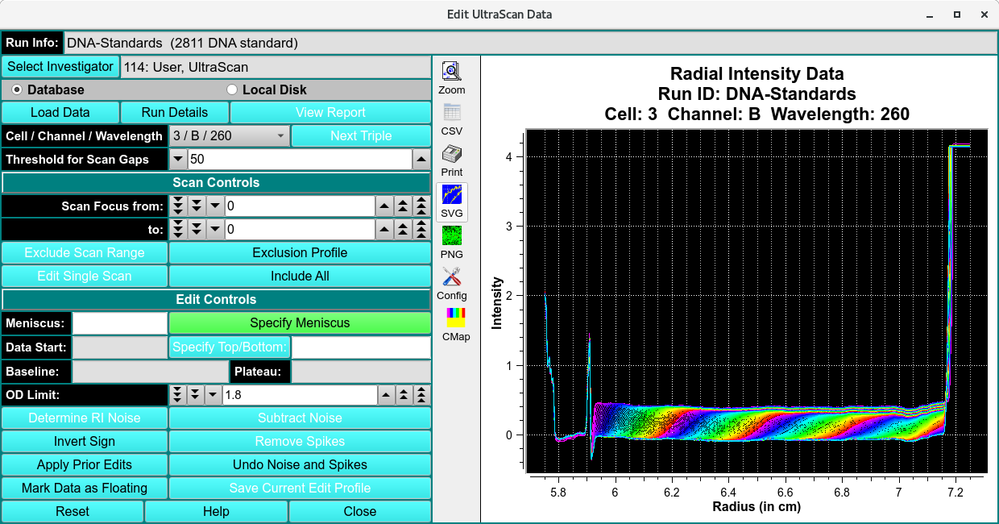
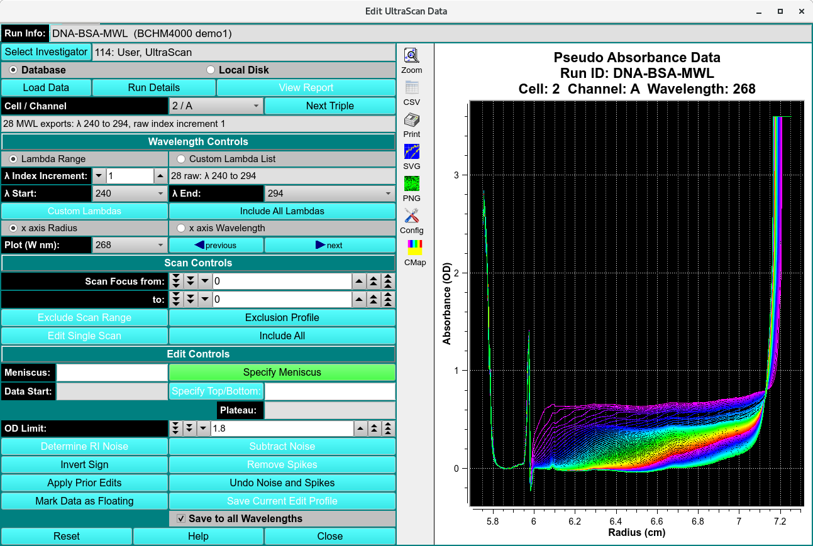

====================
Edit UltraScan Data
====================

.. toctree:: 
    :maxdepth: 3

.. contents:: Index
    :local: 

All experimental data acquired with the analytical ultracentrifuge must be processed into an edit profile before analysis can be performed using UltraScanIII modules. For velocity experiment, the edit profiles define key analysis parameters, including the meniscus and data range, and scans selected. A user can choose to create multiple edit profiles for a particular data set, for example, to explore the effect of various editing steps on the analysis results. For example, a user may wish to exclude either early or late scans to track time dependent changes in the sample. Each profile will receive a unique name automatically based on the time at which the editing process was conducted or a user-defined name. For data analysis, any associated edit profile may be selected at run time to provide a custom data selection.

.. _US-edit-Functions:

Functions:
====================

.. list-table::
  :widths: 20 50
  :header-rows: 0

  * - **Run Info**
    - This text box displays run information for the currently selected run.
  * - **Select Investigator**
    - This button brings up a window that allows selecting the current investigator for input from the database.
  * - **Database**
    - Check to specify data input from the database.    
  * - **Local Disk** 
    - Check to specify data input from local disk. 
  * - **Load Data** 
    - Click here and, in the resulting `Load Data Dialog <common_dialogs.html#data-loader>`_, select raw data set(s) to load for editing. 
  * - **Run Details**
    - This button brings up a child window `Details for Raw Data <run_details.html>`_ to  that describes additional information associated with the data. The data description may be updated in this window. 
  * - **Cell / Channel / Wavelength** 
    - Select the triple for which to perform editing. 
  * - **Threshold for Scan Gaps** 
    - This spin button controls the check for consecutive interpolated data. If more than the specified number of consecutive points on a scan have been interpolated, a warning is displayed when the data is loaded. When editing wavelength data, this control specifies the gap in wavelengths 

**Scan Control**

Scans to be included in analysis, exluded scans are note deleted.

.. list-table::
  :widths: 20 50
  :header-rows: 0

  * - **Scan Focus from:**
    - Set the counter to the lower bound of scans to exclude.
  * - **Scan Focus to:**
    - Set the counter to the upper bound of scans to exclude.
  * - **Exclude Scan Range**
    - Exclude the scans indicated by the two preceding scan bounding counters.
  * - **Exclusion Profile**
    - This button displays a window where additional options for scan exclusion are available. Here it is possible to save only every 2nd, 3rd or nth scan.    
  * - **Edit Single Scan**
    - This button displays a window where individual points may be changed by a Control-Left_Click-Drag operation.
  * - **Include All**
    - This button removes all data and sets the program to a known starting point.

**Edit Control**

.. list-table::
  :widths: 20 50 
  

  * - **Specify Meniscus**
    - This button enables the edit range selection step to be set to specify the meniscus via Ctrl-Click on the meniscus position. The radius value of the selected point is displayed in the text box tothe right of the button.
  * - **Specify Data Range** 
    - This button enables the edit range selection step to be set to specify the data range via Ctrl-Click's on the start and end data positions. The radius values of the selected points are displayed in the text box to the right of the button.
  * - **Specify Plateau** 
    - This button enables the edit range selection stepto be set to specify the plateau via Ctrl-Click on the plateau position.The radius value of the selected point is displayed in the text box to the right of the button.
  * - **Baseline**
    - The text box displays the radius value and average OD value of a baseline automatically computed after the plateau is chosen.
  * - **OD Limit:**
    - Select an upper limit on OD values in the data above which data is excluded from 2-Dimensional Spectrum Analysis computations.
  * - **Determine RI Noise**
    - This button analyzes all scans to determine any radial invariant noise. It brings up a window that shows polynomial coefficients for a best fit of the scan integral. Residuals to this integral represent radially invariant noise. Subtracting the residual values from each data point in a scan will correct radially invariant noise. It is important that the loss of mass in the data as a function of time is properly matched to an appropriate polynomial, so select a polynomial degree thatprovides the best overall fit to all integral values.    
  * - **Subtract Noise**
    - This button removes the calculated noise from the current data set.
  * - **Invert Sign**
    - This button inverts the measured data.
  * - **Remove Spikes**
    - This button determines if data readings are beyond acceptable limits and adjusts outlying data points to an interpolated
  * - **Apply Prior Edits**
    - This button requests the user to specify a saved set of edit operations and applies them to the current data.  
  * - **Undo Noise and Spikes**
    - This button removes any corrections made to the data by noise or spike calculations.
  * - **Mark Data as Floating**
    - This button sets a flag to mark the data as floating.
  * - **Save Current Edit Profile**
    - This button initiates a save of the edited data to local file(s) and/or database.
  

**Window Controls**

.. list-table::
  :widths: 29 71  

  * - **Reset** 
    - This button removes all data and sets the program to a known starting point.
  * - **Help**
    - Display this help.
  * - **Close**
    - Close the editing session.

Editing Steps
====================

.. note:: 
    When editing, the plot may be zoomed by selecting the Zoom button on the graph and dragging the mouse over the area desired. This operation may be repeated as needed. Each right mouse click will un-zoom one level. Clicking on the Zoom button again at any zoom level will restore the un-zoomed graph.
    
    When zoomed, the graph may be panned by pressing the center mouse button (usually the scroll wheel) and dragging.

*   **Step 1:** Load data from the database or a local data directory that contains the UltraScanIII data files previously converted from the Beckman raw data. Load choices are made in a `Load Data Dialog <common_dialogs.html#data-loader>`_.

*    **Step 2:** Select the Cell / Channel / Wavelength triple to be edited.

*    **Step 3:** Specify the meniscus of the data by holding down the Control key and using the left mouse button. The meniscus value may be manually adjusted with the keyboard.

*    **Step 4:** If the data were collected with the interference detector, specify the left and right edges of the air gap area of the data.

*     **Step 5:** Specify the left and right edges of the data to be analyzed. Please note: Do not pick the left data edge too close to the meniscus. During meniscus fitting, the evaluated meniscus positions may reach inside of the data range and violate the boundary conditions of the finite element solution. This will cause the meniscus fit to fail.

*    **Step 6:** Specify the location of the scan plateau. This is the radial position where most scans have a stable plateau, but the selected position should not reach into the back-diffusion region. The most appropriate point tends to be close to the right edge of the data range, but not so far to the right that it extends into the region where the concentration of the later scans curves upward at the bottom of the cell due to back-diffusion.

*   **Step 7:** Make any other optional adjustments to the data that are necesary and save the edit profile. When saving, a pop-up message is presented asking for an edit ID. The default for this ID is the current date and time in the form of YYMMddhhmm (Year / Month / Day / Hour / Minute), but this default can be supplemented with a suffix of your own choice.

*   **Step 8:** Repeat the above process for each triple (Cell / Channel / Wavelength combination) in the data set. 
  

.. Note:: The above process may be reset to any point by pressing the appropriate button at the associated specification entry.

Edit Multi-Wavelength (MWL) Data 
========================================

Where the data loaded in an editing session is comprised of multiple wavelengths (more than two), the main editor window is changed to the above form. Instead of selecting triples to edit, this MWL edit procedure consists of selecting Cell / Channel pairs and the wavelengths within those doubles. Once editing in the normal way has been completed, the user may save the edit for either the specific triple ("Save Current Edit Profile") or for all of the wavelengths of the current double ("Save to all Wavelengths").

Most of the edit controls for MWL are the same as for the standard :ref:`Data Editor Window <US-edit-Functions>`; and are not repeated here. The steps and control objects described herein are those specific to MWL processing.

**Functions specific to MWL:**

.. list-table::
  :widths: 29 71  

  * - **Cell / Channel** 
    - This button removes all data and sets the program to a known starting point.
  * - **Lamdba Range**
    - Display this help.
  * - **Close**
    - Close the editing session.
  * - **Cell / Channel**
    - Select the double for which to perform editing.
  * - **Lamdba Range** 
    - Select this radio button to indicate that wavelength selection will be by start/end/increment specification.
  * - **Custom Lambda List** 
    - Alternatively, select this radio button to indicate that wavelengths will be individually indicated in a list dialog.
  * - **λ Index Increment:** 
    - Select the wavelength range increment.
  * - **λ Start:** 
    - Select the wavelength range start value.
  * - **λ End:** 
    - Select the wavelength range end value.
  * - **Custom Lambdas** 
    - Click to bring up a list dialog in which individual output wavelengths can be enumerated.
  * - **Include All Lambdas** 
    - Reset the implied output wavelength range or list to the full set of loaded dataset values.
  * - **x axis Radius** 
    - Select this radio button to indicate that the plots of data should have an X axis of Radius (the default).
  * - **x axis Wavelength** 
    - Select this radio button to indicate that the plots of data should have an X axis of Wavelength; and, therefore, that each plot is for a selected Radius.
  * - **Plot (W nm):** 
    - Select the Wavelength (in NM) or (if the title of this button is "**Plot (R cm):**" when the "**x axis Wavelength**" radio button was selected) select the Radius (in CM) to plot and edit.
  * - **(left arrow) previous** 
    - Click to change the plot to the one for the previous Wavelength or Radius value.
  * - **(right arrow) next** 
    -  Click to change the plot to the one for the next Wavelength or Radius value.
  * - **Save Current Edit Profile** 
    - Click this button (in the MWL case) to save the current edit for the current Cell / Channel / Wavelength only.
  * - **Save to all Wavelengths** 
    - Click this button to save the current edit for all wavelengths of the currently selected Cell / Channel.

**Editing steps specific to MWL**

*   **Step 1:** Load data from the database or a local data directory. Select an entire runID so that MWL data is recognized as such. 
*   **Step 2:** Select the Cell / Channel to be edited; specify the Lambda (wavelength) range to be edited; and select a single wavelength for display and edit.
*   **Step 3:** Specify editing parameters - such as Meniscus, Data Range, and Plateau - in the normal Control-Click way. 
*   **Step 4:** Save editing for either the specific triple selected or to be applied to all wavelengths of a cell / channel double.

Related
====================

`Import Experimental Data <convart.html>`_

`Time Derivative <time_derivative.html>`_

`Fit Meniscus <fit_meniscus.html>`_

