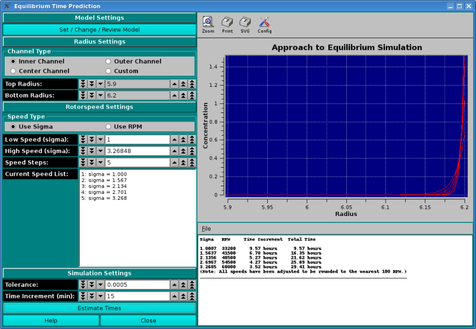

==============================================
Estimating Equilibrium Time
==============================================

.. toctree:: 
  :maxdepth: 3

.. contents:: Index
  :local: 

.. note::
    Why a sedimentation velocity experiment is superior to equilibrium experiments. 
    Link to Documents!!

Whenever you are planning or designing an equilibrium experiment, the question comes up of how long it takes to reach equilibrium at a certain speed. The time it takes depends on several factors: 

* The model of the solution will govern the experiment simulation. Use the `Model Editor <model_editor.html>`_ to set the following parameters: 

    * The diffusion coefficient. The smaller the diffusion coefficient, the longer it will take to reach equilibrium, since the sample will diffuse slower. Asymmetric and random coil molecules will take longer to equilibrate than globular molecules with the same molecular weight. 
    * The sedimentation coefficient. The larger the sedimentation coefficient, the faster the molecule will equilibrate, provided the diffusion coefficient stays constant, which is rarely the case. As molecular weight and sedimentation coefficient increase, the diffusion coefficient will generally decrease, which has the opposite effect. 
    * The molecular weight.

* The position inside the rotor. The further to the outside of the rotor the sample is positioned, the faster the sample will equilibrate, since the centrifugal force is larger at the outside. 
* The column length. The longer the column (the more volume is loaded), the longer it will take to equilibrate. 
* Finally the rotor speed. The larger the rotor speed, the faster the sample will approach equilibrium. 
* It also matters if the system is at chemical equilibrium, and if that equilibrium can be established rapidly enough (on the time order of the experiment). If a monomer-dimer equilibrium experiment takes a long time to equilibrate (i.e., the equilibrium kinetics are not diffusion controlled), then it may take substantially longer than predicted by this program. THis program will only predict the experiment of a diffusion controlled kinetics environment. 

How to use this program: 
==========================

* When designing an equilibrium experiment, you should plan to acquire equilibria at multiple speeds (4-5 speeds, ranging from **sigma=1** to **sigma=5**). Using the finite element simulator programmed in this module, you can predict the time it takes to reach equilibrium for all practical purposes, i.e., the change over time is less than a certain tolerance value. You can then pre-program the speeds into the XLA and are not required to check for equilibrium every time before you change to the next speed. 

* Note: Sigma is a measure of the curvature of the exponential. If it is too small, the curvature is shallow and there is not enough information. If it is too steep, most of the concentration points are going to be near zero, drowned out by bad s/n ratios. The happy medium is between 1.

* When simulating these times, you should simulate a molecule that is sedimenting slightly slower than the actual molecule, perhaps by simulating a system with a larger frictional ratio or larger axial ratio, and perhaps a non-globular model rather than a spherical model. While the equilibrium times may be longer than needed, at least they won't be too short. In this module you can change the parameters that influence the time it takes to reach equilibrium. 

Functions:
===========

.. list-table::
  :widths: 20 50
  :header-rows: 0

  * - Set / Change / Review Model 
    - Use this pushbutton to bring up the Model Editor. 
  * - Radius Settings 
    - Chose a predfined top and bottom radius settings with the Channel Type radio buttons. Use the Custom button to manually define the radius settings. 
  * - Rotor speed Settings 
    - Select the appropriate radio button to enter the speeds in terms of sigma (reduced molecular weight term: **(M * ω² * (1 - vbar * ρ))/( 2 * R * T)** or by RPM. 

      * Low Speed: Select the first speed to be equilibrated 
      * High Speed:Select the last speed to be equilibrated 
      * Speed Steps: The total number of speeds to be simulated, including the high and low speed. These will be linearly spaced between the high and low speed. 
      * Current Speed List: All selected speeds will be listed here. This field cannot be edited directly. 

.. Note:: 
    All speeds will be adjusted to the nearest 100 rpm, so they can be programmed in the XLA, which only allows 100 rpm steps. 

**Simulation Settings**

.. list-table::
  :widths: 20 50
  :header-rows: 0

  * - **Tolerance:** 
    - This value is the tolerance setting that determines if a scan has reached equilibrium. Successive scans are subtracted from each other and the root mean square of the differences are calculated. If the difference is less or equal to this tolerance value, the program will consider the speed equilibrated and automatically proceed to the next speed. For a 3 mm column with 0.001 cm resolution the accuracy of the computer allows about 1.0x10ˉ⁵ for the smallest practical tolerance (noise-free data). 
  * - **Time Increment (min):** 
    - This is the time between successive scans. The larger the time difference, the coarser is the time determination, but the more reliable is the time estimation. A good default setting is 15 minutes, to be used with a 5 x 10-⁴ tolerance setting. 
  * - **Estimate Times Pushbutton** 
    - This function runs the simulation and populates the graph and the text window. The text can be saved with the File dropdown list above the text window. 