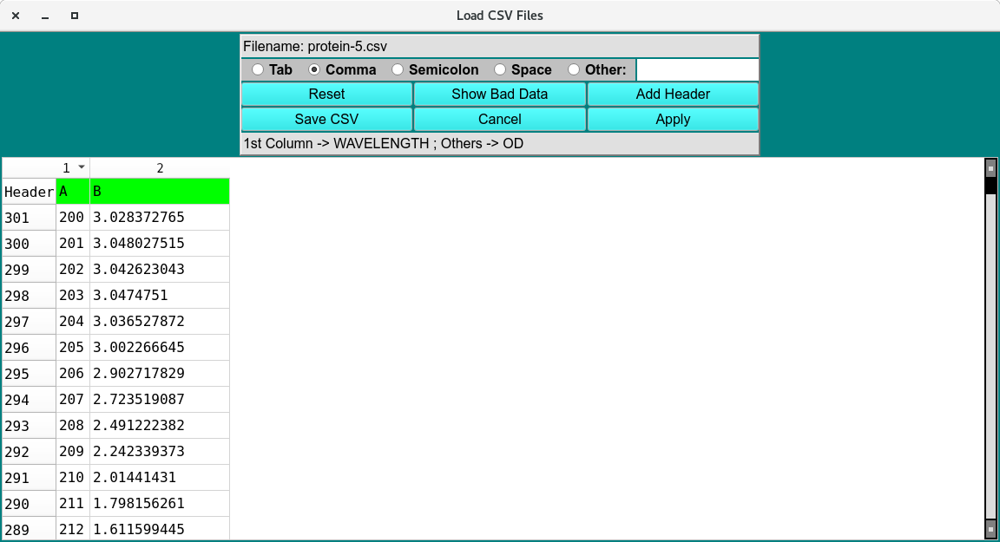
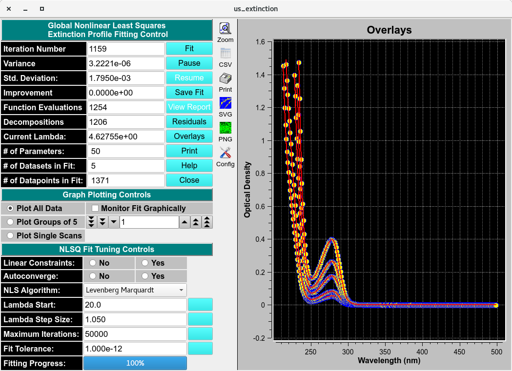
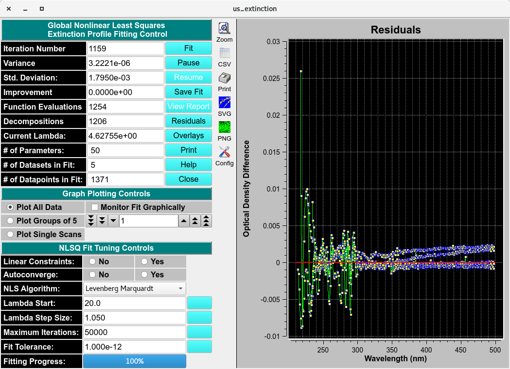

================================
Spectrum Fitter
================================

.. toctree:: 
  :maxdepth: 3

.. contents:: Index
  :local: 
  
The Spectrum Fitter is a module for analyzing spectral scan files collected from component serial dilutions. It applies multiple global nonlinear least-squares (NLS) fitting algorithms to model dilution-dependent extinction curves and determine the solute’s intrinsic extinction coefficient (intrinsic spectrum). Fitted results are exported as a .dat file for downstream analysis. 

.. image:: _static/images/us_extinction-000.png
    :align: center

.. rst-class::
    :align: center

    **Spectrum Fitter**

Process:
=========

1. **Load Scanfiles:**  
Click **Add Wavelength Scanfile** to navigate to a file manager and load the serial dilution spectrum scan .csv files. A **Load CSV Files** window will pop-up to select the Delimiter-separated value, edit the header and inspect data. 

.. rst-class::
    :align: center

    **Load CSV file**

Click **Accept** and the data will be imported and displayed on the Absorbance and Extinction Profile plot. Repeat for each scanfile in the dilution. 

.. image:: _static/images/us_extinction-1.png
    :align: center

.. rst-class::
    :align: center

    **Loaded Spectrum Fitter**

2. **Perform Global Fit:**  

Click **Perform Global Fit** to navigate to the fitting controls for the Global Non-Linear Least Square (NLS) algorithms. For typical users the default settings are sufficient and users can **Fit** without any modifications. 

.. image:: _static/images/us_extinction-0.png
    :align: center

.. rst-class::
    :align: center

    **NLS Fitting Controls**

3. **Global Fit Results:**  
Select **Residuals** or **Overlay** to display the results in the adjacent Overlay/Residual plot. 

.. rst-class::
    :align: center

    **NLS Fitted Overlay**

.. rst-class::
    :align: center

    **NLS Fitted Residuals**

The results of the fit can be saved in the main us_extinction window. Enter a name and save the basis spectrum. 

