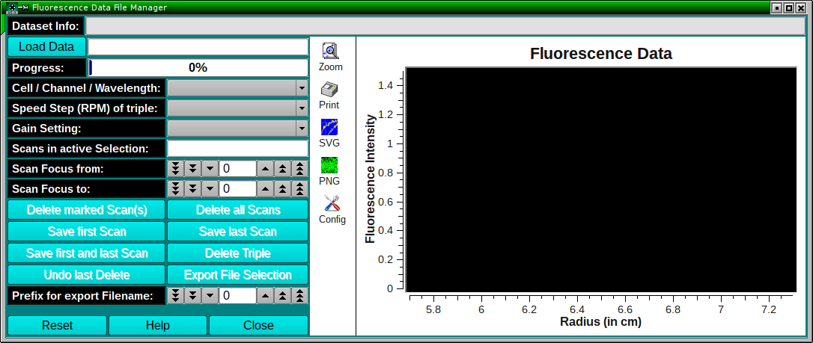

===============================================
Fluorescence Data File Manager
===============================================

.. toctree:: 
  :maxdepth: 3

.. contents:: Index
  :local: 

This module allows the user to manage scan files created by the AOS Fluorescence Detector data acquisition software. 

1. The AOS data acquisition software outputs scan files with a range of different naming conventions to accommodate different cells, channels, and importantly, different gain or voltage settings. 
2. When experimental data are acquired with a singe gain setting, the output files are names A00001.FI1, A00001.FI2, ... for channel A, and B00001.FI1, B00001.FI2, ... for channel B. When multiple gain settings are used to scan the data, a prefix (1_A00001.FI1, 2_A00001.FI1, ...) is added, incrementing the number of the prefix by one for each gain setting. 

|

This procedure allows the user to distinguish between scans for different gain settings, but this requires renaming so that a run can be imported into the OpenAUC format. UltraScan-III recognizes only scan filenames without the prefix. 

This module allows the user to select files with gainsets, speeds, and subsets of scans that are supposed to be combined into a logical run, or experiment. 

.. note:: 
    Depending on the experiment performed, it may be necessary to combine different gains from different speeds into a single run (for example, for equilibrium experiments, where different gains may need to be used to measure different gradients evolving at different speeds, where low speeds produce shallow gradients (requiring a higher gain setting) and higher speeds form steeper gradients that may require a lower gainset for optimal dynamic range). The program allows the user to export all selected triples, speeds, gain settings and scans to a new directory, where the selected scans are saved with the standard file naming convention used for single gain settings. 

The program can also be used to merge scan files from arbitrary many directories into a single directory to create a combined run directory suitable for a single data import action in UltraScan-III. 

.. rst-class::
    :align: center

    **Fluorescence File Manager**

The input to this module consists of fluorescence data only, scan files from other optical systems are ignored. 

Process:
==========

1. **Load Data:** Load fluorescence data by clicking on **Load Data**. 

A file manager dialog that allows user to navigate to the directory containing the desired fluorescence data will appear. You do not need to select any files at this stage, only the directory that contains all the desired scans needs to be selected. 

.. note:: 
    Only one directory can be chosen at this stage. 

Once loaded, the **Dataset Info** field will indicate a summary of the number scans in this directory, the number of triples, speeds and gain settings for this directory. All scans for the first triple, speed and gain setting will be plotted in the graph window: 

.. rst-class::
    :align: center

    **Loaded Fluorescence File Manager**

Once loaded, the listboxes will be populated with all triples, speeds and gain settings. The gain settings will be listed if they differ by voltage, gain set or range: 

.. rst-class::
    :align: center

    **Parameter Details Listed**

.. Tip::
    If every triples, speeds or gain settings are listed, a quick review is possible by simply clicking with the mouse on any listbox item and scrolling through the list by holding down an arrow key button. 

2. **File Exclusion:** There are multiple ways to exclude files before sorting all files into a single directory. For example, if the channel leaked, or the data are unusable for some other reason, **Delete Triple** will remove the entire triple from the list. Alternatively, a scan file selection allows the user to save a subset of scans. Scans marked for exclusion will be marked in red, all others in yellow. To perform the exclusion, click on **Delete marked Scan(s)**: 

.. rst-class::
    :align: center

    **Exclude Scans**

Additional convenience functions are available to quickly delete a subset of scans. **Delete all Scans** will remove all scans for the active triple, speed, and gain setting selection, but not other scans from this triple. To save only the first scan of a selection, click on **Save first Scan**. The first scan may be needed for cases where the meniscus has to be determined visually. Similarly, **Save last Scan** will only save the last scan of the selection shown on the screen. This is useful for picking the last scan in an equilibrium experiment, which is presumably closest to equilibrium. **Save first and last Scan** will save both: 

.. rst-class::
    :align: center

    **Exclude Scans**

3. **Exporting selected Files:** Once all scans that are not desired have been marked for deletion, the remaining scans can be reviewed by selecting the desired triple, speed and gain setting, and then be exported by clicking on **Export File Selection**. A new target directory should be created where the file selection can be written with sorted filenames suitable for import into US3. All exported files will be written with standard filenames of the format A00001.FI1, A00002.FI1, ...

|

4. **Merging Files from multiple directories:** To combine files from different directories (for example, different speeds from an equilibrium experiment that was collected with multiple methods), you can use the following procedure: First, load the data from the directory that contains the earliest experimental data. Process all files as needed using the scan exclusion routine shown above, keeping only the desired scans. Select a prefix for this experiment where the magnitude of the prefix number corresponds to the time of the experimental dataset. Files will later be sorted based on the filename, with files containing prefix **1_** sorted before files with prefix **2_**, and so forth. If you have more than 10 different files, you need to start with a prefix **10_** or larger, because **10_** is sorted before **2_**. Accumulate all runs into a single, newly created directory. Once merging all files into this directory, use this module once more to convert and merge all files with prefixes into a single new directory without prefixes. The second newly created directory will then contain the merged files suitable for import into UltraScan-III. 

