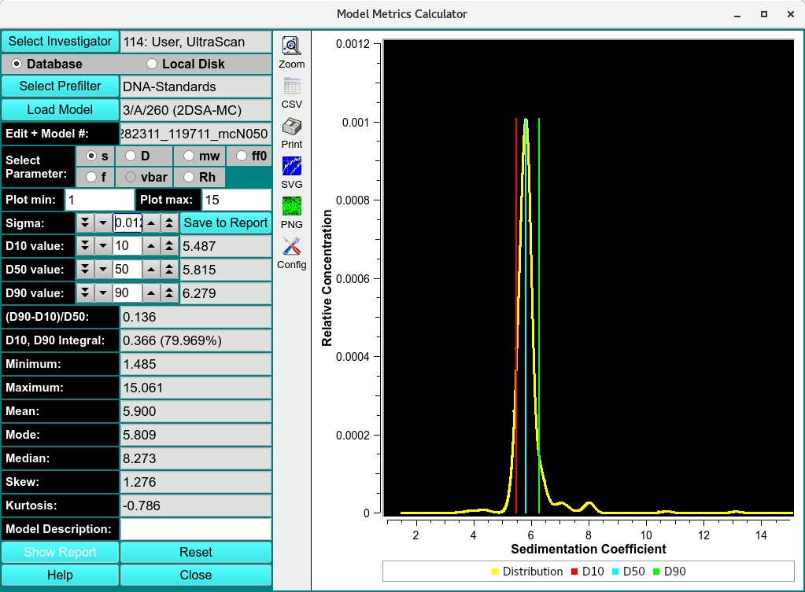

=============================================
Finite Element Model Statistics and Metrics
=============================================

.. toctree:: 
  :maxdepth: 3

.. contents:: Index
  :local: 

This program allows you to obtain statistics for a model computed by any finite element analysis module in UltraScan. 

.. rst-class::
    :align: center

    **Model Metric Calculator**

The following metrics are supported:

* Three distribution limits D :sub:`i`
* The span computed from the distribution limits
* The concentration integral between the lowest and highest distribution limit
* The *minimum* X-value of the distribution
* The *maximum* X-value of the distribution
* The mean, mode and median of the distribution
* The skew and kurtosis of the distribution

The program is started by selecting a model from the database or disk. When using the database, the investigator needs to be specified, and a prefilter can be applied. Once a model has been loaded, the user can choose the distribution based on any of the hydrodynamic parameters available in the model by checking the radio button next to the parameter. By default, the sedimentation coefficient distribution will be shown. One of the parameters fitted will be fixed and not available for plotting.

Once the model is loaded and the distribution parameter has been selected, default distributions limits D1 - D3 are set and the corresponding statistical values are calculated. At this point, the user can choose to add the current calculation and plot window to a report by clicking on **Save to Report**. The user can also change the smoothing level of the displayed distribution by changing the standard deviation (**Sigma**) value to non-zero, positive value. The distribution limits can also be adjusted to bracket different regions of the distribution and obtain different spans and centers. The adjustment of the top and bottom distribution limits can be used to integrate individual peaks in the distribution.

The integral value between the top and bottom distribution limits should be close, but will not exactly match the selected difference. For example, a distribution limit of 10% and 90% will not provide exactly 80% difference. The reason for this is the discrete nature of the finite element model distributions, which contain discrete solute points. To obtain integral values closer to the selected percent difference the discrete nature of the distribution can be reduced to a more continuous distribution by increasing the sigma value

For each model to be included in the report, **Save to Report** needs to be clicked once all parameters are set to acceptable values. Once all models have been evaluated, clicking on :ref:`Show Report <us_modmet_report>` will call up the default browser on your system and display the cumulative report in html format. Clicking on the **Reset** button will reset all values to their original default values.

.. _us_modmet_report:

.. image:: _static/images/us_modmet_report.png
    :align: center

.. rst-class::
    :align: center

    **Model Metric Report**