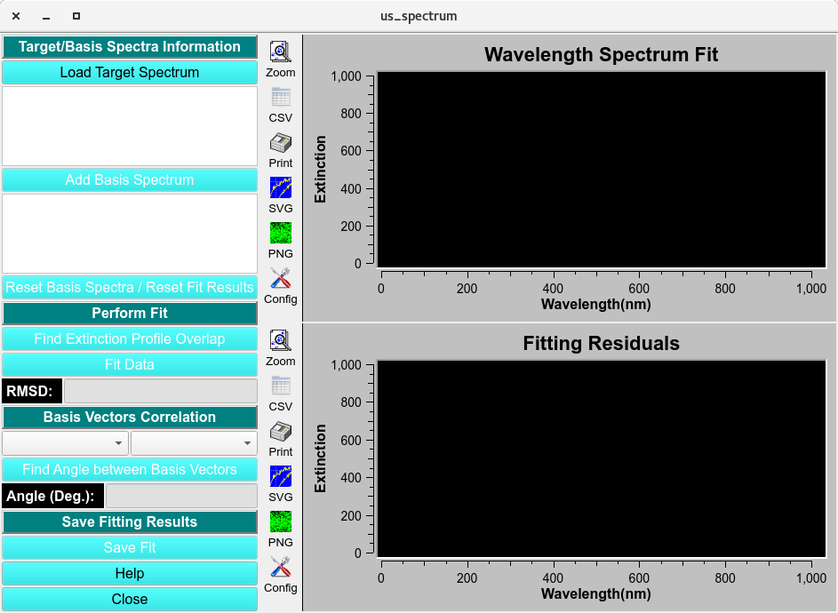
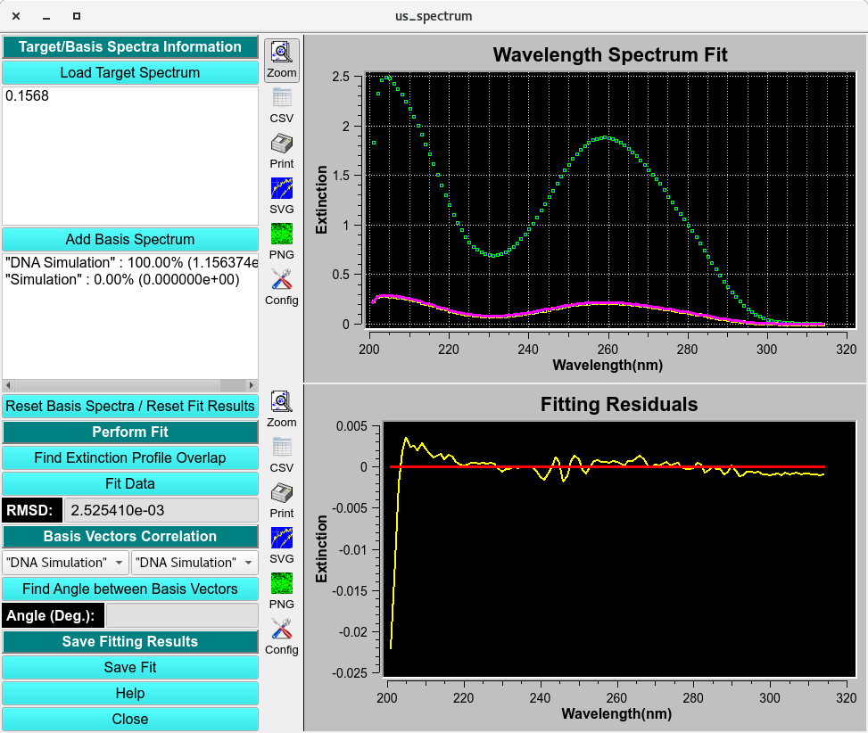

================================
Spectrum Decomposition
================================

.. toctree:: 
  :maxdepth: 3

.. contents:: Index
  :local: 
  
The Spectrum Decomposition module helps you interpret the components of a mixture spectra by fitting to the known intrinsic extinction profiles (basis vectors) of each component. Using CSV inputs, you can load a mixture spectrum and one or more basis spectra, fit the basis set to the mixture, and quantify the percent contribution of each component. The module also includes a vector-angle tool to compare spectra and measure the angle between two basis vectors. 

.. rst-class::
    :align: center

    **Spectrum Decomposition**

Process:
=========

1. **Load Target Spectrum:** and **Load Basis Spectrum**, 

To load the target spectrum, click the **Load Target Spectrum** button and select the csv file from a file manager window. A **Load CSV Files** window will pop-up to select the Delimiter-separated value, edit the header and inspect data. 

.. image:: _static/images/us_spectrum-load.png
    :align: center

.. rst-class::
    :align: center

    **Load CSV File**

2. Click **Accept** and the data will be imported and displayed on the Absorbance and Extinction Profile plot. Repeat for each basis vector by clicking the **Add Basis Spectrum** button and load the intrinsic spectrum profile.  

.. rst-class::
    :align: center

    **Loaded Spectrum Decomposition**

3. **Find profile overlap** and **Fit Data**

Cut the dat by clicking **Find Extinction Profile Overlay** and trimming the data to the overlapping wavelength regions. After fitting the data and the solution curve and the  residuals of the fit displayed it the **Wavelength Spectrum Fit** and **Residuals** plots. 

.. rst-class::
    :align: center

    **Spectrum Decomposition**

    