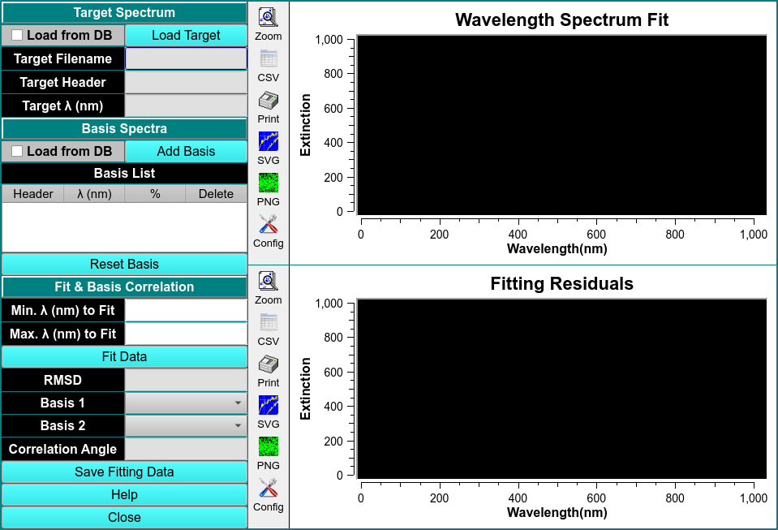
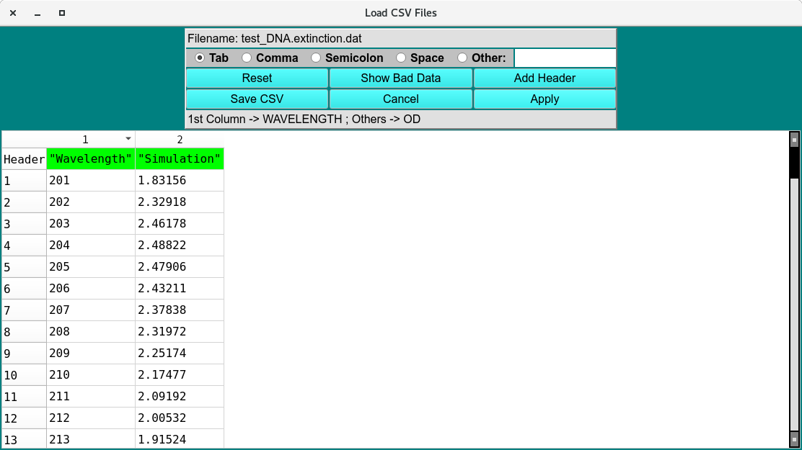
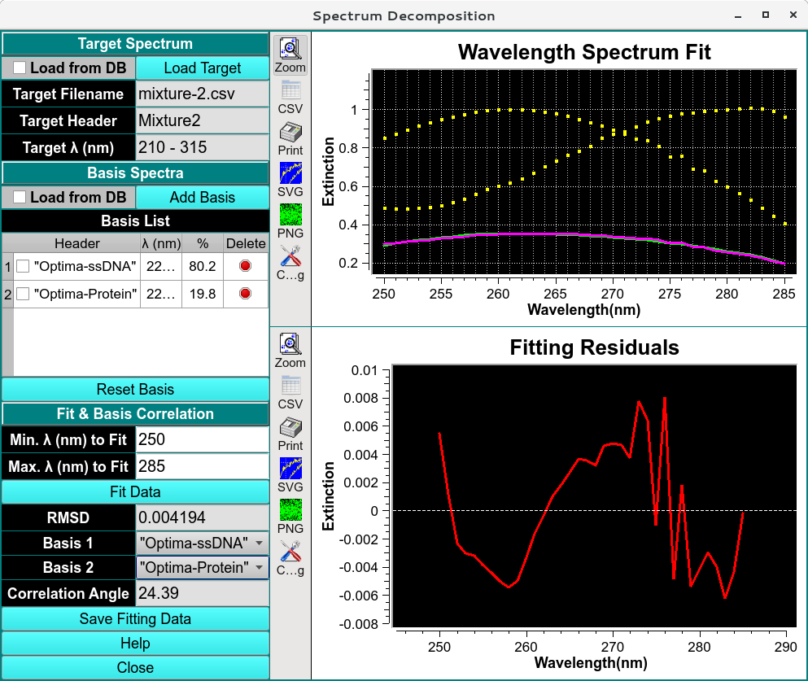

================================
Spectrum Decomposition
================================

.. toctree:: 
  :maxdepth: 3

.. contents:: Index
  :local: 

The Spectrum Decomposition module of UltraScan is used to determine the composition of a mixture of two or more spectrally unique species in a mixture (the basis spectra). The approach used here is to assume a linear relationship between the spectral basis composition, and their partial concentration in an unknown mixture for which an absorbance spectrum exists (the target spectrum). This module solves two problems: 1. measure the relative concentration of each species, and 2. measure the spectral distance between two basis spectra. The larger the spectral distance, the better the two species can be resolved. The assumption is made that all spectral basis add linearly to represent the composite spectrum. This is not always true, as spectral properties may slightly change upon binding, causing a hyper/hypochromic shift in the absorbance spectrum due to slight changes in the chemical environment of the chromophore. Residuals can be inspected to determine if such spectral shifts exist.. 

.. rst-class::
    :align: center

    **Spectrum Decomposition**

Process:
=========
.. note::
    This module is used to estimate the composition of an unknown sample to be measured by a multi-wavelength AUC experiment before the experiment is performed. The measurement requires the availability of two or more basis spectra for the pure, absorbing species present in the unknown sample. The basis spectra should be in the same unit (e.g., optical density, molar concentration) and on the same scale (e.g., molar, millimolar), and cover the same wavelength range and resolution. If the solution buffer has its own absorbance, a basis spectrum for the buffer solution must be included. Any calculations should be performed with spectral basis that were measured in the sample buffer after extensive dialysis against this buffer, and after blanking the spectrophotometer against the analyte buffer. Absorbance spectra used for analysis in this module should be fitted from a dilution series using the Spectrum Fitter module.

1. **Load Target Spectrum:** and **Load Basis Spectrum**, 

To load the target spectrum, click the **Load Target** button and select the csv file from a file manager window. A **Load CSV Files** window will pop-up to select the Delimiter-separated value, edit the header and inspect data. 

.. rst-class::
    :align: center

    **Load CSV File**

.. note::
    Before fitting, at least two spectra need to be loaded. The wavelength range can be adjusted by changing the Min/Max lambda range to be fitted.

2. Click **Accept** and the data will be imported and displayed on the Absorbance and Extinction Profile plot. Repeat for each basis vector by clicking the **Add Basis** button and load the intrinsic spectrum profile.  

3. **Find profile overlap** and **Fit Data**

Cut the dat by clicking **Find Extinction Profile Overlay** and trimming the data to the overlapping wavelength regions. After fitting the data and the solution curve and the  residuals of the fit displayed it the **Wavelength Spectrum Fit** and **Residuals** plots. 

.. rst-class::
    :align: center

    **Spectrum Decomposition**

.. important::
    The difference is reported in terms of a **Correlation Angle**, which can be between 0-90 degrees. A 90 degree difference means that the basis spectra are 100% orthogonal, while a 0 degree difference means that the basis spectra are linearly dependent, i.e., are simply multiples of each other. For a successful multi-wavelength AUC spectral decomposition, a difference of 25 degrees or more is recommended, as well as a fitting RMSD of 0.005 or less. Changing the spectral fitting range allows the user to optimize the wavelength range that should be used in a multi-wavelength AUC experiment. Here, the number of wavelengths needed should be minimized, while the correlation angle should be maximized. 