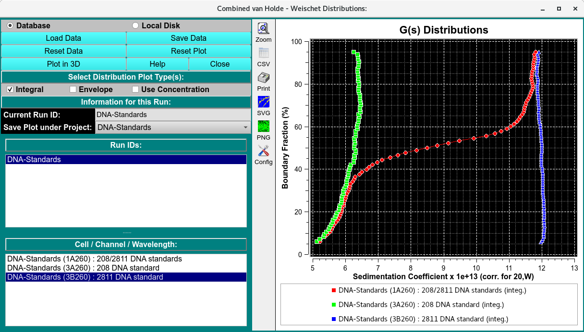
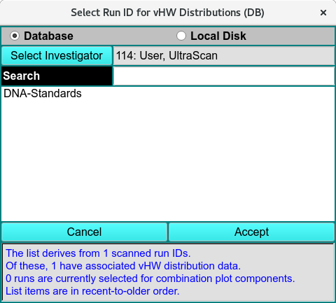

========================================
van Holde - Weischet Combined Plots
========================================

.. toctree:: 
    :maxdepth: 3

.. contents:: Index
    :local: 

To combine integral van Holde - Weischet G(s) distributions from multiple datasets (either from different cells of the same run or from different runs), use **Combine Distribution Plots (vHW)** from the *Velocity* menu. This will allow you to compare integral distributions from different cells to each other. This may be useful if you analyzed the same sample under different conditions; for example, different pH levels or different concentrations. If the samples are the same, the distributions should overlay; if the samples behave differently, the distributions will be shifted relative to each other.

.. note:: 
    All distributions will be plotted relative to the boundary fraction used in analysis. For example, if you analyzed 100% of the boundary, the distribution will range from 0 % to 100 % of the Y-axis. A distribution that was analyzed for 72 % of the boundary, shifted 8 % from the bottom will be plotted from 8 % to 80 % of the Y-axis. It is important that this distinction be made, since, for example, concentration-dependent samples will behave differently depending on the position in the boundary; or heterogeneous samples will show different distributions depending on which portion of the boundary was analyzed.

When data are loaded, arrays of X,Y distribution and envelope values are read and saved. These are then used to quickly display plots. If you want to change the mix of data plotted, you may click the Reset Plot button; and then quickly make new selections that are plotted without need for recalculations.

Functions:
===========

.. list-table::
  :widths: 29 71  

  * - **Database** 
    - Check this radio button to indicate that distribution data to be selected is in the database.
  * - **Local Disk** 
    - Check this radio button to indicate that distribution data to be selected is on local disk file systems.
  * - **Load Data** 
    - Click on this button to open `Run ID Select Dialog <common_dialogs.html#load-distribution-model>`_ in which one or more run IDs may be selected from which distribution data files can be taken.
  * - **Save Data** 
    - Save combined integral distribution and envelope data to a local data file and, if input source so indicates, to the database.
  * - **Reset Data** 
    - Clear all data, lists and plots. To choose runs and triples, a new set of Load Data selections must be made.
  * - **Reset Plot** 
    - Clear all plots. Data is still saved, so a new set of plots can be created by simply selecting runs and triples.
  * - **Help** 
    - Display detailed vHW_Combine help.
  * - **Close** 
    - Close this application.
  * - **Integral** 
    - Check to specify that plots are to include integral distributions.
  * - **Envelope** 
    - Check to specify that plots are to include envelopes.
  * - **Current Run ID:** 
    - The read-only text to the right of this label indicates the currently selected run.
  * - **Save Plot under Project:** 
    - The name shown to the right of this label specifies the project subdirectory under which the combination is to be saved. By default, the name shown is the first run selected for plotting, but this can be changed by the user to any listed name. If "All" is selected, plot copies will be saved to all of the component run IDs.
  * - **Run IDs:** 
    - The list below shows all runs selected in Load Data dialogs. Click on a list line to reveal the Cell / Channel / Wavelength triples for the run.
  * - **Cell/Channel/ Wavelength:** 
    - The list below shows the triples for the currently selected run. Click on a triple line to have its distribution/envelope added to the combined plot.

.. _selrun:

.. rst-class:: center

    **RunID Select Dialog**

.. subfigure:: AB     
  :class-grid: outline 
  :gap: 8px
  :align: center

  .. image:: _static/images/vhw_combine-envel.png
    :align: left
    :width: 85%

  .. image:: _static/images/vhw_combine-combo.png
    :width: 100%
    :align: right

.. rst-class:: center

    **Envelope and Combined Displays**

Besides the integral distribution plots shown above, you may display envelope plots. You may also combine both integral and envelope plots in a single plot.

Related
=========

`van Holde - Weischet Analysis <vhw_enhanced.html>`_