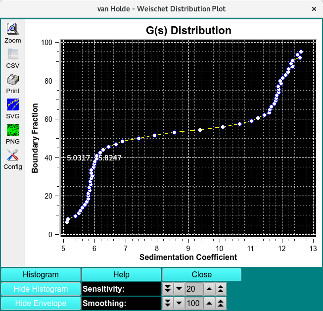
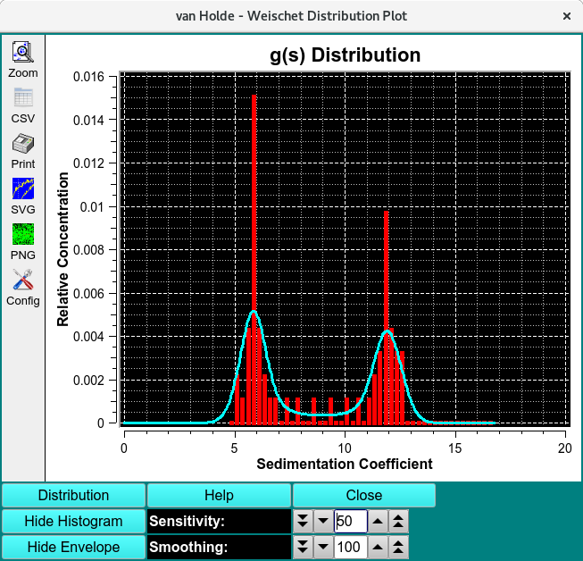

================================
UltraScan vHW Distribution Plot
================================

In the van Holde - Weischet (vHW) Enhanced program, there is a Distribution Plot option that brings up a dialog in which the vHW analysis data is displayed as a distribution plot or a histogram plot. In either case, a clustering of data around several sedimentation coefficient points indicates the presence of multiple species in the solution. 

    
Functions:
============

.. list-table::
    :widths: 20 50
    :header-rows: 0

    * - **Histogram** 
      - Click on this button to change the plot from Distribution to Histogram.
    * - **Distribution** 
      - Click on this button to change the plot from Histogram to Distribution. This is the alternate label to the same button as above.
    * - **Hide Histogram** 
      - Select hiding the histogram, showing only an envelope. The alternate label for this button is **Show Histogram**
    * - **Hide Envelope** 
      - Select hiding the envelope, showing only a histogram. The alternate label for this button is **Show Envelope**
    * - **Sensitivity** 
      - Change the sensitivity factor up or down to primarily affect the nature of the histogram.
    * - **Smoothing** 
      - Change the smoothing factor up or down to primarily affect the nature of the envelope.
    * - **Help:** 
      - Display detailed vHW Distribution/Histogram Plot help.

Related:
===========

`van Holde -Weischet Analysis <vhw_enhanced.html>`_