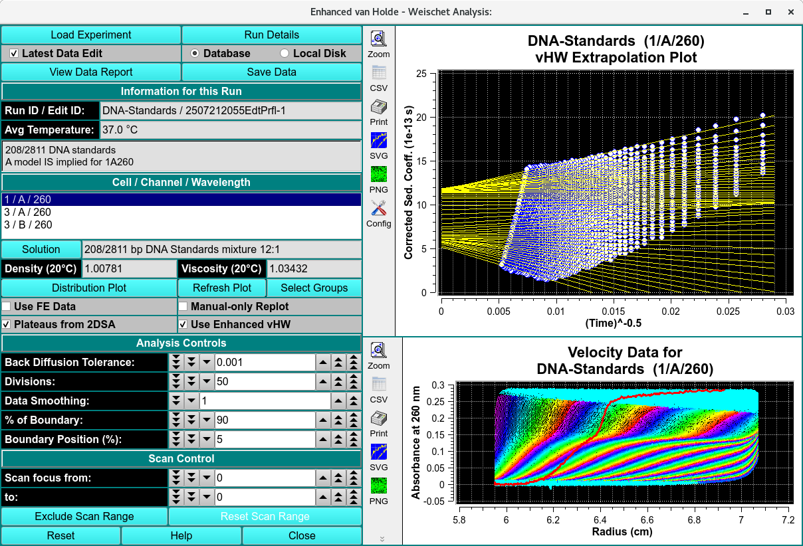
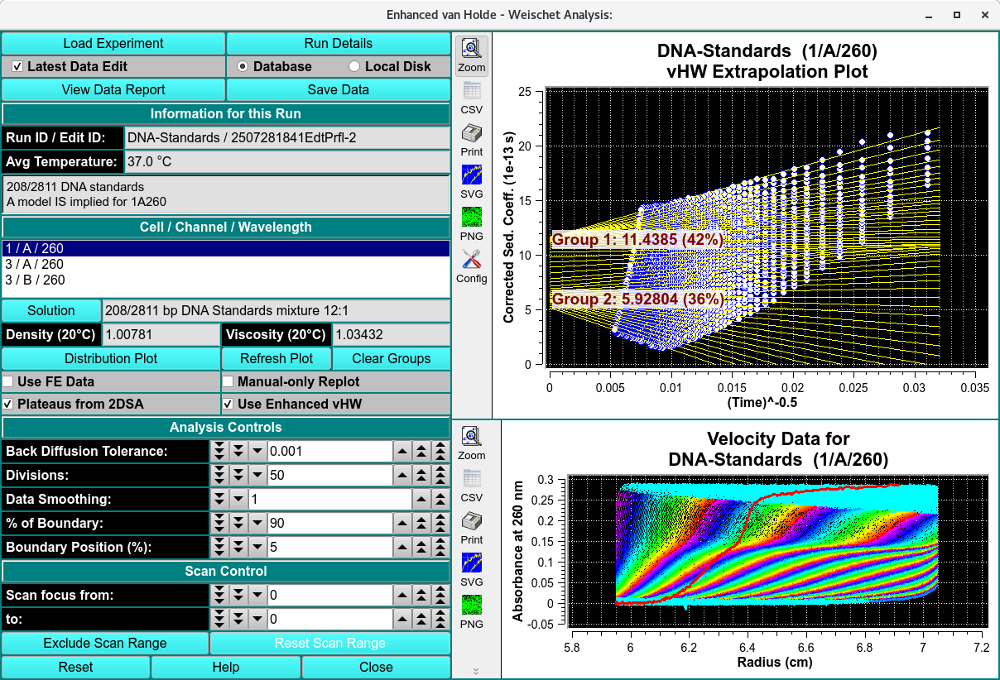
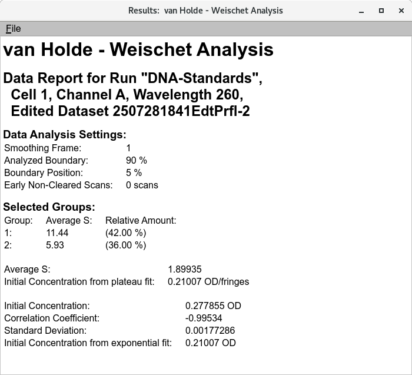

========================================
van Holde - Weischet Enhanced Analysis
========================================

.. toctree:: 
    :maxdepth: 3

.. contents:: Index
    :local: 
	

The method of van Holde and Weischet (vHW) is a versatile, model-independent approach to determine sedimentation coefficient distribution by graphically analyzing sedimentation velocity experimental data. The vHW method's strength derives from its ability to differentiate boundary spreading due to diffusion from boundary spreading due to heterogeneity in the sedimentation coefficient. This program uses a number of enhanced techniques for vHW analysis.

Functions:
===============

.. list-table::
  :widths: 20 50
  :header-rows: 0

  * - **Load Experiment**
    - Click on this button and, in the resulting `Load Run Data Dialog <common_dialogs.html#data-loader>`_, select an edited data set to load.
  * - **Run Details**
    - Bring up a `Run Details Dialog <run_details.html>`_ with a summary of data and run details.		 
  * - **Latest Data Edit**
    - Uncheck to allow choosing an edit other than the latest one for the experimental data.		
  * - **Database**
    - Check to specify data input from the database.		
  * - **Local Disk**
    - Check to specify data input from local disk.		
  * - **View Data Report**
    - Create a results text file and display its contents in a text dialog.		
  * - **Save Data** 
    - Create several data and report files based on input data and vHW parameters.		
  * - **Run ID / Edit ID:**
    - The main run title of the data and an edit identifier are displayed.		
  * - **Avg Temperature:**
    - The average temperature of solute is displayed in Celsius.		
  * - **(description box)**
    - The text box below the one for temperature shows a full data description string.		

**Cell / Channel / Wavelength** The text box below this label gives cell, channel and wavelength triples available in this data set. Highlight the desired value.

.. list-table::
  :widths: 20 50
  :header-rows: 0

  * - **Solution** 
    - Click this button to open a `Solution Management <solution/solution.html>`_ that allows changes to buffer and analyte characteristics of the data set.
  * - **Density (20°C)**
    - Shows the density value for the loaded experiment. Click the Solution button to open a dialog in which density and other values may be changed.		
  * - **Viscosity (20°C)**
    - Shows the viscosity value for the loaded experiment. Click the Solution button to open a dialog in which viscosity and other values may be changed.		
  * - **Distribution Plot**
    - Click for a plot dialog that shows a `vHW Distribution Plot <vhw_distrib_plot.html>`_ illustrating sedimentation coefficient power related to separate species.
  * - **Select Groups**
    - Click on this button to begin a session of choosing vHW Extrapolation Plot division groups. As an initial pop-up dialog explains, you must click first above any group of division lines and then below it. Multiple groups may be chosen, with division line overlap between groups. 
	.. note:: The button label becomes **Clear Groups** after selection, allowing the set of selected groups to be discarded in favor of a new set of selections. 
  * - **Refresh Plot**
    - Click on this button at any time to refresh the right-side plots, based on current parameter settings.		
  * - **Use FE Data**
    - **add definition** 		
  * - **Manual-only Replot**
    - Check this box to suppress automatic re-plotting with each parameter change. This may be desirable when you plan to change several settings, in order to avoid a replot with each change. With this box checked, you may force a plot with the Refresh Plot button.		
  * - **Manual-only Replot**
    - Check this box to suppress automatic re-plotting with each parameter change. This may be desirable when you plan to change several settings, in order to avoid a replot with each change. With this box checked, you may force a plot with the Refresh Plot button.		
  * - **Plateaus from 2DSA**
    - Check this box to have plateau values calculated from a model associated with any loaded noise values. With this box unchecked, each scan's plateau value is determined by a series of fits to initially designated plateaus.		
  * - **Use Enhanced vWH**
    - **add definition**		

**Analysis Controls**

.. list-table::
  :widths: 20 50
  :header-rows: 0
  
  * - **Back Diffusion Tolerance:**
    - Select a tolerance value to fine tune exclusion of points affected by back diffusion, as indicated by the red line on the velocity data. 
  * - **Divisions:**
    - Choose the number of divisions (yellow lines in the vWH Extrapolation Plot) to use in vHW analysis. 
  * - **Data Smoothing:**
    - Choose the number of points to use for any smoothing of raw input data. 
  * - **% of Boundary:**
    - Choose the percentage of the range from concentration baseline to plateau that is to be used for analysis. 
  * - **Boundary Position (%):**
    - Choose the percent of the plateau-baseline range that is to be added to the baseline to form the beginning of analysis span. For typical analysis 5% is recommended. 

**Scan Control**

.. list-table::
  :widths: 20 50
  :header-rows: 0

  * - **Scan Focus from:**
    - Choose the first of a range of scan numbers that may potentially be excluded from analysis.
  * - **Scan Focus to:**
    - Choose the end of a range of scan numbers that may potentially be excluded from analysis. The From/To scan range is illustrated in both plots to the right.
  * - **Exclude Scan Range**
    - Exclude the scans indicated by the two preceding scan bounding counters.
  * - **Reset Scan Range**
    - Resetting the scan range to include all excluded scans.

**Window Controls**

.. list-table::
  :widths: 20 50
  :header-rows: 0 

  * - **Reset** 
    - Indicate that window is reset and the plots are initiated.
  * - **Help** 
    - Display this detailed van Holde-Weischet Analysis help.
  * - **Close** 
    - Close all windows and exit.

van Holde Wieschet Analysis Steps
========================================

*  **Step 1:** First, load a velocity dataset. Click on **Load Experiment** to select an edited velocity data set from the database or from local disk.

*  **Step 2:** Secondly, select a model from database or disk. Simply click on a triplicate in the Cell / Channel / Wavelength. Enhanced van Holde - Weischet analysis is automatically applied according to the Analysis Controls

*  **Step 3:** If necessary, adjust the Back Diffusion Tolerance, Divisions, % of Boundary and Boundary Position (%).

*  **Step 4:** After analysis is complete, the resulting distribution and histogram are available for display in the Distribution Plot.

*  **Step 5:** To choose the vHW Extrapolation Plot division groups, select **Select Group** and follow the prompt instructions. The vHW Extrapolation Plot will display the selected group.

.. rst-class:: center

    vHW Extrapolation Plot division groups

.. rst-class:: center

    vHW Extrapolation Plot division groups 

Related
====================

`Combined vHW Distribution Plot <vhw_distrib_plot.html>`_

`Finite Element Model Viewer <fe_match/fe_match.html>`_

`2-Dimensional Spectrum Analysis <2dsa.html>`_