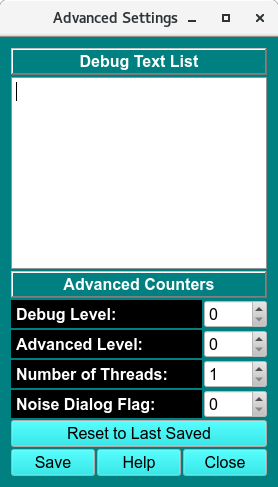

============================================================
Advanced Configuration Panel
============================================================

.. toctree:: 
  :maxdepth: 3

.. contents:: Index
  :local: 

.. note:: 
    Some **UltraScan III** applications output debug text to STDOUT or a log file. Some only include certain GUI elements when in an advanced mode. Certain applications can benefit from use of more than one thread. These variations are governed by the configuration values that are set in this panel. Actual values should be set only under the guidance of software developers, since meanings of settings vary considerably from application to application.

Functions 
==========================

.. list-table::
  :widths: 20 50
  :header-rows: 0
  
  * - **Debug Text List**
    -  Additional debugging to aid in trouble-shooting can be turned on or off based on a debug text phrase. One or more of such phrases may be entered in this list. Leading or trailing blanks and multiple consecutive blanks are ignored.
  * - **Debug Level:** 
    - The quantity of debug outputs may be determined by the magnitude of the value selected here. The greater the count,the greater the number of debug lines output for applications that take advantage of the debug level value. 
  * -  **Advanced Level:** 
    - For certain applications, there are options that should only be visible and changeable by a highly knowledgeable user working in advanced mode. The level of advanced mode may be set with the counter here.
  * - **Number of Threads:** 
    - A threads count greater than one is advantageous in certain applications that are thread-aware. A number from one to ten may be set here.
  * - **Noise Dialog Level** 
    - **ADD DEFINITION of Function** 
  * - **Reset to Last Saved** 
    -  All of the above settings can be made to revert to last-saved settings by clicking this button.

**Window Controls**

.. list-table::
  :widths: 20 50
  :header-rows: 0 

  * - **Reset** 
    - Indicate that parameters are to be reset and the plots re-displayed based on original parameters.
  * - **Help** 
    - Display this detailed Fit Meniscus help.
  * - **Close** 
    - Close all windows and exit.

